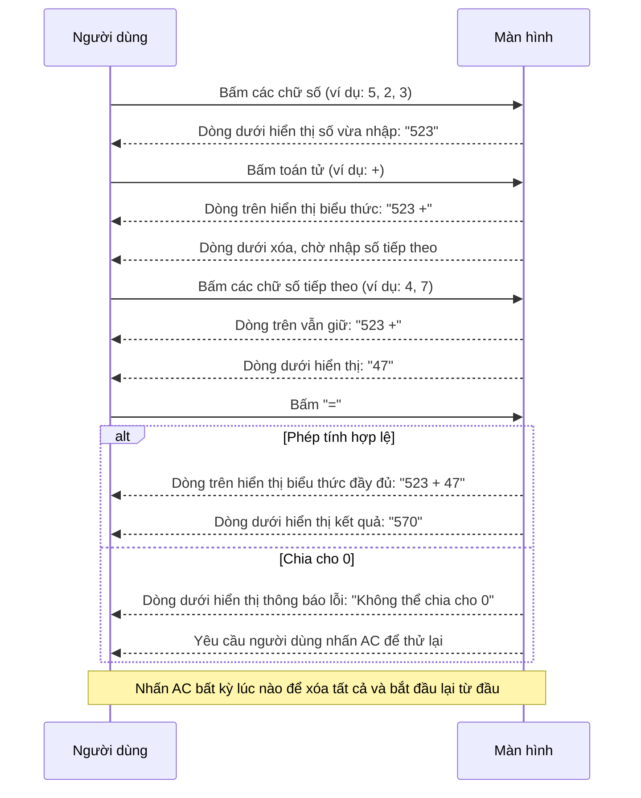

# BUSINESS REQUIREMENTS DOCUMENT (BRD) - Simple Calculator Web App

| Thông tin             | Chi tiết                        |
| :-------------------- | :------------------------------ |
| **Dự án**             | Simple Calculator Web App       |
| **Phiên bản**         | v1.0.0                          |
| **Cập nhật lần cuối** | 2026-05-28                      |
| **Trạng thái**        | DRAFT                           |
| **Tác giả**           | Nam (Product Owner & Developer) |

---

## REVISION HISTORY

| Phiên bản | Ngày       | Cập nhật bởi | Mô tả                                                          |
| :-------- | :--------- | :----------- | :------------------------------------------------------------- |
| 1.0.0     | 2026-05-28 | Nam          | Phiên bản khởi tạo theo quy trình Spec-Driven Development      |

---

## 1. PROJECT OVERVIEW

Simple Calculator Web App là ứng dụng máy tính chạy trên trình duyệt, xây dựng bằng HTML, CSS và JavaScript thuần. Đây là dự án thực hành phương pháp **Spec-Driven Development** — toàn bộ tài liệu đặc tả (BRD → SAD → Database Design → FS) phải được phê duyệt trước khi bắt đầu viết code.

- **Mục đích:** Cung cấp công cụ thực hiện 4 phép tính cơ bản (+, −, ×, ÷), trực quan, không cần cài đặt, hoạt động hoàn toàn trên trình duyệt.
- **Giá trị kinh doanh:** Người dùng có thể tính toán tức thì ngay trong trình duyệt, không cần chuyển sang ứng dụng khác — giảm thiểu gián đoạn trong luồng làm việc. Đồng thời là nền tảng để mở rộng thêm tính năng nâng cao ở các phiên bản sau.
- **Người dùng mục tiêu:** Người dùng phổ thông — nhân viên văn phòng, học sinh, sinh viên — cần thực hiện phép tính nhanh, đơn giản trong công việc và sinh hoạt hàng ngày.

---

## 2. PROBLEMS & OPPORTUNITIES

### Problems

- **Rào cản truy cập:** Máy tính hệ điều hành yêu cầu nhiều thao tác để mở; người dùng không muốn cài thêm ứng dụng mới chỉ để tính toán đơn giản.
- **Thiếu tính nhất quán:** Giao diện và hành vi máy tính khác nhau trên từng hệ điều hành, gây bỡ ngỡ khi chuyển thiết bị.
- **Gián đoạn luồng làm việc:** Người dùng đang thao tác trên trình duyệt phải thoát ra (Alt+Tab, dock/taskbar) để mở máy tính — phá vỡ sự tập trung.

### Opportunities

- **Truy cập tức thì, không rào cản:** Người dùng chỉ cần mở trình duyệt và vào URL — không cài đặt, không đăng ký, không yêu cầu quyền hệ thống.
- **Nhất quán trên mọi thiết bị:** Giao diện và hành vi hoàn toàn giống nhau dù dùng trên Windows, macOS, iOS hay Android — khác hẳn máy tính native của từng hệ điều hành.
- **Không tốn chi phí vận hành:** Không có server, không có database, không có chi phí duy trì — deploy một lần lên GitHub là chạy mãi.
- **Dễ chia sẻ:** Chỉ cần gửi link, bất kỳ ai cũng dùng được ngay — không cần hướng dẫn cài đặt hay tải file.

---

## 3. PROJECT OBJECTIVES

- **Đơn giản tuyệt đối:** Người dùng mới có thể thực hiện phép tính đầu tiên trong vòng 10 giây, không cần đọc hướng dẫn.
- **Chính xác và tin cậy:** Mọi phép tính cho kết quả đúng; các trường hợp đặc biệt (chia cho 0, số âm, số thập phân, kết quả rất lớn) đều được xử lý tường minh.
- **Hiệu năng tức thì:** Kết quả hiển thị trong < 100ms sau khi nhấn "="; ứng dụng hoạt động hoàn toàn offline sau lần tải đầu.
- **Thực hành đúng quy trình:** Bộ tài liệu spec đầy đủ (BRD → SAD → Database Design → FS) được hoàn thành và phê duyệt trước khi viết bất kỳ dòng code nào.

---

## 4. PROJECT SCOPE

### 4.1 In Scope — v1.0.0

| ID    | Tính năng                      | Mô tả                                                                            |
| :---- | :----------------------------- | :------------------------------------------------------------------------------- |
| F-001 | Phép cộng (+)                  | Cộng hai số nguyên hoặc thập phân                                                |
| F-002 | Phép trừ (−)                   | Trừ hai số nguyên hoặc thập phân                                                 |
| F-003 | Phép nhân (×)                  | Nhân hai số nguyên hoặc thập phân                                                |
| F-004 | Phép chia (÷)                  | Chia hai số; xử lý đặc biệt khi chia cho 0                                      |
| F-005 | Nhập số thập phân              | Cho phép nhập và hiển thị số có phần thập phân; chỉ chấp nhận một dấu "." mỗi số |
| F-006 | Kết quả số âm                  | Phép tính cho ra kết quả âm được hiển thị đúng với dấu "−" phía trước           |
| F-007 | Xóa toàn bộ — AC               | Reset ứng dụng về trạng thái ban đầu, màn hình hiển thị "0"                     |
| F-008 | Xóa ký tự cuối — ⌫             | Xóa chữ số cuối đang nhập; nếu chỉ còn một chữ số thì hiển thị "0"             |
| F-009 | Giới hạn độ dài đầu vào        | Mỗi toán hạng tối đa 15 chữ số; ngăn nhập thêm khi đạt giới hạn                |
| F-010 | Xử lý lỗi chia cho 0           | Hiển thị thông báo lỗi rõ ràng; ứng dụng không bị crash, yêu cầu AC để tiếp tục |
| F-011 | Ký hiệu khoa học               | Tự động hiển thị dạng `1.5e+20` khi kết quả vượt quá 15 chữ số                 |
| F-012 | Nhập liệu bằng bàn phím        | Phím 0–9, toán tử, Enter (=), Backspace (⌫), Escape (AC), dấu chấm (.) hoạt động đầy đủ |

### 4.2 Out of Scope — v1.0.0

Các tính năng dưới đây **không** được triển khai trong v1.0.0. Chúng được liệt kê để tránh nhầm lẫn về phạm vi, không phải cam kết roadmap.

| Tính năng                           | Lý do loại trừ                                                      |
| :---------------------------------- | :------------------------------------------------------------------ |
| Phần trăm (%)                       | Người dùng mục tiêu chưa có nhu cầu rõ ràng; có thể thêm sau      |
| Lịch sử phép tính                   | Cần quản lý trạng thái phức tạp hơn, không thuộc v1               |
| Copy kết quả ra clipboard           | Tiện ích bổ sung, không ảnh hưởng đến chức năng cốt lõi           |
| Scientific Calculator (sin, log, √) | Vượt quá yêu cầu của người dùng phổ thông; scope khác hẳn         |

---

## 5. BUSINESS PROCESS FLOW

Luồng dưới đây mô tả những gì **người dùng thấy và làm** khi thực hiện một phép tính trên giao diện. Mỗi bước chỉ mô tả hành động và kết quả hiển thị — chi tiết xử lý bên trong thuộc phạm vi tài liệu kỹ thuật (SAD, FS).

> **Lưu ý về giao diện:** Màn hình calculator có **hai dòng**:
> - **Dòng trên (nhỏ hơn):** Hiển thị biểu thức đang nhập, ví dụ `5 +` hoặc `5 + 3`.
> - **Dòng dưới (lớn hơn):** Hiển thị số đang nhập hoặc kết quả cuối cùng.

---

## 6. BUSINESS RULES

- **Biểu thức đơn giản:** v1.0.0 chỉ hỗ trợ biểu thức dạng `operand1 operator operand2`. Không xử lý chuỗi phép tính liên tiếp có ưu tiên (ví dụ: `2 + 3 × 4`).
- **Tiếp tục sau kết quả:** Sau khi nhấn "=", nếu người dùng nhấn một **toán tử** → kết quả hiện tại trở thành operand1 của phép tính tiếp theo. Nếu nhấn một **chữ số** → bắt đầu phép tính hoàn toàn mới.
- **Giới hạn chữ số:** Mỗi toán hạng không vượt quá 15 chữ số. Khi đạt giới hạn, các phím số không có tác dụng cho đến khi người dùng xóa.
- **Một dấu thập phân:** Mỗi toán hạng chỉ chấp nhận một dấu ".". Nhấn "." lần thứ hai sẽ bị bỏ qua.
- **Khóa sau lỗi chia cho 0:** Khi xảy ra lỗi, ứng dụng vào trạng thái lỗi — mọi phím số và toán tử đều bị vô hiệu hóa. Chỉ AC mới reset được về trạng thái bình thường.
- **Làm tròn kết quả:** Kết quả thập phân được làm tròn tối đa 10 chữ số sau dấu phẩy, tránh hiển thị lỗi floating-point (ví dụ: `0.1 + 0.2` hiển thị `0.3` thay vì `0.30000000000000004`).

---

## 7. FUNCTIONAL REQUIREMENTS

| ID  | Feature Group        | Description                                                                                          |
| :-- | :------------------- | :--------------------------------------------------------------------------------------------------- |
| F1  | Phép tính cơ bản     | Thực hiện 4 phép tính (+, −, ×, ÷) chính xác với số nguyên và thập phân.                           |
| F2  | Quản lý đầu vào      | Nhận input từ nút bấm giao diện và bàn phím vật lý; giới hạn 15 chữ số/toán hạng; một dấu "." mỗi số. |
| F3  | Xử lý lỗi & overflow | Phát hiện chia cho 0 và hiển thị lỗi rõ ràng; chuyển sang ký hiệu khoa học khi kết quả vượt 15 chữ số. |
| F4  | Màn hình hiển thị    | Duy trì hai vùng hiển thị tách biệt: expression row (biểu thức đang nhập) và result row (kết quả). |
| F5  | Reset & Chỉnh sửa    | AC xóa toàn bộ và reset trạng thái; ⌫ xóa từng ký tự cuối để sửa lỗi nhập liệu.                    |

---

## 8. NON-FUNCTIONAL REQUIREMENTS

- **Hiệu năng:** Kết quả hiển thị trong < 100ms sau khi nhấn "="; tải trang lần đầu trong < 2 giây trên kết nối trung bình.
- **Offline-first:** Toàn bộ tính năng hoạt động ngay sau lần tải đầu, không phụ thuộc vào bất kỳ API call nào.
- **Tương thích trình duyệt:** Hoạt động đúng trên Chrome, Firefox, Safari (2 phiên bản mới nhất); không dùng API thực nghiệm.
- **Responsive:** Giao diện sử dụng được trên desktop (≥ 1024px) và mobile (≥ 375px) mà không mất chức năng.
- **Maintainability:** Code tổ chức theo đúng spec; mỗi business rule ở Section 6 có test case tương ứng trong FS; không dùng thư viện ngoài cho logic tính toán.

---

## 9. SUCCESS METRICS

- **Time-to-first-calculation ≤ 10 giây:** Người dùng mới hoàn thành phép tính đầu tiên trong vòng 10 giây kể từ khi mở ứng dụng, không cần hướng dẫn.
- **Độ chính xác 100%:** Mọi kết quả khớp với expected output trong bộ test case được định nghĩa trong [FUNCTION_SPECIFICATION_v1.0.0.md](file:///Users/nam/Desktop/calculator/docs/v1.0.0/FUNCTION_SPECIFICATION_v1.0.0.md).
- **Zero crash:** Không có tổ hợp input nào khiến ứng dụng rơi vào trạng thái không nhất quán hoặc crash — bao gồm chia cho 0, nhập bàn phím liên tục, và vượt giới hạn chữ số.
- **Spec-first compliance:** 100% tính năng trong scope được mô tả đầy đủ trong FS trước khi code tương ứng được viết.

---

## 10. NOTES

- Tài liệu này mô tả yêu cầu ở cấp độ nghiệp vụ. Mọi chi tiết kỹ thuật triển khai thuộc phạm vi các tài liệu cấp dưới.
- Chi tiết hành vi UI, trạng thái màn hình và test scenarios → xem **[FUNCTION_SPECIFICATION_v1.0.0.md](file:///Users/nam/Desktop/calculator/docs/v1.0.0/FUNCTION_SPECIFICATION_v1.0.0.md)**.
- Cấu trúc file, component và luồng dữ liệu → xem **[SYSTEM_ARCHITECTURE_v1.0.0.md](file:///Users/nam/Desktop/calculator/docs/v1.0.0/SYSTEM_ARCHITECTURE_v1.0.0.md)**.
- Dự án không có Database ở v1.0.0. Tài liệu **[DATABASE_DESIGN_v1.0.0.md](file:///Users/nam/Desktop/calculator/docs/v1.0.0/DATABASE_DESIGN_v1.0.0.md)** đã được tạo dưới dạng giả lập để thực hành quy trình — không được implement ở v1.0.0.

---

END OF DOCUMENT
