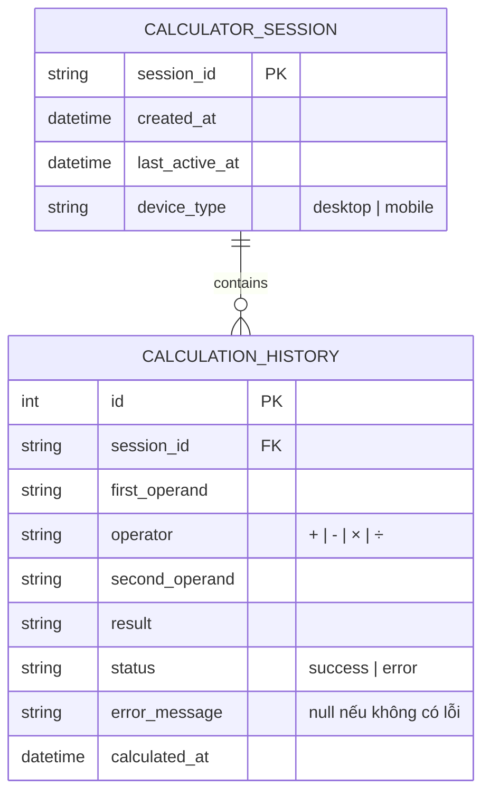

# DATABASE DESIGN DOCUMENT (DBD) - Simple Calculator Web App

| Information           | Details                         |
| :-------------------- | :------------------------------ |
| **Project**           | Simple Calculator Web App       |
| **Version**           | v1.0.0                          |
| **Last Updated**      | 2026-05-31                      |
| **Status**            | DRAFT (Simulated — không implement ở v1.0.0) |
| **Database**          | SQLite (giả lập — client-side)  |
| **Author**            | Nam (Product Owner & Developer) |

> ⚠️ **Lưu ý quan trọng:** Tài liệu này là bản **giả lập** để thực hành quy trình Spec-Driven Development. Thực tế, Simple Calculator v1.0.0 **không có database** — toàn bộ dữ liệu chỉ tồn tại trong RAM (xem SAD Section 4). Database Design này mô tả schema *như thể* ứng dụng có tính năng lưu lịch sử, phục vụ mục đích học tập.

---

## NHẬT KÝ THAY ĐỔI

| Version | Ngày       | Người sửa | Mô tả thay đổi                         |
| :------ | :--------- | :-------- | :------------------------------------- |
| 1.0.0   | 2026-05-31 | Nam       | Phiên bản giả lập ban đầu cho thực hành |

---

## 1. ENTITY RELATIONSHIP DIAGRAM (ERD)

Sơ đồ ERD mô tả các thực thể dữ liệu nếu ứng dụng calculator có khả năng lưu trữ lịch sử phép tính và cấu hình người dùng.

---

## 2. TABLE DEFINITIONS

### 2.1. calculator_session
Lưu trữ thông tin phiên làm việc của người dùng. Một session bắt đầu khi người dùng mở tab và kết thúc khi đóng tab hoặc reset hoàn toàn.

| Cột              | Kiểu dữ liệu  | Ràng buộc    | Mô tả                                              |
| :--------------- | :------------ | :----------- | :------------------------------------------------- |
| `session_id`     | `VARCHAR(36)` | PK, NOT NULL | UUID tự sinh khi mở tab — ví dụ: `a1b2c3d4-...`  |
| `created_at`     | `DATETIME`    | NOT NULL     | Thời điểm bắt đầu session                         |
| `last_active_at` | `DATETIME`    | NOT NULL     | Thời điểm tương tác gần nhất                      |
| `device_type`    | `VARCHAR(10)` | NULL         | Loại thiết bị: `desktop` hoặc `mobile`            |

**Ghi chú:** `session_id` được tạo bằng `crypto.randomUUID()` ở client-side, không cần server sinh.

---

### 2.2. calculation_history
Lưu trữ từng phép tính mà người dùng đã thực hiện trong một session. Đây là bảng trung tâm của thiết kế.

| Cột               | Kiểu dữ liệu  | Ràng buộc         | Mô tả                                                       |
| :---------------- | :------------ | :---------------- | :---------------------------------------------------------- |
| `id`              | `INT`         | PK, AUTO_INCREMENT | ID tự tăng của từng phép tính                              |
| `session_id`      | `VARCHAR(36)` | FK → session, NOT NULL | Liên kết với session đang thực hiện                   |
| `first_operand`   | `VARCHAR(20)` | NOT NULL          | Số thứ nhất — ví dụ: `"523"`, `"-7.5"`                     |
| `operator`        | `VARCHAR(3)`  | NOT NULL          | Toán tử: `"+"`, `"-"`, `"×"`, `"÷"` (dùng VARCHAR(3) vì × và ÷ là ký tự Unicode đa byte) |
| `second_operand`  | `VARCHAR(20)` | NOT NULL          | Số thứ hai — ví dụ: `"47"`, `"0"`                          |
| `result`          | `VARCHAR(30)` | NULL              | Kết quả tính toán — `null` nếu là phép tính lỗi           |
| `status`          | `VARCHAR(10)` | NOT NULL          | Trạng thái: `success` hoặc `error`                         |
| `error_message`   | `VARCHAR(100)`| NULL              | Mô tả lỗi nếu có — ví dụ: `"Không thể chia cho 0"`        |
| `calculated_at`   | `DATETIME`    | NOT NULL          | Thời điểm phép tính được thực hiện                        |

**Ví dụ dữ liệu:**

| id | session_id | first_operand | operator | second_operand | result  | status  | error_message          |
| :- | :--------- | :------------ | :------- | :------------- | :------ | :------ | :--------------------- |
| 1  | a1b2c3...  | 523           | +        | 47             | 570     | success | null                   |
| 2  | a1b2c3...  | 10            | ÷        | 0              | null    | error   | Không thể chia cho 0   |
| 3  | a1b2c3...  | 7.5           | ×        | 4              | 30      | success | null                   |

---

## 3. BUSINESS RULES ÁNH XẠ VÀO DATABASE

| Business Rule (từ BRD Section 6)              | Ánh xạ vào DB                                                         |
| :-------------------------------------------- | :-------------------------------------------------------------------- |
| Chia cho 0 → hiển thị lỗi                    | `status = 'error'`, `result = null`, `error_message = 'Không thể chia cho 0'` |
| Kết quả làm tròn 10 chữ số thập phân         | `result` lưu giá trị đã làm tròn, không lưu giá trị raw float        |
| Kết quả hiển thị ký hiệu khoa học nếu quá dài | `result` lưu chuỗi đã format — ví dụ: `"1.5e+20"`                   |
| Một biểu thức gồm 2 toán hạng + 1 toán tử    | Schema có đúng 3 cột riêng: `first_operand`, `operator`, `second_operand` |

---

## 4. INDEXES & PERFORMANCE

| Index Name                       | Bảng                  | Cột               | Lý do                                                    |
| :------------------------------- | :-------------------- | :---------------- | :------------------------------------------------------- |
| `idx_history_session_id`         | `calculation_history` | `session_id`      | Truy vấn lịch sử theo session thường xuyên               |
| `idx_history_calculated_at`      | `calculation_history` | `calculated_at`   | Sắp xếp lịch sử theo thứ tự thời gian                   |
| `idx_session_last_active`        | `calculator_session`  | `last_active_at`  | Tìm và dọn các session không hoạt động (nếu có cleanup)  |

---

## 5. NOTES

- Tài liệu này phục vụ mục đích **thực hành quy trình** Spec-Driven Development, không phản ánh implementation thực tế của v1.0.0.
- Nếu tính năng **Lịch sử phép tính** được thêm vào v1.1.0, schema này có thể dùng làm nền tảng với điều chỉnh nhỏ — thay thế SQLite bằng localStorage theo cấu trúc JSON tương đương.
- Không có bảng `users` vì v1.0.0 không có hệ thống đăng nhập. Session là cách đơn giản nhất để nhóm các phép tính lại với nhau.

---

END OF DOCUMENT
