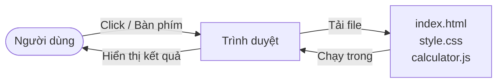
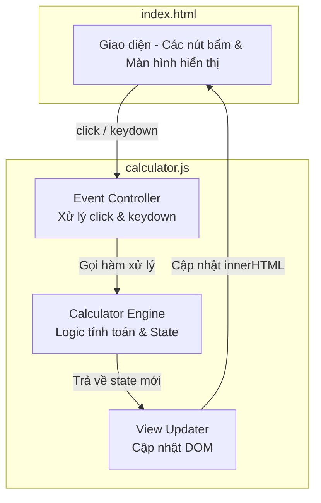
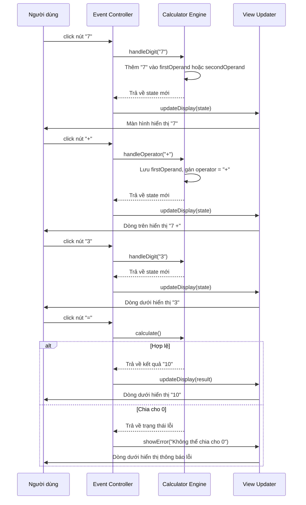
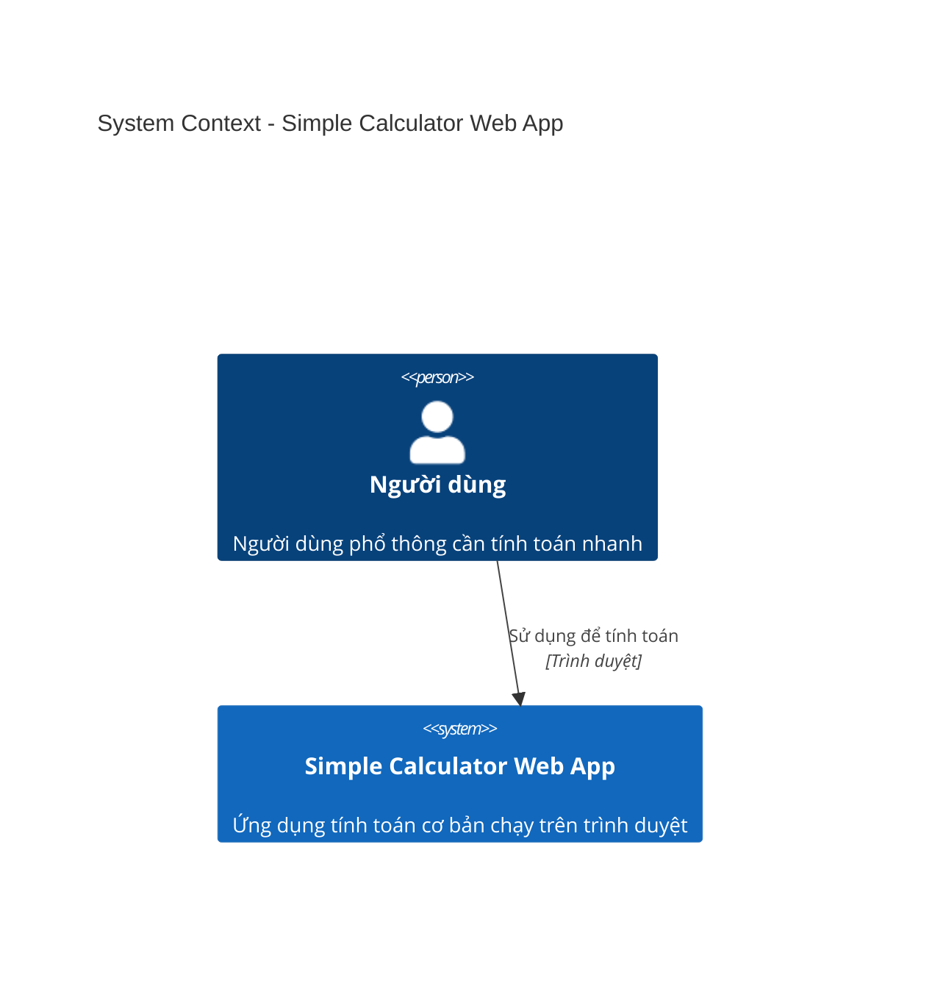
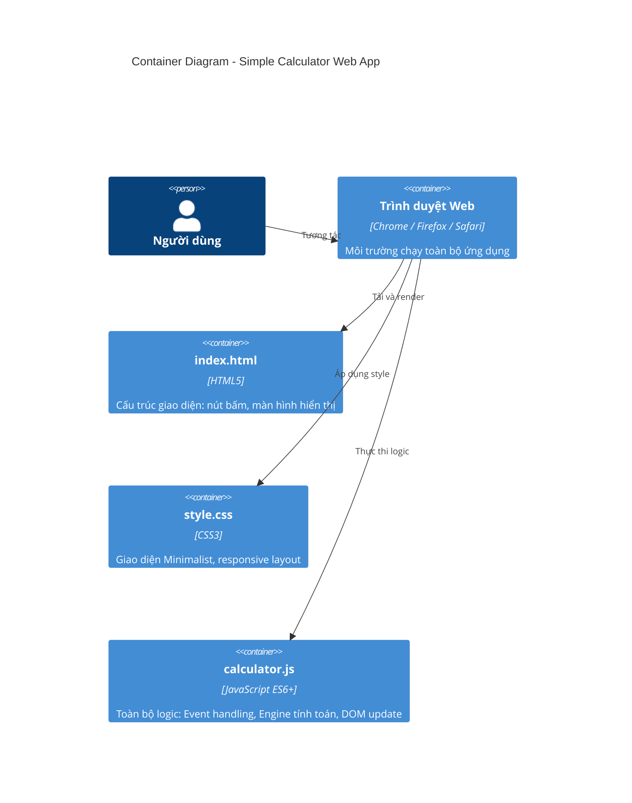
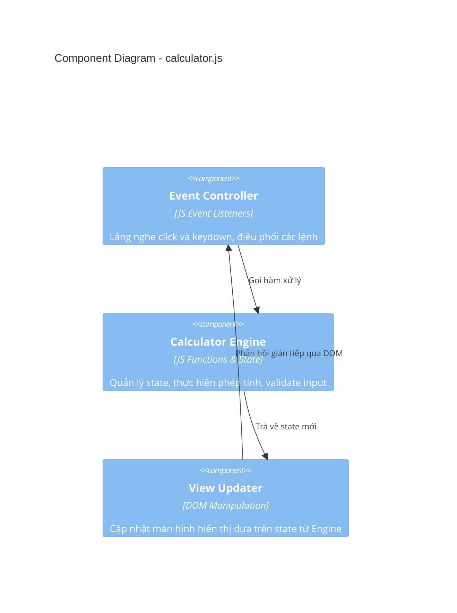

# SYSTEM ARCHITECTURE DOCUMENT (SAD) - Simple Calculator Web App

| Thông tin         | Chi tiết                        |
| :---------------- | :------------------------------ |
| **Dự án**         | Simple Calculator Web App       |
| **Phiên bản**     | v1.0.0                          |
| **Ngày cập nhật** | 2026-05-29                      |
| **Trạng thái**    | DRAFT                           |
| **Tác giả**       | Nam (Product Owner & Developer) |

---

## NHẬT KÝ THAY ĐỔI

| Version | Ngày       | Người sửa | Mô tả thay đổi                 |
| :------ | :--------- | :-------- | :------------------------------ |
| 1.0.0   | 2026-05-29 | Nam       | Tài liệu kiến trúc ban đầu      |

---

## Section 1: Introduction and Goals

Simple Calculator Web App là ứng dụng tính toán cơ bản chạy hoàn toàn trên trình duyệt (client-side only), không có server backend hay database. Toàn bộ logic được xử lý bằng JavaScript thuần, giao diện xây dựng bằng HTML và CSS Vanilla.

**Mục tiêu kiến trúc chính:**

- Giữ kiến trúc **đơn giản nhất có thể** — không framework, không dependency, không build tool — để phù hợp với quy mô dự án và mục tiêu học tập.
- Tách biệt rõ ràng 3 tầng: **Giao diện (HTML)**, **Logic tính toán (JS)**, **Hiển thị kết quả (DOM manipulation)**.
- Đảm bảo ứng dụng có thể chạy offline hoàn toàn sau lần tải đầu tiên.
- Cấu trúc file rõ ràng, dễ mở rộng khi bổ sung tính năng ở phiên bản sau.

---

## Section 2: Architecture Constraints

- **Ngôn ngữ:** HTML5, CSS3, JavaScript ES6+ — không dùng TypeScript hay transpiler.
- **Framework:** Không dùng bất kỳ UI framework nào (React, Vue, Angular). Vanilla JS thuần.
- **Thư viện:** Không dùng thư viện tính toán ngoài (math.js, decimal.js...) — tự implement toàn bộ logic.
- **Build tool:** Không có build step — file HTML mở trực tiếp trên trình duyệt là chạy được.
- **Backend:** Không có. Ứng dụng 100% client-side.
- **Database:** Không có. Không lưu dữ liệu, không dùng localStorage ở v1.0.0.
- **Deployment:** Static file — có thể deploy lên GitHub Pages hoặc bất kỳ hosting tĩnh nào.

---

## Section 3: Context and Scope

Ứng dụng không giao tiếp với bất kỳ hệ thống bên ngoài nào. Toàn bộ vòng đời xử lý diễn ra trong trình duyệt của người dùng.



> Không có kết nối ra ngoài sau khi các file được tải. Ứng dụng hoàn toàn tự chứa.

---

## Section 4: Data Architecture & Persistence

Ứng dụng **không có lớp persistence** ở v1.0.0. Toàn bộ dữ liệu tồn tại trong bộ nhớ (RAM) của trình duyệt dưới dạng biến JavaScript và bị xóa khi người dùng reload trang hoặc đóng tab.

**Trạng thái runtime của Calculator Engine** gồm 4 biến chính:

| Biến              | Kiểu dữ liệu | Ý nghĩa                                                    |
| :---------------- | :----------- | :--------------------------------------------------------- |
| `firstOperand`    | `string`     | Số thứ nhất đang nhập hoặc đã xác nhận                    |
| `operator`        | `string`     | Toán tử được chọn: `"+"`, `"-"`, `"×"`, `"÷"` hoặc `null` |
| `secondOperand`   | `string`     | Số thứ hai đang nhập                                       |
| `currentInput`    | `string`     | Chuỗi số người dùng đang gõ vào — hiển thị real-time trên dòng dưới |
| `shouldResetNext` | `boolean`    | Cờ xác định liệu lần nhập tiếp theo có reset màn hình không |
| `isError`         | `boolean`    | Cờ báo hiệu ứng dụng đang ở Error State (ví dụ: chia cho 0) |

> Chi tiết các trạng thái chuyển đổi (state machine) và edge case được mô tả trong [FUNCTION_SPECIFICATION_v1.0.0.md](file:///Users/nam/Desktop/calculator/docs/v1.0.0/FUNCTION_SPECIFICATION_v1.0.0.md).

---

## Section 5: Building Block View

### 5.1. Cấu trúc File Dự Án

```
calculator/
├── index.html          # Cấu trúc giao diện (HTML)
├── style.css           # Toàn bộ styling (CSS)
├── calculator.js       # Logic tính toán và xử lý sự kiện (JS)
└── docs/
    ├── BUSINESS_REQUIREMENTS_v1.0.0.md
    ├── SYSTEM_ARCHITECTURE_v1.0.0.md
    ├── DATABASE_DESIGN_v1.0.0.md
    └── FUNCTION_SPECIFICATION_v1.0.0.md
```

### 5.2. Phân Tầng Ứng Dụng (Layered Architecture)

Dù là ứng dụng đơn giản, code vẫn được tổ chức theo 3 tầng logic rõ ràng trong file `calculator.js`:

| Tầng                    | Trách nhiệm                                                                          |
| :---------------------- | :----------------------------------------------------------------------------------- |
| **View Layer**          | Đọc và cập nhật DOM — hiển thị số, biểu thức, thông báo lỗi lên màn hình           |
| **Controller Layer**    | Lắng nghe sự kiện (click nút, nhấn phím), chuyển đổi input thành lệnh cho Engine   |
| **Engine Layer**        | Xử lý logic tính toán thuần túy — thực hiện phép tính, validate input, quản lý state |

### 5.3. Sơ Đồ Component



---

## Section 6: Non-Functional Architecture Aspects

### 6.1 Hiệu Năng

- Không có network request sau lần tải đầu → kết quả hiển thị gần như tức thì (< 1ms cho logic tính toán).
- Toàn bộ file (HTML + CSS + JS) nhỏ hơn 50KB → tải trang < 1 giây ngay cả trên kết nối chậm.
- Không cần tối ưu caching đặc biệt — trình duyệt tự cache file tĩnh.

### 6.2 Xử Lý Lỗi

Lỗi được xử lý ở **Engine Layer** và truyền lên **View Layer** để hiển thị. Không có exception uncaught nào được phép bubble lên console.

| Loại lỗi              | Cách xử lý                                                         |
| :-------------------- | :------------------------------------------------------------------ |
| Chia cho 0            | Engine trả về trạng thái lỗi; View hiển thị "Không thể chia cho 0" |
| Kết quả = `Infinity`  | Tương đương chia cho 0 — xử lý giống nhau                         |
| Kết quả = `NaN`       | Xử lý như lỗi tính toán — hiển thị thông báo lỗi chung            |
| Floating-point rounding | Kết quả được làm tròn tối đa 10 chữ số thập phân trước khi hiển thị |

### 6.3 Khả Năng Mở Rộng

Kiến trúc Engine Layer độc lập với UI, cho phép:
- Thêm toán tử mới (%, √) chỉ cần bổ sung vào Engine và thêm nút trong HTML.
- Thêm tính năng History bằng cách thêm mảng `history[]` vào Engine mà không ảnh hưởng View.
- Tách thành module ES6 (`import/export`) nếu codebase lớn hơn ở phiên bản sau.

---

## Section 7: Runtime View

### Luồng xử lý khi người dùng bấm một nút



---

## Section 8: Deployment View

Ứng dụng là tập hợp file tĩnh, không cần server để chạy.

| Phương thức        | Mô tả                                                                        |
| :----------------- | :--------------------------------------------------------------------------- |
| **Local**          | Mở file `index.html` trực tiếp trên trình duyệt — không cần server          |
| **GitHub Pages**   | Push code lên GitHub repo → bật GitHub Pages → có URL công khai ngay lập tức |
| **Netlify / Vercel** | Kéo thả thư mục vào dashboard → deploy tự động, có HTTPS miễn phí         |

> Không có bước build, không có CI/CD pipeline cần thiết ở v1.0.0.

---

## C4 Model Diagrams

### Level 1: System Context Diagram



### Level 2: Container Diagram



### Level 3: Component Diagram (calculator.js)



---

END OF DOCUMENT
