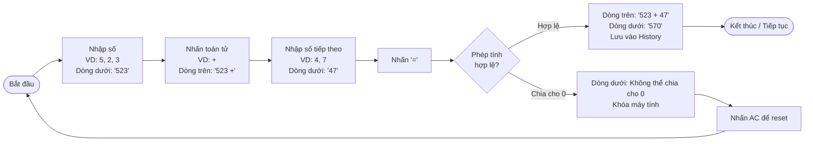
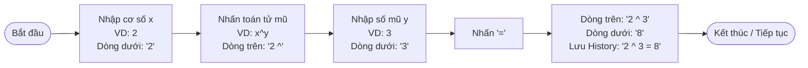
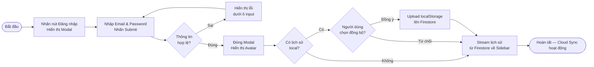

# BUSINESS REQUIREMENTS DOCUMENT (BRD) - Simple Calculator Web App

| Thông tin             | Chi tiết                        |
| :-------------------- | :------------------------------ |
| **Dự án**             | Simple Calculator Web App       |
| **Phiên bản**         | v2.0.0                          |
| **Cập nhật lần cuối** | 2026-06-08                      |
| **Trạng thái**        | DRAFT                           |
| **Tác giả**           | Nam (Product Owner & Developer) |

---

## REVISION HISTORY

| Phiên bản | Ngày       | Cập nhật bởi | Mô tả                                                                                    |
| :-------- | :--------- | :----------- | :--------------------------------------------------------------------------------------- |
| 1.0.0     | 2026-05-28 | Nam          | Phiên bản khởi tạo theo quy trình Spec-Driven Development                               |
| 2.0.0     | 2026-06-08 | Nam          | Nâng cấp lớn: thêm Scientific Mode, Dark/Light Mode, Cloud History Sync, Authentication |

---

## 1. PROJECT OVERVIEW

Simple Calculator Web App là ứng dụng máy tính chạy trên trình duyệt, xây dựng bằng HTML, CSS và JavaScript thuần. Đây là dự án thực hành phương pháp **Spec-Driven Development** — toàn bộ tài liệu đặc tả (BRD → SAD → DBD → FS) phải được phê duyệt trước khi bắt đầu viết code.

- **Mục đích:** Nâng cấp máy tính web thành ứng dụng **trực tuyến** hỗ trợ tính toán khoa học tức thời (Scientific Mode), thay đổi giao diện linh hoạt (Dark/Light Mode), và đồng bộ lịch sử tính toán cá nhân lên đám mây (Cloud Sync) thông qua Authentication.
- **Giá trị kinh doanh:** Mở rộng đối tượng người dùng sang học sinh, sinh viên và kỹ sư có nhu cầu tính toán khoa học. Tính năng Cloud Sync tạo ra giá trị cá nhân hóa và giữ chân người dùng lâu dài.
- **Người dùng mục tiêu:** Học sinh, sinh viên, kỹ sư và người dùng phổ thông (nhân viên văn phòng) — cần thực hiện từ phép tính đơn giản đến các phép toán khoa học nhanh chóng trực tiếp trên trình duyệt, trên mọi thiết bị.
- **Nguyên tắc kỹ thuật cốt lõi:**
  - **Zero build step:** Chạy bằng cách mở `index.html` trực tiếp, không cần build step phức tạp.
  - **Tích hợp đám mây gọn nhẹ:** Kết nối Firebase Services qua CDN, không cần npm hay backend riêng.


---

## 2. PROBLEMS & OPPORTUNITIES

### Problems

- **Không lưu lịch sử tính toán:** Người dùng thực hiện hàng chục phép tính mỗi ngày nhưng không thể tra cứu lại kết quả trước đó; phải tính lại từ đầu khi cần kiểm tra.
- **Không đồng bộ giữa các thiết bị:** Mỗi thiết bị là một phiên độc lập — người dùng tính toán trên máy tính văn phòng không xem lại được trên điện thoại.
- **Thiếu tính năng khoa học:** Học sinh, sinh viên và kỹ sư phải mở thêm ứng dụng khác (máy tính vật lý, Wolfram Alpha, Google) để thực hiện các phép toán như lượng giác, căn bậc n, logarithm — gián đoạn luồng làm việc.
- **Giao diện không linh hoạt:** Ứng dụng chỉ có một giao diện tối cố định, không phù hợp với môi trường ánh sáng ban ngày hoặc sở thích người dùng — thiếu trải nghiệm cá nhân hóa.

### Opportunities

- **Lịch sử tính toán cá nhân hóa:** Lưu và đồng bộ lịch sử phép tính trên mọi thiết bị thông qua tài khoản — người dùng luôn có thể tra cứu lại kết quả cũ bất kỳ lúc nào, bất kỳ đâu.
- **Mở rộng đối tượng người dùng:** Tích hợp Scientific Mode thu hút học sinh, sinh viên và kỹ sư — giúp họ không cần rời khỏi ứng dụng để thực hiện phép toán khoa học.
- **Trải nghiệm giao diện linh hoạt:** Dark/Light Mode cho phép người dùng tùy chỉnh giao diện theo sở thích và môi trường — cải thiện comfort khi dùng lâu dài.
- **Truy cập tức thì, không rào cản:** Chỉ cần URL — không cài đặt, không đăng ký bắt buộc, nhất quán trên mọi hệ điều hành và thiết bị.
- **Chi phí vận hành thấp:** Firebase Spark Plan miễn phí cho quy mô nhỏ — Cloud Sync hoạt động ổn định mà không cần đầu tư server riêng.


---

## 3. PROJECT OBJECTIVES

- **Đơn giản tuyệt đối:** Người dùng mới có thể thực hiện phép tính đầu tiên nhanh chóng (kỳ vọng trong vòng 10 giây đầu), không cần đọc hướng dẫn sử dụng.
- **Chính xác và tin cậy:** Mọi phép tính — bao gồm cả tính toán khoa học — cho kết quả đúng; tất cả trường hợp đặc biệt đều được xử lý tường minh và không crash.
- **Hiệu năng tính toán tức thì:** Kết quả phép tính cơ bản và khoa học phản hồi tức thời, mang lại trải nghiệm mượt mà không có độ trễ cảm nhận được.
- **Chuyển đổi giao diện mượt mà:** Việc chuyển đổi chế độ sáng/tối diễn ra mượt mà thông qua hiệu ứng chuyển cảnh, không gây giật lag hay reload lại trang. Theme được áp dụng trước khi trang render để tránh lỗi flash giao diện (FOUC).
- **Luồng Đăng nhập & Đăng ký tối ưu:** Form được validate trực quan ngay khi nhập liệu để giảm thiểu tỷ lệ submit form lỗi. Modal đăng nhập tự động đóng và cập nhật trạng thái giao diện ngay khi phiên xác thực thành công.
- **Cloud Sync tin cậy:** Đồng bộ hóa dữ liệu lịch sử nhanh chóng giữa local và Firestore khi thiết bị kết nối mạng. Đảm bảo ứng dụng hoạt động ngoại tuyến ổn định, không mất mát dữ liệu và không làm gián đoạn trải nghiệm tính toán khi mất kết nối.
- **Mở rộng tính năng có kiểm soát:** Thêm Scientific Mode và Cloud Sync mà không làm phức tạp hóa hoặc thay đổi hành vi luồng tính toán cơ bản (F-001 → F-005) của v1.0.0.
- **Thực hành đúng quy trình:** Bộ tài liệu spec đầy đủ (BRD → SAD → DBD → FS) được hoàn thành và phê duyệt trước khi viết bất kỳ dòng code nào.


---

## 4. PROJECT SCOPE

### 4.1 In Scope — Tính năng kế thừa từ v1.0.0 (F-001 → F-005)

12 tính năng cốt lõi của v1.0.0 được tổng hợp lại thành 5 nhóm chức năng để tài liệu súc tích hơn. Toàn bộ hành vi được giữ nguyên, không thay đổi:

| ID    | Tính năng                | Mô tả |
| :---- | :----------------------- | :-------------------------------------------------------------------------------- |
| F-001 | Các phép tính số học cơ bản | Cộng, trừ, nhân, chia (+, −, ×, ÷) số nguyên hoặc thập phân; làm tròn kết quả thập phân tối đa 10 chữ số. |
| F-002 | Nhập liệu từ giao diện và bàn phím | Hỗ trợ nhập chữ số và số thập phân (tối đa một dấu "."); tự động giới hạn mỗi toán hạng tối đa 15 chữ số; nhận tín hiệu từ cả phím bấm UI và bàn phím vật lý. |
| F-003 | Các chức năng xóa và sửa lỗi nhập | Nút AC để reset ứng dụng về trạng thái ban đầu; nút ⌫ để xóa chữ số cuối đang nhập. |
| F-004 | Xử lý hiển thị nâng cao | Hiển thị dấu "−" cho kết quả âm; tự động chuyển sang ký hiệu khoa học (`1.5e+20`) khi kết quả vượt quá 15 chữ số. |
| F-005 | Xử lý lỗi chia cho 0 | Phát hiện chia cho 0, hiển thị thông báo lỗi rõ ràng, khóa các phím chức năng cơ bản/khoa học cho đến khi nhấn AC. |

### 4.2 In Scope — Tính năng mới v2.0.0 (F-006 → F-011)

Các tính năng được triển khai lần đầu trong v2.0.0, bao gồm cả các tính năng vốn là Out-of-Scope của v1.0.0:

| ID    | Tính năng                                     | Mô tả nghiệp vụ |
| :---- | :-------------------------------------------- | :-------------------------------------------------------------------------------- |
| F-006 | Phần trăm (%)                                 | Chuyển giá trị hiện tại thành phần trăm (chia cho 100) khi nhấn `%` và nhấn `=`. |
| F-007 | Các hàm lượng giác | Hỗ trợ tính toán lượng giác gồm `sin`, `cos`, `tan`, `asin`, `acos`, `atan` bằng cách nhấn phím hàm, nhập giá trị (hoặc ngược lại) và nhấn `=` để ra kết quả; tích hợp nút chuyển đổi đơn vị góc DEG/RAD. |
| F-008 | Các hàm logarithm và lũy thừa/căn thức | Tính toán các hàm logarithm (`log`, `ln`), hàm mũ và căn thức (`x^y`, `x^2`, `x^3`, `√x`, `³√x`, `n!`, `|x|`, `ʸ√x`) bằng cách nhấn phím hàm, nhập giá trị (hoặc ngược lại) và nhấn `=` để ra kết quả, cùng phím nhập hằng số $\pi$ và $e$. |
| F-009 | Dark Mode / Light Mode                        | Chuyển đổi giao diện sáng/tối mượt mà, lưu tùy chọn vào `localStorage` và tự động áp dụng theme OS nếu chưa chọn. |
| F-010 | Quản lý lịch sử tính toán hai tầng | Lưu trữ lịch sử cục bộ (Tier 1, tối đa 50 phép tính gần nhất) và đồng bộ lên Firebase Firestore (Tier 2, tối đa 200 bản ghi) khi người dùng đăng nhập. |
| F-011 | Đăng nhập & Đăng ký (Firebase Authentication) | Xác thực người dùng bằng Email/Password qua Firebase Auth bằng modal popup; tự động kích hoạt Cloud Sync sau khi đăng nhập thành công. |

### 4.3 Out of Scope — v2.0.0

| Tính năng | Lý do loại trừ / Kế hoạch |
| :--- | :--- |
| Copy kết quả ra clipboard | Còn trong backlog — chưa có nhu cầu rõ ràng; có thể thêm ở phiên bản patch sau |
| **Expression Parser (PEMDAS)** | Nhập biểu thức dài để tính toán — đòi hỏi refactor toàn bộ engine; dời sang v2.1.0 |
| **Equation Display** | Hiển thị biểu thức dạng toán học đẹp ở dòng phụ — phụ thuộc PEMDAS; dời sang v2.1.0 |
| **Equation Solver** | Giải phương trình bậc nhất, bậc hai, hệ 2 ẩn — dời sang v2.1.0 |
| Đăng nhập bằng mạng xã hội | Tối giản hóa cấu hình Firebase ở v2.0.0; dời sang v2.1.0 |
| Graphing Calculator | Vẽ đồ thị hàm số — dời sang v3.0.0 |


---

## 5. BUSINESS PROCESS FLOW

> **Lưu ý về giao diện:** Màn hình có **hai dòng**:
> - **Dòng trên (nhỏ hơn):** Hiển thị biểu thức đang nhập, ví dụ `5 +` hoặc `√(9)`.
> - **Dòng dưới (lớn hơn):** Hiển thị số đang nhập hoặc kết quả cuối cùng.

### 5.1 Luồng tính toán cơ bản (kế thừa v1.0.0 — không thay đổi)



### 5.2 Luồng tính toán khoa học 1 toán hạng

```mermaid
flowchart TD
    A([Bắt đầu]) --> B{Kiểu hàm?}
    B -- Prefix\nVD: sin, √ --> C[Nhấn phím hàm\nVD: √\nDòng trên: '√(0)'\nDòng dưới: '0']
    C --> D[Nhập số\nVD: 9\nDòng trên: '√(9)'\nDòng dưới: '9']
    D --> G[Nhấn '=']
    
    B -- Postfix\nVD: x², % --> E[Nhập số\nVD: 5\nDòng dưới: '5']
    E --> F[Nhấn phím hàm\nVD: x²\nDòng trên: '(5)²'\nDòng dưới: '5']
    F --> G
    
    G --> H{Giá trị\nhợp lệ?}
    H -- Hợp lệ --> I[Dòng trên: '√(9)' hoặc '(5)²'\nDòng dưới: '3' hoặc '25'\nLưu History]
    H -- Không hợp lệ\nVD: √ số âm --> J[Dòng dưới: Lỗi toán học\nKhóa máy tính]
    I --> K([Kết thúc / Tiếp tục])
    J --> L[Nhấn AC để reset]
    L --> A
```

### 5.3 Luồng tính toán khoa học 2 toán hạng



### 5.4 Luồng Authentication & Cloud Sync (mới v2.0.0)



---

## 6. BUSINESS RULES

### Quy tắc kế thừa từ v1.0.0 (BR-01 → BR-06)

| ID | Tên quy tắc | Chi tiết nghiệp vụ |
| :--- | :--- | :--- |
| **BR-01** | **Biểu thức đơn giản** | v2.0.0 vẫn chỉ hỗ trợ dạng `operand1 operator operand2`. Không xử lý chuỗi phép tính có ưu tiên (ví dụ: `2 + 3 × 4`). *(Expression Parser để v2.1.0)* |
| **BR-02** | **Tiếp tục sau kết quả** | Sau khi nhấn "=", nếu người dùng nhấn **toán tử** → kết quả hiện tại trở thành operand1 mới. Nếu nhấn **chữ số** → bắt đầu phép tính mới hoàn toàn. |
| **BR-03** | **Giới hạn 15 chữ số** | Mỗi toán hạng không vượt quá 15 chữ số. Khi đạt giới hạn, các phím số không có tác dụng cho đến khi người dùng xóa. |
| **BR-04** | **Một dấu thập phân** | Mỗi toán hạng chỉ chấp nhận một dấu ".". Nhấn "." lần thứ hai bị bỏ qua. |
| **BR-05** | **Khóa sau lỗi chia cho 0** | Khi xảy ra lỗi, mọi phím số, toán tử cơ bản, và các nút chức năng khoa học (ngoại trừ AC, nút chuyển Theme, nút đăng nhập/đăng xuất, nút Sidebar lịch sử) đều bị vô hiệu hóa. Chỉ AC mới reset máy tính về trạng thái bình thường. |
| **BR-06** | **Làm tròn kết quả** | Kết quả thập phân được làm tròn tối đa 10 chữ số sau dấu phẩy, tránh hiển thị lỗi floating-point (`0.1 + 0.2` → `0.3`). |

### Quy tắc mới v2.0.0 (BR-07 → BR-11)

| ID | Tên quy tắc | Chi tiết nghiệp vụ |
| :--- | :--- | :--- |
| **BR-07** | **Đồng bộ hóa lịch sử** | Khi đăng nhập thành công và phát hiện có lịch sử local chưa được đồng bộ, hỏi người dùng có muốn đồng bộ (đẩy) toàn bộ lịch sử đang lưu ở `localStorage` lên Firestore để đồng nhất dữ liệu. |
| **BR-08** | **Offline mode** | Khi mất kết nối internet, khóa Đăng nhập/Đăng ký và đồng bộ Cloud trực tiếp. Máy tính vẫn hoạt động bình thường, ghi nhận các phép tính mới vào `localStorage`. Khi kết nối internet được khôi phục và người dùng đang ở trạng thái đăng nhập, ứng dụng sẽ tự động đồng bộ (reconcile) các phép tính mới này lên Firestore. |
| **BR-09** | **Giới hạn hiển thị kết quả khoa học** | Kết quả phép tính khoa học vượt quá 15 chữ số tự động chuyển về ký hiệu khoa học (Exponential notation). |
| **BR-10** | **Đơn vị lượng giác** | Mặc định khởi động là DEG (hoặc lấy từ tùy chọn đã lưu). Trạng thái DEG/RAD được lưu vào `localStorage` giống như Dark/Light Mode. Có nút toggle DEG/RAD và badge hiển thị rõ trạng thái đơn vị góc trên màn hình. |
| **BR-11** | **Lỗi toán học khoa học** | Các phép toán khoa học không hợp lệ (như căn bậc hai số âm $\sqrt{-4}$, giai thừa số âm hoặc số thập phân như $-3!$, $5.5!$, hoặc lượng giác/logarithm ngoài miền xác định như $asin(2)$, $ln(-1)$) sẽ đưa máy tính về trạng thái lỗi (isError = true), hiển thị thông báo lỗi `"Lỗi toán học"` hoặc `"Lỗi tính toán"` ở dòng kết quả, và khóa các phím tương tự BR-05. |

---

## 7. FUNCTIONAL REQUIREMENTS

Danh sách chức năng đầy đủ theo ID đã được mô tả chi tiết tại **Section 4 — Project Scope**. Bảng dưới đây là bảng tổng hợp nhanh để tra cứu chéo:

| ID | Feature Group | Thuộc phiên bản |
| :-- | :---------------------- | :-------------- |
| F-001 | Các phép tính số học cơ bản | Kế thừa v1.0.0 |
| F-002 | Nhập liệu từ giao diện và bàn phím | Kế thừa v1.0.0 |
| F-003 | Các chức năng xóa và sửa lỗi nhập | Kế thừa v1.0.0 |
| F-004 | Xử lý hiển thị nâng cao | Kế thừa v1.0.0 |
| F-005 | Xử lý lỗi chia cho 0 | Kế thừa v1.0.0 |
| F-006 | Phần trăm (%) | Mới v2.0.0 |
| F-007 | Các hàm lượng giác | Mới v2.0.0 |
| F-008 | Các hàm logarithm và lũy thừa/căn thức | Mới v2.0.0 |
| F-009 | Dark Mode / Light Mode | Mới v2.0.0 |
| F-010 | Quản lý lịch sử tính toán hai tầng | Mới v2.0.0 |
| F-011 | Đăng nhập & Đăng ký (Firebase Authentication) | Mới v2.0.0 |

---

## 8. NON-FUNCTIONAL REQUIREMENTS

- **Hiệu năng:** Giao diện phản hồi tức thời đối với các phép tính cơ bản và khoa học. Thời gian tải trang ban đầu tối ưu để người dùng có thể sử dụng ngay lập tức.
- **Offline-first:** Toàn bộ tính năng tính toán và lịch sử local hoạt động ngay sau lần tải đầu, không phụ thuộc vào internet. Tính năng Cloud Sync bị khóa khi offline.
- **Tương thích trình duyệt:** Hoạt động đúng trên Chrome, Firefox, Safari, Edge (2 phiên bản mới nhất); không dùng API thực nghiệm.
- **Responsive:** Giao diện sử dụng được trên Desktop (≥ 1024px) và Mobile (≥ 375px) mà không mất chức năng. Bàn phím Scientific co giãn linh hoạt.
- **Bảo mật Cloud:** Firestore Security Rules chặt chẽ — mỗi người dùng chỉ đọc/ghi được lịch sử của chính họ (`request.auth.uid == userId`).
- **Maintainability:** Code tổ chức theo đúng spec; mỗi Business Rule có test case tương ứng trong FS; tích hợp CDN (Firebase) không làm vỡ chức năng offline-first.

---

## 9. SUCCESS METRICS

- **Time-to-first-calculation ≤ 10 giây:** Người dùng mới hoàn thành phép tính đầu tiên trong 10 giây kể từ khi mở ứng dụng, không cần hướng dẫn.
- **Độ chính xác 100%:** Mọi kết quả — bao gồm cả phép tính khoa học — khớp với expected output trong bộ test case định nghĩa trong [FUNCTION_SPECIFICATION_v2.0.0.md](file:///Users/nam/Desktop/calculator/docs/v2.0.0/FUNCTION_SPECIFICATION_v2.0.0.md).
- **Zero crash:** Không có tổ hợp input nào khiến ứng dụng rơi vào trạng thái không nhất quán, kể cả khi offline hoặc Firebase không khả dụng.
- **Cloud Sync hoạt động đúng:** Lịch sử đồng bộ chính xác giữa các thiết bị khi đăng nhập cùng tài khoản.
- **Spec-first compliance:** 100% tính năng trong scope được mô tả đầy đủ trong FS trước khi code tương ứng được viết.

---

## 10. NOTES

- Tài liệu này mô tả yêu cầu ở cấp độ nghiệp vụ. Mọi chi tiết kỹ thuật triển khai thuộc phạm vi các tài liệu cấp dưới.
- Chi tiết hành vi UI, trạng thái màn hình và test scenarios → xem **[FUNCTION_SPECIFICATION_v2.0.0.md](file:///Users/nam/Desktop/calculator/docs/v2.0.0/FUNCTION_SPECIFICATION_v2.0.0.md)**.
- Cấu trúc file, module JS và luồng dữ liệu → xem **[SYSTEM_ARCHITECTURE_v2.0.0.md](file:///Users/nam/Desktop/calculator/docs/v2.0.0/SYSTEM_ARCHITECTURE_v2.0.0.md)**.
- Schema Firestore và localStorage → xem **[DATABASE_DESIGN_v2.0.0.md](file:///Users/nam/Desktop/calculator/docs/v2.0.0/DATABASE_DESIGN_v2.0.0.md)**.
- Firebase yêu cầu HTTPS cho Authentication — chạy local cần dùng `python3 -m http.server` hoặc deploy lên GitHub Pages/Netlify thay vì mở `file://` trực tiếp.

---

END OF DOCUMENT
