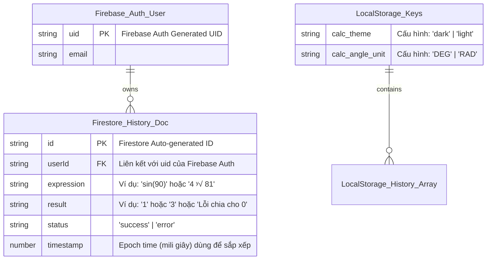

# DATABASE DESIGN DOCUMENT - Simple Calculator Web App

| Thông tin            | Chi tiết                                                         |
| :------------------ | :--------------------------------------------------------------- |
| **Dự án**            | Simple Calculator Web App                                        |
| **Phiên bản**        | v2.0.0                                                           |
| **Ngày cập nhật**    | 2026-06-08                                                       |
| **Trạng thái**       | DRAFT (Bản thiết kế thực tế cho v2.0.0)                          |
| **Công nghệ lưu trữ**| Local Storage (Tier 1) & Firebase Firestore Cloud NoSQL (Tier 2) |
| **Tác giả**          | Nam (Product Owner & Developer)                                  |

---

## NHẬT KÝ THAY ĐỔI

| Version | Ngày       | Người sửa | Mô tả thay đổi                                                                                     |
| :------ | :--------- | :-------- | :------------------------------------------------------------------------------------------------- |
| 1.0.0   | 2026-05-31 | Nam       | Phiên bản giả lập SQLite phục vụ học tập (không implement thực tế)                                 |
| 2.0.0   | 2026-06-08 | Nam       | Thiết kế thực tế cho v2.0.0: Đồng bộ 2 tầng dùng Local Storage (Tier 1) và Firebase Firestore NoSQL (Tier 2) |

---

## 1. ENTITY RELATIONSHIP DIAGRAM (ERD)

Hệ thống lưu trữ của Calculator Web App v2.0.0 được phân cấp thành hai tầng chính nhằm hỗ trợ tối đa tính năng offline-first và tối ưu chi phí vận hành:
- **Tier 1 — Cục bộ (Local Persistence):** Sử dụng Web Storage API (`localStorage`) của trình duyệt để lưu cấu hình ứng dụng (Theme, đơn vị đo góc), lịch sử tính toán tạm thời khi chưa đăng nhập (tối đa 50 phép tính) và hàng đợi đồng bộ ngoại tuyến (`offlineQueue`).
- **Tier 2 — Đám mây (Cloud Persistence):** Sử dụng Firebase Firestore làm cơ sở dữ liệu NoSQL đám mây để đồng bộ hóa lịch sử phép tính (tối đa 200 phép tính gần nhất cho mỗi tài khoản đã đăng nhập).

Firestore là một CSDL NoSQL hướng tài liệu (document-oriented), do đó mô hình dữ liệu sẽ được thiết kế dưới dạng tập hợp các Collection và Document JSON, liên kết logic với Firebase Authentication thông qua thuộc tính `userId`.



---

## 2. TABLE DEFINITIONS

### 2.1. local_config
Lưu trữ cấu hình cục bộ của người dùng trên trình duyệt (Local Storage).
- `calc_theme` (VARCHAR(5)): Giao diện hiện tại của ứng dụng (`'dark'` hoặc `'light'`). Mặc định tự phát hiện theo hệ điều hành.
- `calc_angle_unit` (VARCHAR(3)): Đơn vị đo góc cho các phép tính lượng giác (`'DEG'` hoặc `'RAD'`). Mặc định là `'DEG'`.

### 2.2. calculation_history
Lưu lịch sử phép tính đã thực hiện. Thực thể này được sử dụng chung cho cả Local Storage (mảng lưu cache cục bộ và mảng hàng đợi ngoại tuyến) và Cloud Firestore (mỗi phép tính là một Document trong collection `history`).
- `id` (VARCHAR(36), PK): ID duy nhất của phép tính (UUID v4 tự sinh ở Client hoặc Firestore Document ID).
- `userId` (VARCHAR(36), FK): UID người dùng từ Firebase Auth (null nếu chưa đăng nhập hoặc tính offline).
- `expression` (VARCHAR(100)): Biểu thức toán học hoàn chỉnh (ví dụ: `"sin(90)"`, `"2 ^ 3"`).
- `result` (VARCHAR(50)): Kết quả hiển thị của phép tính, hoặc nội dung thông báo lỗi.
- `status` (VARCHAR(10)): Trạng thái phép toán (`"success"` hoặc `"error"`).
- `timestamp` (BIGINT): Thời gian thực hiện phép tính dưới dạng Unix Epoch Time (milliseconds).

**Ví dụ dữ liệu:**

| id | userId | expression | result | status | timestamp |
| :--- | :--- | :--- | :--- | :--- | :--- |
| `doc_12345` | `user_abc123` | `sin(90)` | `1` | `success` | `1780447380000` |
| `doc_67890` | `user_abc123` | `10 ÷ 0` | `Không thể chia cho 0` | `error` | `1780447400000` |
| `doc_11121` | `user_xyz789` | `2 ^ 3` | `8` | `success` | `1780447450000` |

---

## 3. BUSINESS RULES ÁNH XẠ VÀO DATABASE

| Business Rule (từ BRD v2.0.0) | Ánh xạ vào DB |
| :--- | :--- |
| **BR-05 / BR-11 (Lỗi chia cho 0 & Lỗi khoa học)** | Khi xảy ra lỗi: `status = 'error'`, `result = 'Không thể chia cho 0'` hoặc `'Lỗi toán học'`, và `expression` lưu dạng biểu thức lỗi (ví dụ: `10 ÷ 0` hoặc `sin(invalid)`). |
| **BR-09 (Ký hiệu khoa học)** | Trường `result` lưu chuỗi đã định dạng khoa học (ví dụ: `8.99e+15`) nếu kết quả vượt quá 15 chữ số trước khi ghi vào database. |
| **BR-08 (Mất mạng và đồng bộ)** | Phép toán offline ghi vào mảng cache `calc_local_history` đồng thời xếp vào `calc_offline_queue`. Khi có mạng trở lại, đọc mảng queue, đẩy tuần tự lên Firestore, sau đó xóa rỗng queue. |
| **F-010 (Giới hạn lịch sử hiển thị)** | - Khi query Firestore để nạp Sidebar: sử dụng `.where("userId", "==", uid).orderBy("timestamp", "desc").limit(200)` để chỉ lấy tối đa 200 bản ghi gần nhất.<br>- Khi ghi offline vào `calc_local_history`: nếu mảng đạt chiều dài 50, thực hiện `shift()` để xóa phần tử cũ nhất trước khi `push()` phần tử mới. |

---

## 4. INDEXES & PERFORMANCE

| Index Name | Bảng | Cột | Lý do |
| :--- | :--- | :--- | :--- |
| `idx_history_userId` | `calculation_history` | `userId` | Lọc danh sách lịch sử theo từng người dùng cụ thể. |
| `idx_history_timestamp` | `calculation_history` | `timestamp` | Sắp xếp lịch sử hiển thị theo thứ tự thời gian giảm dần. |
| `composite_user_timestamp` | `calculation_history` | `userId` (Asc), `timestamp` (Desc) | Chỉ mục hỗn hợp (Composite Index) bắt buộc trên Firestore để chạy query lọc theo user kết hợp sắp xếp. |

### Ràng buộc Bảo mật (Firestore Security Rules)
Để bảo vệ dữ liệu lịch sử riêng tư của mỗi tài khoản, cấu hình phân quyền trên Firestore được cài đặt nghiêm ngặt:

```javascript
rules_version = '2';
service cloud.firestore {
  match /databases/{database}/documents {
    match /history/{document} {
      // Cho phép đọc và xóa nếu UID người dùng đang đăng nhập khớp với thuộc tính userId trong tài liệu
      allow read, delete: if request.auth != null && request.auth.uid == resource.data.userId;
      
      // Cho phép tạo mới hoặc cập nhật nếu UID người dùng khớp với trường userId dữ liệu chuẩn bị ghi
      allow create, update: if request.auth != null && request.auth.uid == request.resource.data.userId;
    }
  }
}
```

---

## 5. NOTES

- **Mock Fallback Storage (`calc_mock_cloud_history`):**
  - Nhằm mục đích phục vụ kiểm thử khi chưa cấu hình Firebase (`isFirebaseConfigured = false`), hệ thống sử dụng một key local `calc_mock_cloud_history` để giả lập cơ sở dữ liệu đám mây Firestore ngay tại Local Storage.
  - Cấu trúc phần tử hoàn toàn giống với schema của lịch sử Firestore. Nó có giới hạn tối đa 200 phần tử (FIFO) và được lọc theo `userId` giả lập tương ứng khi hiển thị.
- **Tính năng Offline-First:**
  - Toàn bộ cơ chế đồng bộ được tối ưu hóa để giảm số lượng kết nối mạng thừa. Hệ thống luôn đọc dữ liệu từ local cache trước tiên và chỉ đồng bộ lên Cloud khi trạng thái mạng online được phát hiện (qua sự kiện `online` của trình duyệt) và người dùng đã đăng nhập thành công.

---

END OF DOCUMENT
