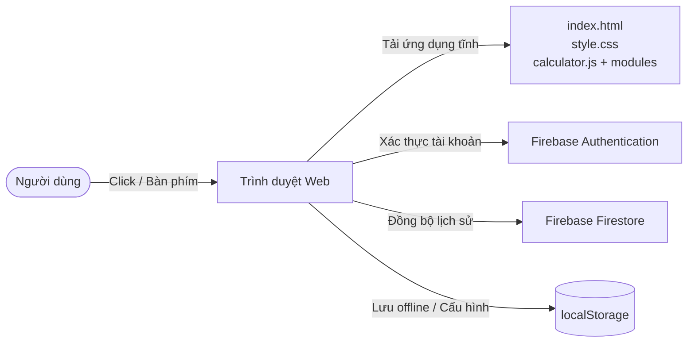
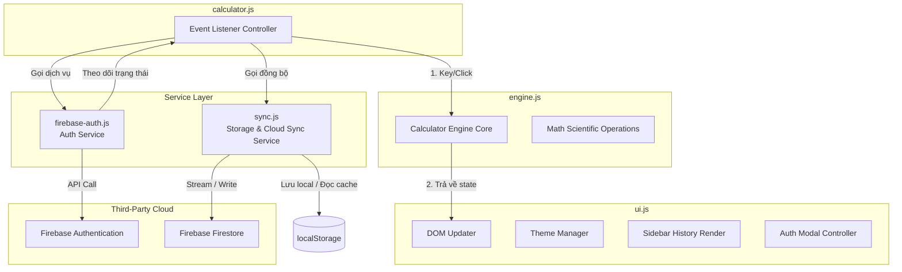
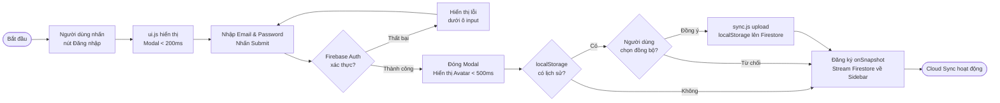
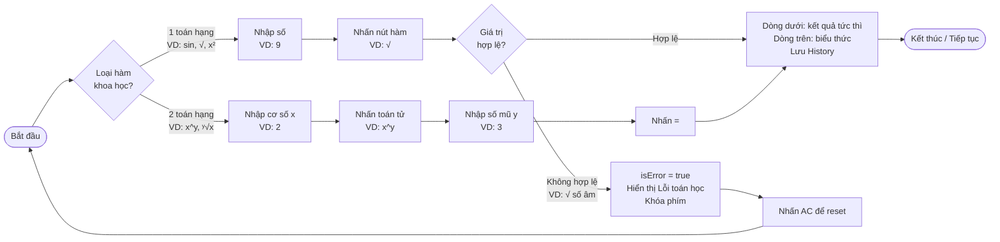
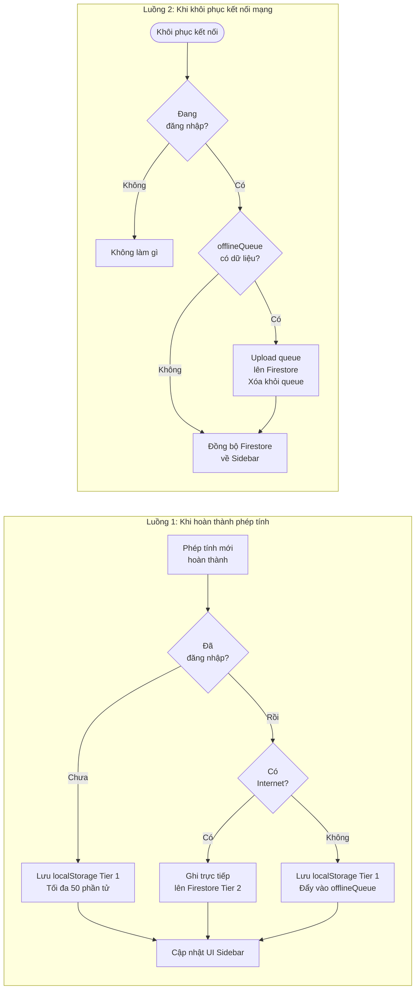
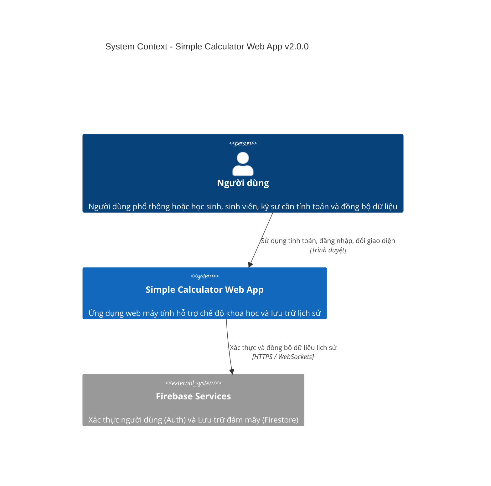
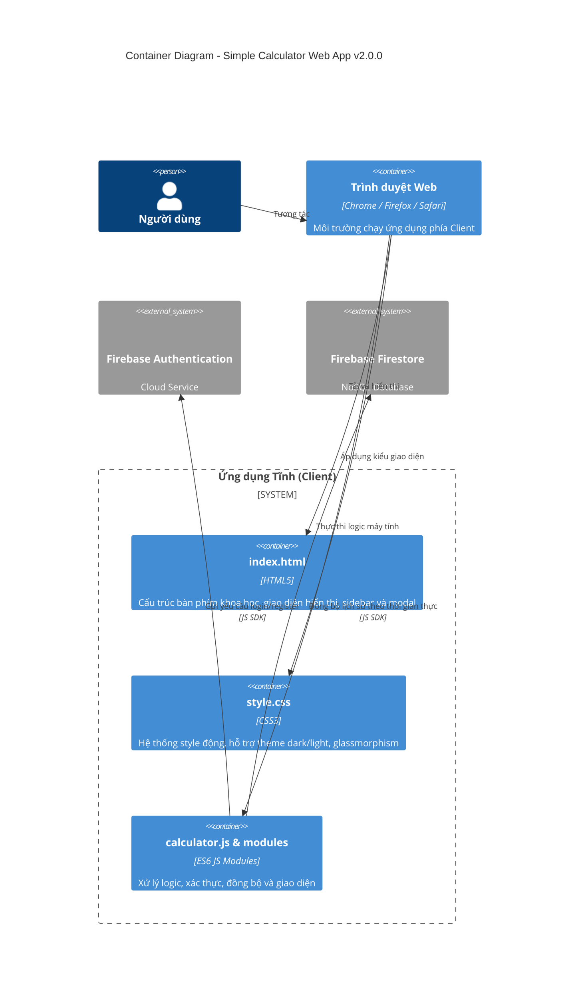
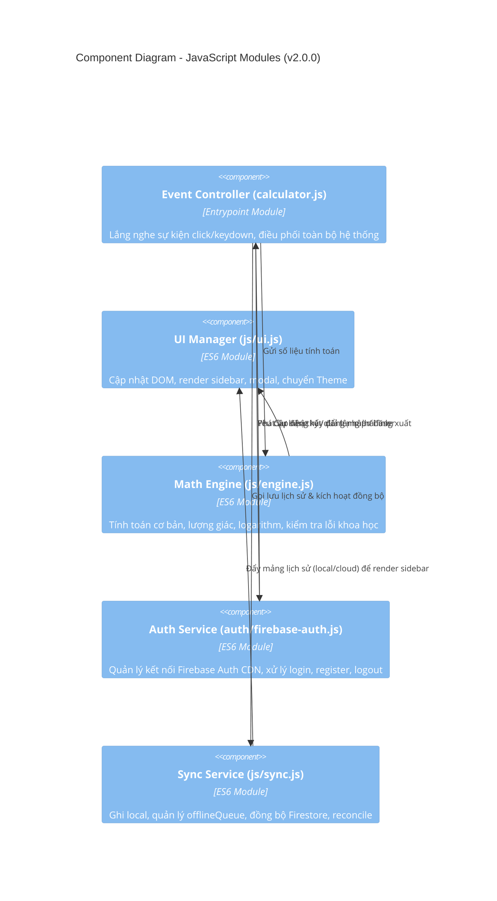

# SYSTEM ARCHITECTURE DOCUMENT (SAD) - Simple Calculator Web App

| Thông tin         | Chi tiết                        |
| :---------------- | :------------------------------ |
| **Dự án**         | Simple Calculator Web App       |
| **Phiên bản**     | v2.0.0                          |
| **Ngày cập nhật** | 2026-06-08                      |
| **Trạng thái**    | DRAFT                           |
| **Tác giả**       | Nam (Product Owner & Developer) |

---

## NHẬT KÝ THAY ĐỔI

| Version | Ngày       | Người sửa | Mô tả thay đổi                 |
| :------ | :--------- | :-------- | :------------------------------ |
| 1.0.0   | 2026-05-29 | Nam       | Tài liệu kiến trúc ban đầu      |
| 2.0.0   | 2026-06-08 | Nam       | Nâng cấp kiến trúc: thêm Scientific Mode, Dark/Light Mode, Cloud History Sync, Firebase Authentication |

---

## Section 1: Introduction and Goals

Simple Calculator v2.0.0 nâng cấp từ ứng dụng tĩnh chỉ chạy trên RAM thành ứng dụng web đám mây gọn nhẹ, hỗ trợ đồng bộ lịch sử tính toán cá nhân (Cloud Sync), xác thực người dùng (Authentication), đổi giao diện (Dark/Light Mode), và bổ sung các hàm toán học nâng cao (Scientific Mode — F-006 đến F-008).

**Mục tiêu kiến trúc chính ở v2.0.0:**

- **Zero build step:** Tiếp tục duy trì nguyên tắc chạy trực tiếp qua `index.html` mà không cần build step (webpack, vite...) hay cài đặt Node.js.
- **Tách biệt mối quan tâm (Separation of Concerns):** Tách rõ phần tính toán (Engine), giao diện (View), điều phối sự kiện (Controller), xác thực (Auth Service) và lưu trữ đồng bộ (Storage & Sync Service).
- **Offline-First & Auto-Reconcile:** Hỗ trợ tính toán và lưu lịch sử offline hoàn toàn; tự động xếp hàng đợi (queue) và đẩy dữ liệu lên Firestore khi có mạng trở lại (BR-08).
- **Bảo mật tối thiểu:** Mỗi người dùng đăng nhập chỉ truy cập được lịch sử của riêng họ thông qua Firebase Security Rules.

---

## Section 2: Architecture Constraints

- **Ngôn ngữ:** HTML5, CSS3 Custom Properties (CSS variables), JavaScript ES6+ (chạy Module ES6 trực tiếp trong trình duyệt bằng `type="module"`).
- **Framework:** Không dùng bất kỳ UI framework nào (React, Vue, Angular). Vanilla JS thuần.
- **Thư viện:** Không dùng thư viện tính toán ngoài — tự implement toàn bộ logic trong `engine.js`.
- **Build tool:** Không có build step — file HTML mở trực tiếp trên trình duyệt hoặc qua máy chủ tĩnh đơn giản là chạy được.
- **Firebase integration:** Tích hợp Firebase Auth và Firestore qua URL CDN chính thức của Firebase SDK v10 (ES Modules).
- **Persistence:**
  - **Local:** `localStorage` lưu trữ Lịch sử Tier 1 (tối đa 50 phần tử), Theme (`dark`/`light`), Đơn vị lượng giác (`DEG`/`RAD`), và `offlineQueue`.
  - **Cloud:** Firebase Firestore lưu trữ Lịch sử Tier 2 (tối đa 200 phần tử gần nhất cho mỗi người dùng).

---

## Section 3: Context and Scope

Hệ thống kết nối với Firebase để lưu trữ lịch sử và xác thực tài khoản. Khi offline, kết nối tạm ngắt và ứng dụng tự động chuyển về chế độ lưu trữ cục bộ.



---

## Section 4: Data Architecture & Persistence

Ứng dụng có hai lớp persistence: **RAM** (trạng thái runtime) và **localStorage + Firestore** (trạng thái lâu dài).

**Trạng thái runtime của Calculator Engine** gồm các biến chính:

| Biến               | Kiểu dữ liệu    | Ý nghĩa                                                                          | Lưu trữ lâu dài |
| :----------------- | :-------------- | :------------------------------------------------------------------------------- | :-------------- |
| `currentInput`     | `string`        | Số đang hiển thị ở dòng dưới, đại diện cho operand hiện tại.                   | RAM             |
| `firstOperand`     | `string`        | Số thứ nhất đã được xác nhận trước khi chọn toán tử.                           | RAM             |
| `operator`         | `string`        | Toán tử đang chờ (`+`, `−`, `×`, `÷`, `ʸ√x`).                                  | RAM             |
| `waitingForSecond` | `boolean`       | Trạng thái đang chờ người dùng nhập toán hạng thứ hai.                          | RAM             |
| `shouldResetNext`  | `boolean`       | Cờ báo hiệu phép tính tiếp theo sẽ bắt đầu mới hoàn toàn.                      | RAM             |
| `isError`          | `boolean`       | `true` khi xảy ra lỗi chia cho 0 hoặc lỗi toán học khoa học.                  | RAM             |
| `_errorMessage`    | `string`        | Nội dung thông báo lỗi hiển thị.                                                 | RAM             |
| `angleUnit`        | `string`        | Đơn vị góc cho hàm lượng giác: `'DEG'` hoặc `'RAD'`.                           | `localStorage`  |
| `theme`            | `string`        | Giao diện hiện tại: `'dark'` hoặc `'light'`.                                    | `localStorage`  |
| `user`             | `object\|null`  | Đối tượng thông tin người dùng đăng nhập từ Firebase Auth.                      | Session (SDK)   |
| `localHistory`     | `array`         | Danh sách tối đa 50 phép tính lưu cục bộ.                                       | `localStorage`  |
| `cloudHistory`     | `array`         | Danh sách tối đa 200 phép tính tải từ Firestore về.                             | Firestore       |
| `offlineQueue`     | `array`         | Hàng đợi các phép tính thực hiện khi offline, chờ sync.                         | `localStorage`  |
| `pendingUnary`     | `string\|null`  | Hàm một toán hạng đang chờ xử lý (ví dụ: `'sin'`, `'sqrt'`).                    | RAM             |
| `waitingForUnaryInput` | `boolean`   | Báo hiệu đang chờ người dùng nhập giá trị đối số cho hàm một toán hạng prefix. | RAM             |
| `unaryOperand`     | `string`        | Giá trị đối số được sử dụng cho hàm một toán hạng.                              | RAM             |

> Schema chi tiết của từng phần tử lịch sử (cấu trúc JSON, các trường `id`, `userId`, `expression`, `result`, `status`, `timestamp`) → xem **[DATABASE_DESIGN_v2.0.0.md](file:///Users/nam/Desktop/calculator/docs/v2.0.0/DATABASE_DESIGN_v2.0.0.md)**.

> Chi tiết các trạng thái chuyển đổi (state machine) và edge case → xem **[FUNCTION_SPECIFICATION_v2.0.0.md](file:///Users/nam/Desktop/calculator/docs/v2.0.0/FUNCTION_SPECIFICATION_v2.0.0.md)**.

---

## Section 5: Building Block View

### 5.1. Cấu trúc File Dự Án

```
calculator/
├── index.html              # Giao diện nâng cấp (bàn phím khoa học, sidebar lịch sử, modal auth)
├── style.css               # CSS Grid/Flexbox, hỗ trợ 2 Theme và thiết kế Glassmorphism
├── calculator.js           # Entrypoint — Lắng nghe sự kiện, điều phối toàn bộ hệ thống
├── auth/
│   └── firebase-auth.js    # Auth Service — bọc các hàm Firebase Auth, xử lý CDN
├── js/
│   ├── api-mock.js         # Mock Router Layer — chặn fetch, định tuyến API tới Service Layers
│   ├── engine.js           # Engine tính toán (cơ bản + lượng giác + logarithm + hàm mũ)
│   ├── sync.js             # Storage & Sync Service — localStorage, Firestore sync, offline queue
│   └── ui.js               # View Layer — cập nhật DOM, Sidebar, Modal, Theme Transition
└── docs/
    ├── v1.0.0/             # Tài liệu đặc tả phiên bản 1.0.0
    └── v2.0.0/             # Tài liệu đặc tả phiên bản 2.0.0
```

### 5.2. Phân Tầng Ứng Dụng (Layered Architecture)

Code được tổ chức theo 5 tầng logic rõ ràng, mỗi tầng có một trách nhiệm duy nhất:

| Tầng                          | File                    | Trách nhiệm                                                                               |
| :---------------------------- | :---------------------- | :---------------------------------------------------------------------------------------- |
| **View Layer**                | `js/ui.js`              | Đọc và cập nhật DOM — hiển thị số, biểu thức, lỗi; render Sidebar, Modal, chuyển Theme   |
| **Controller Layer**          | `calculator.js`         | Lắng nghe sự kiện (click nút, nhấn phím), chuyển đổi input thành lệnh cho Engine/Service |
| **Engine Layer**              | `js/engine.js`          | Xử lý logic tính toán thuần túy — phép tính cơ bản, hàm khoa học, validate, quản lý state |
| **Auth Service Layer**        | `auth/firebase-auth.js` | Quản lý kết nối Firebase Auth CDN, xử lý login, register, logout, theo dõi trạng thái    |
| **Storage & Sync Service Layer** | `js/sync.js`         | Ghi localStorage, quản lý offlineQueue, đồng bộ Firestore, reconcile khi khôi phục mạng  |

### 5.3. Sơ Đồ Component



---

## Section 6: Non-Functional Architecture Aspects

### 6.1 Hiệu Năng

- Tính toán cơ bản và khoa học 1 toán hạng (sin, √, x²...) xử lý trong RAM — kết quả hiển thị **< 50ms**.
- Phép tính 2 toán hạng (chia, nhân, cộng, trừ, x^y) xử lý **< 100ms** sau khi nhấn `=`.
- Tải trang lần đầu **< 2 giây** (bao gồm cả CDN Firebase).
- **Tránh Flash giao diện (FOUC):** Script đọc `theme` từ `localStorage` được đặt đồng bộ trong `<head>` trước khi render body, tránh hiện tượng màn hình nháy sai màu khi tải lại trang.

### 6.2 Xử Lý Lỗi

Lỗi được xử lý ở **Engine Layer** và truyền lên **View Layer** để hiển thị. Không có exception uncaught nào được phép bubble lên console.

| Loại lỗi                         | Cách xử lý                                                                           |
| :-------------------------------- | :----------------------------------------------------------------------------------- |
| Chia cho 0                        | Engine đặt `isError = true`; View hiển thị "Không thể chia cho 0"; khóa phím (BR-05) |
| Kết quả = `Infinity` / `NaN`      | Tương đương chia cho 0 — xử lý giống nhau                                            |
| Căn bậc hai số âm (√ số âm)       | Engine đặt `isError = true`; View hiển thị "Lỗi toán học" (BR-11)                   |
| Giai thừa số âm / thập phân       | Engine đặt `isError = true`; View hiển thị "Lỗi tính toán" (BR-11)                  |
| Logarithm / lượng giác ngoài miền | Engine đặt `isError = true`; View hiển thị "Lỗi toán học" (BR-11)                   |
| Floating-point rounding           | Kết quả được làm tròn tối đa 10 chữ số thập phân trước khi hiển thị (BR-06)         |

### 6.3 Bảo Mật Đám Mây (Cloud Security Rules)

Bảo mật phân quyền trực tiếp tại tầng Firestore — ngăn chặn đọc trộm hoặc giả mạo dữ liệu người dùng khác:

```javascript
rules_version = '2';
service cloud.firestore {
  match /databases/{database}/documents {
    match /history/{document} {
      allow read, delete: if request.auth != null && request.auth.uid == resource.data.userId;
      allow create, update: if request.auth != null && request.auth.uid == request.resource.data.userId;
    }
  }
}
```

### 6.4 Khả Năng Mở Rộng

Kiến trúc module hóa cho phép:
- Thêm hàm toán học mới chỉ cần bổ sung vào `engine.js` và thêm nút trong `index.html`.
- Tích hợp đăng nhập mạng xã hội chỉ cần mở rộng `firebase-auth.js` (kế hoạch v2.1.0).
- Nâng cấp Expression Parser (PEMDAS) chỉ cần thay thế `engine.js` mà không ảnh hưởng View hay Service Layer (kế hoạch v2.1.0).

---

## Section 7: Runtime View

### Luồng xác thực và đồng bộ lịch sử khi đăng nhập



### Luồng tính toán khoa học (Scientific Mode)



### Luồng offline-first và tự động đồng bộ



---

## Section 8: Deployment View

Để hỗ trợ Firebase Authentication một cách an toàn (yêu cầu môi trường HTTPS hoặc localhost):

| Môi trường              | Máy chủ lưu trữ                           | Giao thức                   | Cơ chế Firebase                                                                          |
| :---------------------- | :---------------------------------------- | :--------------------------- | :--------------------------------------------------------------------------------------- |
| **Local Development**   | `python3 -m http.server` hoặc `npx serve` | `http://localhost:port`      | Firebase Auth cho phép test trên `localhost`.                                            |
| **GitHub Pages**        | GitHub Pages (repo public/private)        | `https://` (HTTPS bắt buộc) | Đăng ký domain `username.github.io` vào "Authorized Domains". Lưu ý: không hỗ trợ custom 404 redirect. |
| **Vercel / Netlify**    | Vercel / Netlify (kéo thả hoặc Git CI)    | `https://` (HTTPS bắt buộc) | Đăng ký tên miền production vào "Authorized Domains". Hỗ trợ đầy đủ redirect và custom domain. |

---

## C4 Model Diagrams

### Level 1: System Context Diagram



### Level 2: Container Diagram



### Level 3: Component Diagram (JS Modules)



---

END OF DOCUMENT
