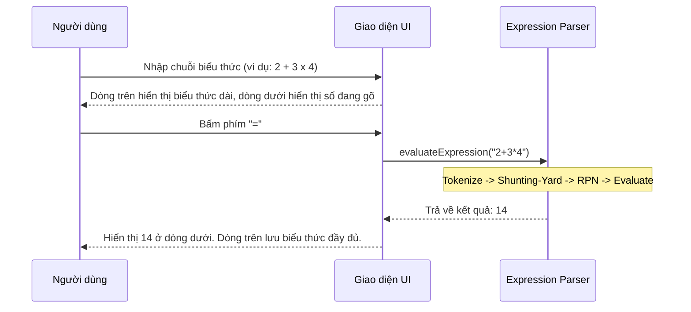
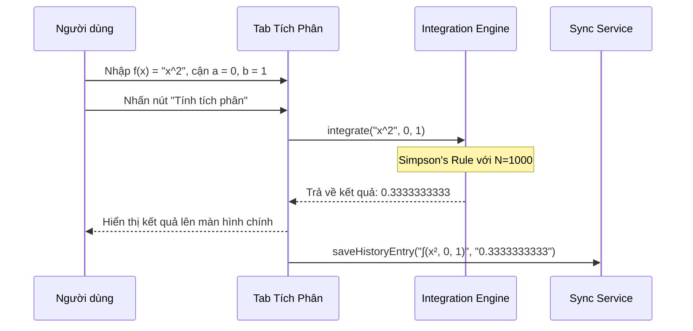

# BUSINESS REQUIREMENTS DOCUMENT (BRD) - Simple Calculator Web App v2.1.0

| Thông tin             | Chi tiết                        |
| :-------------------- | :------------------------------ |
| **Dự án**             | Simple Calculator Web App       |
| **Phiên bản**         | v2.1.0                          |
| **Cập nhật lần cuối** | 2026-06-05                      |
| **Trạng thái**        | DRAFT                           |
| **Tác giả**           | Nam (Product Owner & Developer) |

---

## REVISION HISTORY

| Phiên bản | Ngày       | Cập nhật bởi | Mô tả                                                                                    |
| :-------- | :--------- | :----------- | :--------------------------------------------------------------------------------------- |
| 1.0.0     | 2026-05-28 | Nam          | Phiên bản khởi tạo theo quy trình Spec-Driven Development                               |
| 2.0.0     | 2026-06-02 | Nam          | Nâng cấp lớn: thêm Scientific Mode, Dark/Light Mode, Cloud History Sync, Authentication |
| 2.1.0     | 2026-06-05 | Nam          | Nâng cấp tính năng nâng cao: PEMDAS Parser, Equation Display, Solver và Definite Integral|

---

## 1. PROJECT OVERVIEW

Simple Calculator Web App v2.1.0 là phiên bản nâng cấp tính năng toán học chuyên sâu. Ở các phiên bản trước (v1.0.0 & v2.0.0), máy tính chỉ hỗ trợ nhập liệu tuần tự 2 toán hạng (`operand1 operator operand2`). Khi người dùng có nhu cầu thực hiện các phép toán phức tạp hơn hoặc giải phương trình học tập, họ buộc phải chuyển sang các công cụ khác. 

Phiên bản v2.1.0 giải quyết bài toán này bằng cách tái cấu trúc Engine tính toán từ mô hình tuần tự sang mô hình **Bộ phân tích biểu thức (Expression Parser)**, hỗ trợ thứ tự ưu tiên PEMDAS, đồng thời tích hợp thêm các công cụ toán học thông dụng: **Bộ giải phương trình (Solver)** và **Bộ tính tích phân xác định (Definite Integral)**.

---

## 2. PROBLEMS & OPPORTUNITIES

### Problems

- **Tính toán tuần tự hạn chế:** Người dùng không thể nhập các biểu thức phức tạp dạng chuỗi như `2 + 3 × 4`. Máy tính v2.0.0 chỉ thực hiện phép tính ngay khi gõ toán tử tiếp theo, không tuân thủ thứ tự ưu tiên toán học tiêu chuẩn nếu không bấm từng bước thủ công.
- **Thiếu tính năng giải toán trường học:** Học sinh và sinh viên kỹ thuật thường xuyên phải giải các phương trình bậc hai, hệ phương trình cơ bản hoặc tính tích phân của các hàm số. Việc thiếu các công cụ này khiến ứng dụng chưa đáp ứng được nhu cầu thực tế của đối tượng người dùng mục tiêu (Scientific Mode).
- **Trải nghiệm hiển thị công thức nghèo nàn:** Màn hình chỉ hiển thị các biểu thức cơ bản, không hiển thị toàn bộ chuỗi phép tính dài đang nhập, gây khó khăn cho việc kiểm tra và chỉnh sửa.

### Opportunities

- **Tối ưu hóa khả năng học tập & làm việc:** Tích hợp bộ giải phương trình và tính tích phân số biến ứng dụng thành một trợ thủ học tập đắc lực cho học sinh, sinh viên cấp 3 và đại học.
- **Nâng tầm trải nghiệm toán học:** Bộ phân tích biểu thức PEMDAS chuẩn chỉ giúp trải nghiệm nhập liệu tự nhiên và chính xác như các dòng máy tính khoa học cầm tay cao cấp (Casio FX-580VNX, Texas Instruments).
- **Giữ nguyên tính kế thừa và bảo mật:** Toàn bộ dữ liệu lịch sử của các phép toán nâng cao (PEMDAS, Solver, Tích phân) vẫn được lưu trữ hai tầng (Local Storage & Firebase Cloud) đồng bộ theo cấu trúc bảo mật của v2.0.0.

---

## 3. PROJECT OBJECTIVES

- **Hỗ trợ biểu thức dài tùy ý:** Cho phép nhập chuỗi biểu thức toán học có độ dài lên tới 100 ký tự (bao gồm các hàm lượng giác, hằng số, lũy thừa và dấu ngoặc).
- **Độ chính xác và hiệu năng tính toán số:**
  - Kết quả phép tính PEMDAS hiển thị trong **< 50ms** sau khi nhấn `=`.
  - Kết quả giải phương trình phản hồi **tức thì (< 30ms)**.
  - Phép tính tích phân xác định (chia nhỏ $N=1000$ khoảng) phản hồi trong **< 300ms** và đạt độ chính xác sai số $\epsilon \le 10^{-6}$.
- **Giao diện Tab tích hợp mượt mà:**
  - Chuyển đổi giữa các tab "Cơ bản", "Khoa học" và "Công cụ" hoàn thành trong **< 100ms** bằng hiệu ứng chuyển mượt mà.
  - Giao diện tab Giải phương trình và Tích phân trực quan, dễ nhập liệu, tự động validate hệ số và cận trước khi tính.

---

## 4. PROJECT SCOPE

### 4.1 In Scope — Tính năng v2.1.0 mới

| ID    | Tính năng                                 | Mô tả chi tiết nghiệp vụ |
| :---- | :---------------------------------------- | :-------------------------------------------------------------------------------- |
| F-019 | Bộ phân tích biểu thức (PEMDAS Parser)    | Tokenize, parse và evaluate biểu thức toán học dài có chứa ngoặc đơn `( )` và tuân thủ thứ tự ưu tiên toán học. |
| F-020 | Hiển thị phương trình (Equation Display) | Dòng hiển thị biểu thức (top display) hiển thị đầy đủ chuỗi biểu thức đang nhập. |
| F-021 | Bộ giải phương trình (Equation Solver)    | Giải phương trình bậc nhất ($ax+b=0$), phương trình bậc hai ($ax^2+bx+c=0$) và hệ phương trình tuyến tính 2 ẩn trên giao diện tab chuyên biệt. |
| F-022 | Bộ tính Tích phân xác định (Integral)     | Tính giá trị số của tích phân $\int_a^b f(x) dx$ bằng phương pháp Simpson's Rule dựa trên hàm $f(x)$ và hai cận $a, b$ do người dùng nhập. |

#### Chi tiết [F-019] & [F-020] — PEMDAS & Equation Display
- Thay vì tính toán trung gian khi bấm toán tử, các phím bấm sẽ chèn ký tự trực tiếp vào chuỗi biểu thức hiển thị ở dòng trên.
- Chỉ khi nhấn phím `=`, máy tính mới phân tích cú pháp biểu thức và đưa ra kết quả cuối cùng ở dòng dưới.
- **Cách thức nhập hàm khoa học:** Khi nhấn các nút hàm khoa học (sin, cos, tan, asin, acos, atan, ln, log, sqrt), giao diện tự động chèn tên hàm kèm ngoặc đơn mở (ví dụ: `sin(`, `cos(`, `ln(`, `√(`). Người dùng gõ tiếp toán hạng và đóng ngoặc bằng phím `)`.
- **Hiển thị hằng số:** Khi bấm nút $\pi$ hoặc $e$, màn hình biểu thức hiển thị ký hiệu trực quan là $\pi$ và $e$ thay vì hiển thị số thập phân dài. Bộ Parser tự động chuyển đổi sang `Math.PI` và `Math.E` khi tính toán.
- **Phép toán phần trăm (%):** Hoạt động như một toán tử đơn trị hậu tố (postfix unary operator) tương đương với việc chia giá trị đứng trước nó cho 100. Ví dụ: `50%` $\rightarrow$ `0.5`.
- Thứ tự ưu tiên toán tử: Dấu ngoặc `()` $\rightarrow$ Hàm khoa học $\rightarrow$ Lũy thừa, căn bậc n $\rightarrow$ Nhân, chia $\rightarrow$ Cộng, trừ.
- Ví dụ nhập: `2 + 3 × ( 4 - 1 )` $\rightarrow$ Nhấn `=` $\rightarrow$ Dòng trên hiển thị `2 + 3 × (4 - 1)`, dòng dưới hiển thị kết quả `11`.

#### Chi tiết [F-021] — Equation Solver (Tab Giải PT)
- Cung cấp form nhập liệu riêng cho từng loại phương trình:
  - **Bậc nhất ($ax+b=0$):** Nhập $a, b \rightarrow$ Nghiệm $x$. Xử lý khi $a = 0$: Nếu $b = 0$ báo vô số nghiệm, nếu $b \neq 0$ báo vô nghiệm.
  - **Bậc hai ($ax^2+bx+c=0$):** Nhập $a, b, c \rightarrow$ Nghiệm kép, 2 nghiệm phân biệt. Nếu $\Delta < 0$, hỗ trợ hiển thị nghiệm phức tiêu chuẩn dưới dạng `x1 = u + vi` và `x2 = u - vi` (làm tròn nghiệm tối đa 10 chữ số thập phân).
  - **Hệ 2 ẩn ($\begin{cases}a_1x+b_1y=c_1\\a_2x+b_2y=c_2\end{cases}$):** Nhập 6 hệ số $\rightarrow$ Nghiệm $(x, y)$. Nếu hệ phương trình không có nghiệm duy nhất, hiển thị rõ `"Vô nghiệm"` hoặc `"Vô số nghiệm"`.

#### Chi tiết [F-022] — Definite Integral (Tab Tích Phân)
- Cung cấp form nhập liệu gồm:
  - Hàm số $f(x)$: Người dùng có thể nhập các biểu thức chứa biến `x` (ví dụ: `x^2 + sin(x)`).
  - Cận dưới $a$ và cận trên $b$.
- Thuật toán tích phân số: Chia đoạn tích phân làm $N = 1000$ đoạn bằng nhau và áp dụng công thức Simpson's Rule để tính tổng tích phân.
- **Ràng buộc cận:** Hỗ trợ tính toán khi cận trên nhỏ hơn cận dưới ($b < a$) bằng cách đảo dấu kết quả tích phân. Nếu cận bằng nhau ($a = b$), trả về `0` ngay lập tức mà không chạy vòng lặp.

---

## 5. BUSINESS PROCESS FLOW

### 5.1 Luồng tính toán biểu thức PEMDAS (F-019)

### 5.2 Luồng tính toán Tích phân xác định (F-022)

---

## 6. BUSINESS RULES

- **BR-12 — Biểu thức PEMDAS hợp lệ:** Bộ parser chỉ chấp nhận biểu thức đúng cú pháp. Nếu biểu thức sai (dư toán tử `2 + * 3` hoặc ngoặc không cân đối `(2+3`), hiển thị `"Lỗi cú pháp"` ở dòng kết quả và khóa máy tính ở trạng thái lỗi tương tự BR-05.
- **BR-13 — Ưu tiên hiển thị biến dạng toán học:** Các ký hiệu toán tử hiển thị trên màn hình sẽ sử dụng các ký tự chuẩn trực quan: Nhân là `×`, chia là `÷`, lũy thừa là `^`. Ký tự biến là chữ `x` thường.
- **BR-14 — Xử lý biến tự do x:** Ký tự biến `x` chỉ được coi là biến số tự do khi tính toán trong Tab Tích phân. Nếu người dùng nhập `x` ở chế độ tính toán thông thường PEMDAS và nhấn `=`, máy tính sẽ báo `"Lỗi cú pháp"`.
- **BR-15 — Ràng buộc hệ số Solver:** Các hệ số nhập vào Solver phải là các số thực hợp lệ. Nếu hệ số $a = 0$ đối với phương trình bậc hai, hệ thống tự động giải theo phương trình bậc nhất $bx + c = 0$.
  - Nếu xảy ra trường hợp đặc biệt $a = b = 0$ trong phương trình bậc hai hoặc phương trình bậc nhất, hệ thống trả về thông báo `"Vô số nghiệm"` (nếu $c = 0$) hoặc `"Vô nghiệm"` (nếu $c \neq 0$).
  - Đối với hệ phương trình không có nghiệm duy nhất, hiển thị rõ `"Vô nghiệm"` hoặc `"Vô số nghiệm"` trên màn hình.
- **BR-16 — Ràng buộc Tích phân:** Cận tích phân $a$ và $b$ phải là các số thực hữu hạn. Hàm số $f(x)$ phải xác định liên tục trên đoạn $[a, b]$ (hoặc $[b, a]$ nếu cận đảo). Trong quá trình tính số (Simpson's Rule), nếu bất kỳ điểm chia nào cho ra giá trị `NaN`, `Infinity` hoặc `-Infinity` (ví dụ chia cho 0 tại điểm bất định), thuật toán lập tức dừng lại và báo lỗi `"Lỗi toán học"`.
- **BR-17 — Schema lưu trữ lịch sử nâng cao:** Phép tính Solver và Tích phân được lưu vào cơ sở dữ liệu lịch sử với định dạng biểu thức đặc biệt:
  - Tích phân: `∫(f(x), a, b) = kết quả` (ví dụ: `∫(x², 0, 1) = 0.3333333333`).
  - Solver bậc hai: `Giải PT: ax² + bx + c = 0 → x = nghiệm` (ví dụ: `Giải PT: x² - 3x + 2 = 0 → x₁=2, x₂=1`).

---

## 7. FUNCTIONAL REQUIREMENTS

| ID | Feature Group | Description |
| :-- | :---------------------- | :------------------------------------------------------------------------------------------------------------ |
| F1 | Phép tính PEMDAS | Phân tích và tính toán chuỗi biểu thức phức tạp cộng, trừ, nhân, chia, lũy thừa, căn thức, lượng giác. |
| F2 | Quản lý lỗi cú pháp | Phát hiện lỗi ngoặc đơn, lỗi thừa toán tử, trả về thông báo lỗi thân thiện. |
| F3 | Equation Display | Hiển thị chuỗi gõ đầy đủ trực quan, hỗ trợ dấu ngoặc và định dạng hiển thị đẹp. |
| F4 | Tab Solver | Bộ giải phương trình bậc 1, bậc 2 và hệ 2 ẩn với giao diện nhập liệu hệ số rõ ràng. |
| F5 | Tab Tích phân | Công cụ tính tích phân số Simpson's Rule với ô nhập hàm số và hai cận. |
| F6 | Lịch sử đồng bộ nâng cao| Lưu trữ và đồng bộ hóa các phép tính tích phân và giải phương trình lên Local Storage và Cloud Firestore. |

---

## 8. NON-FUNCTIONAL REQUIREMENTS

- **Độ chính xác tích phân số:** Đảm bảo giá trị sai số tích phân số so với tích phân giải tích lý thuyết $\le 10^{-6}$ đối với các hàm số liên tục trơn phổ biến.
- **Hiệu năng:** Bộ phân tích biểu thức PEMDAS hoạt động tức thời (< 50ms). Tính toán tích phân số thực thi không làm treo giao diện chính (không chặn Main Thread quá 300ms).
- **Responsive & Layout:** Giao diện Tab "Công cụ" hoạt động tốt cả trên Desktop và các thiết bị di động có màn hình hẹp (co giãn các ô nhập hệ số và cận thông minh).

---

## 9. SUCCESS METRICS

- **Độ chính xác toán học 100%:** Các phép tính giải phương trình và tích phân số khớp hoàn toàn với expected output trong bộ test suite thiết kế cho v2.1.0.
- **Độ phủ kiểm thử:** Đạt 100% các Business Rules mới (BR-12 đến BR-17) được cover bởi các test cases tự động (unit tests & E2E).
- **Trải nghiệm mượt mà:** Không xảy ra lỗi hiển thị hoặc tràn nút bấm trên giao diện mobile khi chuyển đổi giữa 3 Tab chính.

---

END OF DOCUMENT
