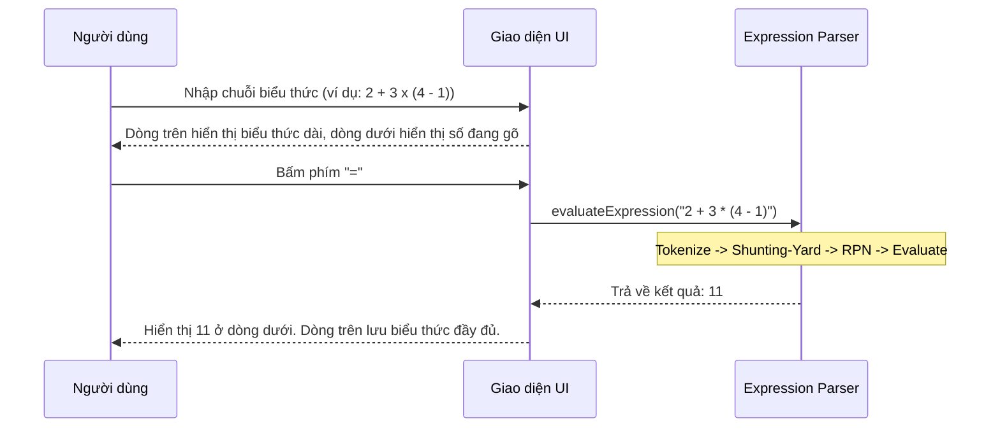
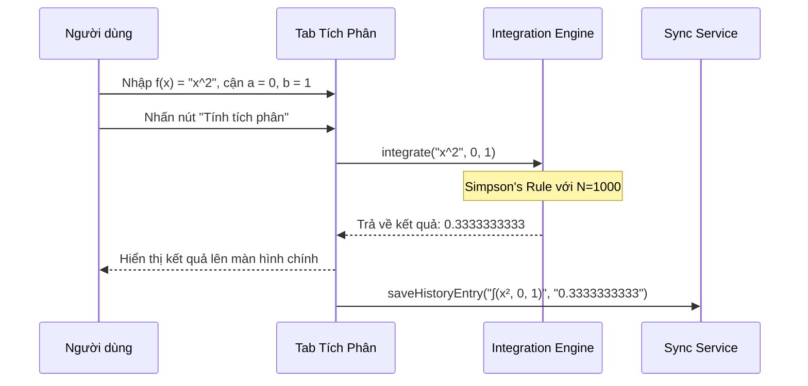
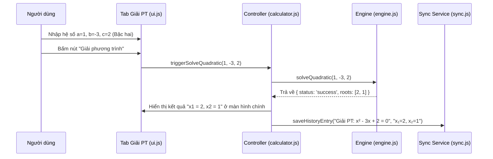

# BUSINESS REQUIREMENTS DOCUMENT (BRD) - Simple Calculator Web App v2.1.0

| Thông tin             | Chi tiết                        |
| :-------------------- | :------------------------------ |
| **Dự án**             | Simple Calculator Web App       |
| **Phiên bản**         | v2.1.0                          |
| **Cập nhật lần cuối** | 2026-06-15                      |
| **Trạng thái**        | DRAFT                           |
| **Tác giả**           | Nam (Product Owner & Developer) |

---

## REVISION HISTORY

| Phiên bản | Ngày       | Cập nhật bởi | Mô tả                                                                                                        |
| :-------- | :--------- | :----------- | :----------------------------------------------------------------------------------------------------------- |
| 1.0.0     | 2026-05-28 | Nam          | Phiên bản khởi tạo theo quy trình Spec-Driven Development                                                   |
| 2.0.0     | 2026-06-08 | Nam          | Nâng cấp lớn: thêm Scientific Mode, Dark/Light Mode, Cloud History Sync, Authentication và yêu cầu phím `=` để tính toán Unary |
| 2.1.0     | 2026-06-15 | Nam          | Nâng cấp tính năng nâng cao: PEMDAS Parser, Equation Display, Solver và Definite Integral                   |

---

## 1. PROJECT OVERVIEW

Simple Calculator Web App v2.1.0 là phiên bản nâng cấp tính năng toán học chuyên sâu. Ở phiên bản trước (v2.0.0), máy tính đã được cập nhật để các hàm lượng giác và khoa học 1 toán hạng (prefix/postfix) yêu cầu dấu `=` để ra kết quả thay vì thực thi tức thời. Tuy nhiên, luồng nhập liệu tổng thể vẫn chỉ giới hạn ở mô hình tuần tự 2 toán hạng (`operand1 operator operand2`). Khi người dùng có nhu cầu thực hiện các biểu thức chứa nhiều phép toán phức tạp hoặc giải phương trình học tập, họ buộc phải chuyển sang các công cụ khác.

Phiên bản v2.1.0 giải quyết bài toán này bằng cách tái cấu trúc Engine tính toán từ mô hình tuần tự sang mô hình **Bộ phân tích biểu thức (Expression Parser)**, hỗ trợ thứ tự ưu tiên PEMDAS đầy đủ, đồng thời tích hợp thêm các công cụ toán học thông dụng: **Bộ giải phương trình (Solver)** và **Bộ tính tích phân xác định (Definite Integral)**. Mối quan hệ giữa các tính năng được kế thừa và phát triển liên tục, ký hiệu tuần tự từ phiên bản v2.0.0.

---

## 2. PROBLEMS & OPPORTUNITIES

### Problems

- **Tính toán tuần tự hạn chế:** Người dùng không thể nhập các biểu thức phức tạp dạng chuỗi như `2 + 3 × 4`. Máy tính chỉ thực hiện phép tính ngay khi gõ toán tử tiếp theo, không tuân thủ thứ tự ưu tiên toán học tiêu chuẩn nếu không bấm từng bước thủ công.
- **Thiếu tính năng giải toán trường học:** Học sinh và sinh viên kỹ thuật thường xuyên phải giải các phương trình bậc hai, hệ phương trình cơ bản hoặc tính tích phân của các hàm số. Việc thiếu các công cụ này khiến ứng dụng chưa đáp ứng được nhu cầu thực tế của đối tượng người dùng mục tiêu (Scientific Mode).
- **Trải nghiệm hiển thị công thức nghèo nàn:** Màn hình chỉ hiển thị các biểu thức cơ bản, không hiển thị toàn bộ chuỗi phép tính dài đang nhập, gây khó khăn cho việc kiểm tra và chỉnh sửa.

### Opportunities

- **Tối ưu hóa khả năng học tập & làm việc:** Tích hợp bộ giải phương trình và tính tích phân số biến ứng dụng thành một trợ thủ học tập đắc lực cho học sinh, sinh viên cấp 3 và đại học.
- **Nâng tầm trải nghiệm toán học:** Bộ phân tích biểu thức PEMDAS chuẩn chỉ giúp trải nghiệm nhập liệu tự nhiên và chính xác như các dòng máy tính khoa học cầm tay cao cấp (Casio FX-580VNX, Texas Instruments).
- **Giữ nguyên tính kế thừa và bảo mật:** Toàn bộ dữ liệu lịch sử của các phép toán nâng cao (PEMDAS, Solver, Tích phân) vẫn được lưu trữ hai tầng (Local Storage & Firebase Cloud) đồng bộ theo cấu trúc bảo mật của v2.0.0.

---

## 3. PROJECT OBJECTIVES

- **Hỗ trợ biểu thức dài tùy ý:** Cho phép nhập chuỗi biểu thức toán học có độ dài lên tới 100 ký tự (bao gồm các hàm lượng giác, hằng số, lũy thừa và dấu ngoặc).
- **Độ chính xác và hiệu năng tính toán số:**
  - Kết quả phép tính PEMDAS hiển thị trong **< 50ms** sau khi nhấn `=`.
  - Kết quả giải phương trình phản hồi **tức thì (< 30ms)**.
  - Phép tính tích phân xác định (chia nhỏ $N=1000$ khoảng) phản hồi trong **< 300ms** và đạt độ chính xác sai số $\epsilon \le 10^{-6}$.
- **Giao diện Tab tích hợp mượt mà:**
  - Chuyển đổi giữa các tab "Cơ bản", "Khoa học" và "Công cụ" hoàn thành trong **< 100ms** bằng hiệu ứng chuyển mượt mà.
  - Giao diện tab Giải phương trình và Tích phân trực quan, dễ nhập liệu, tự động validate hệ số và cận trước khi tính.

---

## 4. PROJECT SCOPE

### 4.1 In Scope — Tính năng kế thừa từ v2.0.0 (F-001 -> F-011)

| ID    | Tính năng                                     | Mô tả tóm tắt |
| :---- | :-------------------------------------------- | :-------------------------------------------------------------------------------- |
| F-001 | Các phép tính số học cơ bản                  | Cộng, trừ, nhân, chia (+, −, ×, ÷) số nguyên hoặc thập phân; làm tròn 10 chữ số. |
| F-002 | Nhập liệu từ giao diện và bàn phím            | Nhập chữ số và số thập phân từ phím ảo hoặc bàn phím cứng. |
| F-003 | Các chức năng xóa và sửa lỗi nhập            | Phím AC để reset máy tính, phím ⌫ để xóa chữ số cuối cùng. |
| F-004 | Xử lý hiển thị nâng cao                       | Hiển thị dấu trừ, tự động chuyển về exponential notation khi kết quả dài. |
| F-005 | Xử lý lỗi chia cho 0                          | Phát hiện chia cho 0, hiển thị thông báo lỗi rõ ràng và khóa máy tính. |
| F-006 | Phần trăm (%)                                 | Chuyển giá trị hiện tại thành phần trăm (yêu cầu bấm `=`). |
| F-007 | Các hàm lượng giác                            | Hỗ trợ `sin`, `cos`, `tan`, `asin`, `acos`, `atan` và toggle DEG/RAD (yêu cầu bấm `=`). |
| F-008 | Các hàm logarithm và lũy thừa/căn thức        | Hỗ trợ `log`, `ln`, `x^y`, `x^2`, `x^3`, `√x`, `³√x`, `n!`, `|x|`, và hằng số $\pi$, $e$ (yêu cầu bấm `=`). |
| F-009 | Dark Mode / Light Mode                        | Chuyển đổi giao diện sáng/tối mượt mà, lưu vào localStorage. |
| F-010 | Quản lý lịch sử tính toán hai tầng            | Lưu lịch sử local (50 bản ghi) và đồng bộ Firestore Cloud (200 bản ghi). |
| F-011 | Đăng nhập & Đăng ký (Firebase Auth)           | Xác thực người dùng bằng Email/Password để kích hoạt Cloud Sync. |

---

### 4.2 In Scope — Tính năng mới v2.1.0 (F-012 -> F-016)

| ID    | Tính năng | Mô tả tóm tắt |
| :---- | :-------- | :------------ |
| F-012 | Phép tính PEMDAS | Phân tích và tính toán chuỗi biểu thức phức tạp cộng, trừ, nhân, chia, lũy thừa, căn thức, lượng giác bằng Shunting-yard. |
| F-013 | Hiển thị biểu thức dài | Hỗ trợ hiển thị đầy đủ chuỗi biểu thức nhập vào trực quan ở dòng trên (top display) trước khi tính. |
| F-014 | Tab Equation Solver | Cung cấp giao diện con (form nhập hệ số) để giải các phương trình bậc 1, bậc 2 và hệ 2 ẩn số. |
| F-015 | Tab Definite Integral | Cung cấp giao diện con (nhập hàm f(x), cận a, cận b) tính tích phân số bằng thuật toán Simpson's Rule. |
| F-016 | Lịch sử & đồng bộ nâng cao | Lưu trữ định dạng lịch sử chuyên biệt cho các phép tính Solver và Integral lên localStorage và Firestore. |

---

### 4.3 Out of Scope — v2.1.0

| Tính năng | Lý do loại trừ / Kế hoạch |
| :--- | :--- |
| Copy kết quả ra clipboard | Còn trong backlog — dời sang phiên bản sau. |
| Đăng nhập bằng mạng xã hội | Ưu tiên hoàn thiện phần lõi toán học; dời sang phiên bản sau. |
| Graphing Calculator (Vẽ đồ thị) | Đòi hỏi giao diện Canvas phức tạp; dời sang v3.0.0. |

---

## 5. BUSINESS PROCESS FLOW

### 5.1 Luồng tính toán biểu thức PEMDAS (F-012)

### 5.2 Luồng tính toán Tích phân xác định (F-015)

### 5.3 Luồng giải phương trình Solver (F-014)

---

## 6. BUSINESS RULES

### Quy tắc kế thừa và điều chỉnh từ v2.0.0 (BR-01 → BR-11)

| ID | Tên quy tắc | Chi tiết nghiệp vụ |
| :--- | :--- | :--- |
| **BR-01** | **Biểu thức PEMDAS** | Thay thế quy tắc biểu thức đơn giản của v2.0.0. Hỗ trợ nhập chuỗi biểu thức phức tạp có dấu ngoặc và tuân thủ thứ tự ưu tiên PEMDAS. |
| **BR-02** | **Tiếp tục sau kết quả** | Sau khi nhấn "=", nếu người dùng nhấn **toán tử** → kết quả hiện tại trở thành phần tử đầu tiên của biểu thức mới. Nếu nhấn **chữ số** → bắt đầu biểu thức mới hoàn toàn. |
| **BR-03** | **Giới hạn độ dài** | Biểu thức nhập vào có độ dài tối đa 100 ký tự để tránh quá tải hiển thị và xử lý. |
| **BR-04** | **Một dấu thập phân** | Mỗi số hạng thập phân trong biểu thức chỉ chấp nhận một dấu "." duy nhất. |
| **BR-05** | **Khóa sau lỗi chia cho 0** | Khi xảy ra lỗi chia cho 0 hoặc lỗi cú pháp, hiển thị thông báo lỗi, khóa các phím chức năng cơ bản/khoa học cho đến khi nhấn AC. |
| **BR-06** | **Làm tròn kết quả** | Kết quả thập phân được làm tròn tối đa 10 chữ số sau dấu phẩy để tránh lỗi floating-point. |
| **BR-07** | **Đồng bộ hóa lịch sử** | Hỏi người dùng đồng bộ lịch sử từ `localStorage` lên Cloud Firestore khi đăng nhập thành công. |
| **BR-08** | **Offline mode** | Hoạt động bình thường ngoại tuyến và tự động đồng bộ lịch sử lên Cloud khi có mạng trở lại. |
| **BR-09** | **Ký hiệu khoa học** | Kết quả vượt quá 15 chữ số hoặc cực nhỏ (< 1e-9) tự động hiển thị dưới dạng số mũ khoa học (Exponential notation). |
| **BR-10** | **Đơn vị lượng giác** | Mặc định khởi động là DEG (hoặc cấu hình đã lưu). Trạng thái DEG/RAD được lưu vào `localStorage`. |
| **BR-11** | **Lỗi toán học khoa học** | Hàm lượng giác/logarithm ngoài miền xác định, căn bậc 2 số âm, giai thừa số âm/thập phân sẽ báo `"Lỗi toán học"` và khóa máy tính. |

### Quy tắc mới v2.1.0 (BR-12 → BR-17)

| ID | Tên quy tắc | Chi tiết nghiệp vụ |
| :--- | :--- | :--- |
| **BR-12** | **Biểu thức PEMDAS hợp lệ** | Bộ parser chỉ chấp nhận biểu thức đúng cú pháp. Nếu sai (dư toán tử `2 + * 3` hoặc ngoặc không cân đối `(2+3`), hiển thị `"Lỗi cú pháp"` và khóa máy tính. |
| **BR-13** | **Ưu tiên hiển thị toán học** | Toán tử hiển thị chuẩn trực quan: nhân là `×`, chia là `÷`, lũy thừa là `^`. Ký tự biến là chữ `x` thường. |
| **BR-14** | **Xử lý biến tự do x** | Ký tự `x` chỉ là biến tự do trong Tab Tích phân. Ở chế độ thường PEMDAS, nhập `x` nhấn `=` sẽ báo `"Lỗi cú pháp"`. |
| **BR-15** | **Ràng buộc hệ số Solver** | Hệ số Solver phải là số thực. Nếu $a=0$ ở PT bậc 2, giải theo PT bậc 1. Nếu vô số nghiệm/vô nghiệm, hiển thị rõ thông báo tương ứng. Hỗ trợ hiển thị nghiệm phức dạng `u + vi` / `u - vi` khi $\Delta < 0$. |
| **BR-16** | **Ràng buộc Tích phân** | Cận $a, b$ phải là số thực hữu hạn. Hàm $f(x)$ phải xác định liên tục trên đoạn tích phân. Nếu tính số (Simpson's Rule) ra `NaN`, `Infinity`, thuật toán dừng và báo `"Lỗi toán học"`. |
| **BR-17** | **Schema lịch sử nâng cao** | Phép tính Solver và Tích phân lưu lịch sử theo định dạng chuyên biệt: - Tích phân: `∫(f(x), a, b) = kết quả` - Solver bậc hai: `Giải PT: ax² + bx + c = 0 → x = nghiệm` - Solver bậc nhất: `Giải PT: ax + b = 0 → x = nghiệm` - Solver hệ 2 ẩn: `Giải hệ PT: {a1x+b1y=c1, a2x+b2y=c2} → x = nghiệmX, y = nghiệmY`. |

---

## 7. FUNCTIONAL REQUIREMENTS

Danh sách chức năng đầy đủ theo ID đã được mô tả chi tiết tại **Section 4 — Project Scope**. Bảng dưới đây là bảng tổng hợp nhanh để tra cứu chéo:

| ID | Feature Group | Thuộc phiên bản |
| :-- | :---------------------- | :-------------- |
| F-001 | Các phép tính số học cơ bản | Kế thừa v2.0.0 (Gốc v1.0.0) |
| F-002 | Nhập liệu từ giao diện và bàn phím | Kế thừa v2.0.0 (Gốc v1.0.0) |
| F-003 | Các chức năng xóa và sửa lỗi nhập | Kế thừa v2.0.0 (Gốc v1.0.0) |
| F-004 | Xử lý hiển thị nâng cao | Kế thừa v2.0.0 (Gốc v1.0.0) |
| F-005 | Xử lý lỗi chia cho 0 | Kế thừa v2.0.0 (Gốc v1.0.0) |
| F-006 | Phần trăm (%) | Kế thừa v2.0.0 |
| F-007 | Các hàm lượng giác | Kế thừa v2.0.0 |
| F-008 | Các hàm logarithm và lũy thừa/căn thức | Kế thừa v2.0.0 |
| F-009 | Dark Mode / Light Mode | Kế thừa v2.0.0 |
| F-010 | Quản lý lịch sử tính toán hai tầng | Kế thừa v2.0.0 |
| F-011 | Đăng nhập & Đăng ký (Firebase Auth) | Kế thừa v2.0.0 |
| F-012 | Phép tính PEMDAS | Mới v2.1.0 |
| F-013 | Hiển thị biểu thức dài | Mới v2.1.0 |
| F-014 | Tab Equation Solver | Mới v2.1.0 |
| F-015 | Tab Definite Integral | Mới v2.1.0 |
| F-016 | Lịch sử & đồng bộ nâng cao | Mới v2.1.0 |

---

## 8. NON-FUNCTIONAL REQUIREMENTS

- **Độ chính xác tích phân số:** Đảm bảo giá trị sai số tích phân số so với tích phân giải tích lý thuyết $\le 10^{-6}$ đối với các hàm số liên tục trơn phổ biến.
- **Hiệu năng:** 
  - Giao diện phản hồi tức thời đối với các phép tính cơ bản và khoa học.
  - Bộ phân tích biểu thức PEMDAS hoạt động tức thời (< 50ms).
  - Tính toán tích phân số thực thi không làm treo giao diện chính (không chặn Main Thread quá 300ms).
- **Offline-first:** Toàn bộ tính năng tính toán và lịch sử local hoạt động ngay sau lần tải đầu, không phụ thuộc vào internet. Tính năng Cloud Sync bị khóa khi offline.
- **Tương thích trình duyệt:** Hoạt động đúng trên Chrome, Firefox, Safari, Edge (2 phiên bản mới nhất); không dùng API thực nghiệm.
- **Responsive & Layout:** Giao diện Tab "Công cụ" và các Tab chính hoạt động tốt cả trên Desktop (≥ 1024px) và các thiết bị di động có màn hình hẹp (≥ 375px) mà không mất chức năng, co giãn các ô nhập hệ số và cận thông minh.
- **Bảo mật Cloud:** Firestore Security Rules chặt chẽ — mỗi người dùng chỉ đọc/ghi được lịch sử của chính họ (`request.auth.uid == userId`).
- **Maintainability:** Code tổ chức theo đúng spec; mỗi Business Rule có test case tương ứng trong FS.

---

## 9. SUCCESS METRICS

- **Time-to-first-calculation ≤ 10 giây:** Người dùng mới hoàn thành phép tính đầu tiên trong 10 giây kể từ khi mở ứng dụng, không cần hướng dẫn.
- **Độ chính xác toán học 100%:** Các phép tính giải phương trình, tích phân số và các phép toán cơ bản/khoa học khớp hoàn toàn với expected output trong bộ test suite thiết kế cho v2.1.0.
- **Zero crash:** Không có tổ hợp nhập liệu nào (kể cả biểu thức PEMDAS sai cú pháp, hệ số Solver không xác định, hàm số tích phân không liên tục) khiến ứng dụng rơi vào trạng thái không nhất quán, kể cả khi offline hoặc Firebase không khả dụng.
- **Trải nghiệm mượt mà:** Không xảy ra lỗi hiển thị hoặc tràn nút bấm trên giao diện mobile khi chuyển đổi giữa 3 Tab chính.
- **Độ phủ kiểm thử:** Đạt 100% các Business Rules mới và cũ được cover bởi các test cases tự động (unit tests & E2E).
- **Spec-first compliance:** 100% tính năng trong scope được mô tả đầy đủ trong các tài liệu đặc tả trước khi code tương ứng được viết.

---

## 10. NOTES

- Tài liệu này mô tả yêu cầu ở cấp độ nghiệp vụ. Mọi chi tiết kỹ thuật triển khai thuộc phạm vi các tài liệu cấp dưới.
- Chi tiết hành vi UI, trạng thái màn hình và test scenarios → xem **[FUNCTION_SPECIFICATION_v2.1.0.md](file:///Users/nam/Desktop/calculator/docs/v2.1.0/FUNCTION_SPECIFICATION_v2.1.0.md)**.
- Cấu trúc file, module JS và luồng dữ liệu → xem **[SYSTEM_ARCHITECTURE_v2.1.0.md](file:///Users/nam/Desktop/calculator/docs/v2.1.0/SYSTEM_ARCHITECTURE_v2.1.0.md)**.
- Schema Firestore và localStorage → xem **[DATABASE_DESIGN_v2.1.0.md](file:///Users/nam/Desktop/calculator/docs/v2.1.0/DATABASE_DESIGN_v2.1.0.md)**.
- Firebase yêu cầu HTTPS cho Authentication — chạy local cần dùng `python3 -m http.server` hoặc deploy lên GitHub Pages/Netlify thay vì mở `file://` trực tiếp.

---

END OF DOCUMENT
