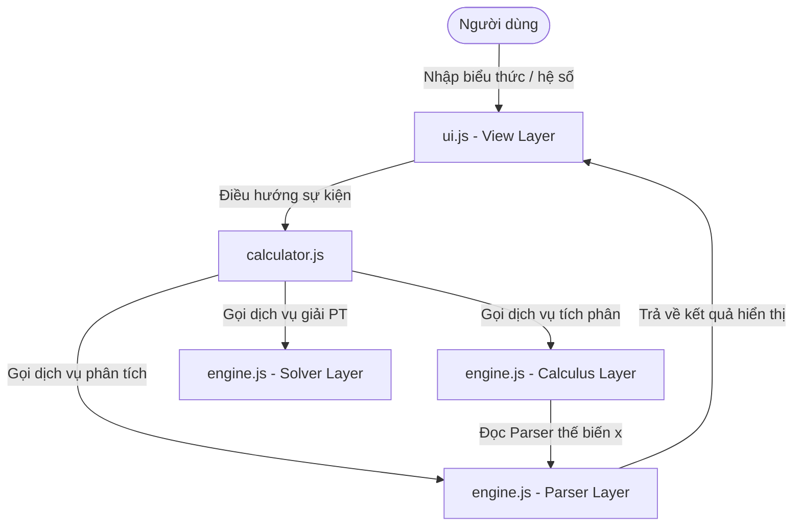
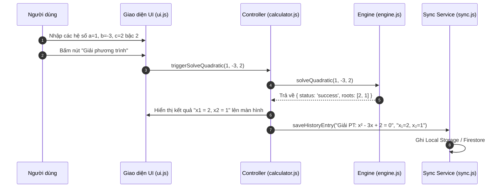

# SYSTEM ARCHITECTURE DOCUMENT (SAD) - Simple Calculator Web App v2.1.0

| Thông tin         | Chi tiết                        |
| :---------------- | :------------------------------ |
| **Dự án**         | Simple Calculator Web App       |
| **Phiên bản**     | v2.1.0                          |
| **Ngày cập nhật** | 2026-06-06                      |
| **Trạng thái**    | DRAFT                           |
| **Tác giả**       | Nam (Product Owner & Developer) |

---

## NHẬT KÝ THAY ĐỔI

| Version | Ngày       | Người sửa | Mô tả thay đổi                 |
| :------ | :--------- | :-------- | :------------------------------ |
| 1.0.0   | 2026-05-29 | Nam       | Tài liệu kiến trúc ban đầu (v1) |
| 2.0.0   | 2026-06-03 | Nam       | Cập nhật v2: Thêm Scientific Mode, Dark/Light Mode, Cloud History Sync, Firebase Authentication |
| 2.1.0   | 2026-06-06 | Nam       | Nâng cấp v2.1.0: Thiết kế Expression Parser (PEMDAS), Equation Solver, Definite Integral Engine |

---

## Section 1: Introduction and Goals

Simple Calculator v2.1.0 nâng cấp hệ thống tính toán từ mô hình **tuần tự đơn giản** (chỉ tính 2 số hạng) sang mô hình **Phân tích cú pháp biểu thức (Expression Parser)**. 

**Mục tiêu kiến trúc chính ở v2.1.0:**
- **Zero build step:** Tiếp tục duy trì nguyên tắc chạy trực tiếp qua ES Modules trong trình duyệt không qua build tool.
- **Tách biệt mối quan tâm (Separation of Concerns):** Tách biệt rõ bộ Tokenizer/Parser của Expression Engine khỏi luồng điều phối Controller.
- **Tính toán số học chính xác (Numerical Calculus & Solver):** Thiết kế bộ giải tích phân số (Simpson's Rule) hiệu năng cao và các module giải phương trình đại số chính xác.

---

## Section 2: Architecture Constraints

- **Ngôn ngữ & Runtime:** HTML5, CSS3, JavaScript ES6+ (chạy ES Modules trực tiếp trong trình duyệt).
- **Bộ phân tích biểu thức:** Triển khai bộ phân tích cú pháp thủ công bằng thuật toán **Shunting-yard** nhằm tránh sử dụng hàm `eval()` (rủi ro bảo mật XSS) hoặc các thư viện ngoài cồng kềnh.
- **Giới hạn luồng chính:** Giải thuật tích phân Simpson's Rule giới hạn khoảng chia mặc định $N = 1000$ để đảm bảo thời gian thực thi dưới **5ms**, không gây gián đoạn luồng hiển thị giao diện (Main Thread).

---

## Section 3: Context and Scope

Hệ thống bổ sung thêm một Module con chuyên biệt trong Engine toán học để xử lý việc phân tích cú pháp chuỗi ký tự, thế biến $x$, và giải phương trình đại số.



---

## Section 4: Engine Layer Design (Expression & Math Engine)

Tái cấu trúc file `js/engine.js` để bao gồm 3 thành phần chính:

```
js/engine.js
├── Tokenizer (Chia chuỗi biểu thức thành mảng các Token)
├── Parser (Chuyển đổi biểu thức trung tố thành Ký pháp Ba Lan ngược RPN - Shunting-yard)
├── Evaluator (Tính toán giá trị RPN, hỗ trợ thế biến x)
├── Solver Module (Giải phương trình bậc 1, bậc 2, hệ 2 ẩn)
└── Calculus Module (Tích phân số bằng Simpson's Rule)
```

### 4.1. Bộ phân tích biểu thức (PEMDAS Parser)

#### A. Tokenizer (Bộ phân tích từ vựng)
Tokenizer quét chuỗi biểu thức đầu vào từ trái sang phải, nhận diện các phần tử (Token) và phân loại chúng:
- **NUMBER:** Các số nguyên hoặc thập phân (ví dụ: `3.14`, `100`).
- **VARIABLE:** Biến tự do `x`.
- **OPERATOR:** Toán tử 2 toán hạng (`+`, `−`, `×`, `÷`, `^`, `ʸ√x`).
- **FUNCTION:** Các hàm lượng giác/khoa học (`sin`, `cos`, `tan`, `asin`, `acos`, `atan`, `ln`, `log`, `sqrt`, `cbrt`, `abs`, `!`, `%`).
- **PARENTHESIS:** Ngoặc mở `(` và ngoặc đóng `)`.

#### B. Parser (Shunting-yard Algorithm)
Sử dụng thuật toán **Shunting-yard** với một Ngăn xếp toán tử (Operator Stack) và một Hàng đợi đầu ra (Output Queue) để chuyển đổi mảng Token từ dạng Trung tố (Infix) sang dạng Hậu tố (Reverse Polish Notation - RPN):

```mermaid
flowchart TD
    A[Token tiếp theo] --> B{Là Số hoặc Biến x?}
    B -- Có --> C[Đẩy thẳng vào Output Queue]
    B -- Không --> D{Là Hàm số hoặc Ngoặc mở '('?}
    D -- Có --> E[Đẩy vào Operator Stack]
    D -- Không --> F{Là Toán tử?}
    F -- Có --> G[So sánh độ ưu tiên với đỉnh Stack\nĐẩy toán tử ưu tiên hơn từ Stack sang Output\nRồi đẩy toán tử mới vào Stack]
    F -- Không --> H{Là Ngoặc đóng ')'?}
    H -- Có --> I[Đẩy các toán tử từ Stack sang Output\nĐến khi gặp Ngoặc mở '(' thì xóa '(' khỏi Stack]
```

#### C. Evaluator (Hàm lượng giá RPN)
Nhận mảng RPN và một giá trị số tùy chọn cho biến $x$. Sử dụng một Ngăn xếp giá trị (Value Stack) để tính toán:
- Gặp số $\rightarrow$ Đẩy vào Stack.
- Gặp biến $x$ $\rightarrow$ Đẩy giá trị của $x$ vào Stack.
- Gặp toán tử đơn trị (Unary Function) $\rightarrow$ Lấy 1 phần tử ra tính và đẩy kết quả ngược lại.
- Gặp toán tử nhị trị (Binary Operator) $\rightarrow$ Lấy 2 phần tử ra tính và đẩy kết quả ngược lại.

---

### 4.2. Bộ Giải Tích Phân Số (Calculus Module)

Hàm `integrateSimpson(expression, a, b, N = 1000)` thực hiện tích phân số của hàm `expression` từ cận $a$ đến $b$:
1. Nếu cận $a == b$: Trả về `0` lập tức.
2. Thiết lập hướng tích phân: Nếu $b < a$, đảo cận tích phân và nhân kết quả cuối với $-1$.
3. Chia khoảng $[a, b]$ thành $N$ khoảng nhỏ, bước nhảy $h = (b-a)/N$.
4. Sử dụng bộ **Evaluator** để tính toán giá trị của hàm số tại từng điểm chia $x_i = a + i \cdot h$ (với $i = 0 \rightarrow N$):
   - Nếu gặp bất kỳ điểm chia nào cho kết quả không hợp lệ (`NaN`, `Infinity`), lập tức dừng chương trình và ném lỗi.
5. Áp dụng công thức Simpson's Rule để tổng hợp kết quả:
   $$S = \frac{h}{3} \left[ f(x_0) + 4 \sum_{i=1,3,...}^{N-1} f(x_i) + 2 \sum_{j=2,4,...}^{N-2} f(x_j) + f(x_N) \right]$$

---

### 4.3. Bộ Giải Phương Trình (Solver Module)

Giải thuật giải phương trình đại số:
- **Phương trình bậc nhất ($ax+b=0$):**
  - Nếu $a \neq 0$: Nghiệm $x = -b/a$.
  - Nếu $a == 0$: Nếu $b == 0$ trả về `"Vô số nghiệm"`, nếu $b \neq 0$ trả về `"Vô nghiệm"`.
- **Phương trình bậc hai ($ax^2+bx+c=0$):**
  - Nếu $a == 0$: Hạ cấp giải theo bậc nhất $bx+c=0$.
  - Tính biệt thức $\Delta = b^2 - 4ac$:
    - $\Delta > 0$: 2 nghiệm thực phân biệt $x_{1,2} = \frac{-b \pm \sqrt{\Delta}}{2a}$.
    - $\Delta == 0$: Nghiệm kép $x = \frac{-b}{2a}$.
    - $\Delta < 0$: 2 nghiệm phức $x_{1,2} = \frac{-b}{2a} \pm \frac{\sqrt{-\Delta}}{2a}i$.
- **Hệ 2 ẩn ($\begin{cases}a_1x+b_1y=c_1\\a_2x+b_2y=c_2\end{cases}$):**
  - Tính các định thức Cramer:
    - $D = a_1b_2 - a_2b_1$
    - $D_x = c_1b_2 - c_2b_1$
    - $D_y = a_1c_2 - a_2c_1$
  - Nghiệm:
    - Nếu $D \neq 0$: Hệ có nghiệm duy nhất $x = D_x/D$, $y = D_y/D$.
    - Nếu $D == 0$: Nếu $D_x == 0$ và $D_y == 0$ trả về `"Vô số nghiệm"`, ngược lại trả về `"Vô nghiệm"`.

---

## Section 5: View Layer Design (Tabbed Layout)

Bổ sung tab **"Công cụ" (Tools)** bên cạnh tab "Cơ bản" và "Khoa học". 

```
+------------------------------------------+
|                 Display                  |
+------------------------------------------+
|   Tabs: [Cơ bản] [Khoa học] [Công cụ]    |
+------------------------------------------+
|  [Tab Công cụ chọn]                      |
|  Loại: [ Giải Phương Trình v ]           |
|  Dạng: ( Bậc 1 ) ( Bậc 2 ) ( Hệ 2 ẩn )   |
|  Hệ số:  [ a ]   [ b ]   [ c ]           |
|  [ Nút giải phương trình ]               |
+------------------------------------------+
```

### Quản lý Trạng thái UI trong `ui.js`:
- Bổ sung hàm `switchToolTab(toolName)` để ẩn/hiển thị động các form tương ứng (Giải PT / Tích phân).
- Khi người dùng gõ hệ số vào các ô input, validate trực tiếp kiểu dữ liệu (chỉ chấp nhận số thực).
- Sau khi bấm nút giải hoặc tính toán, kết quả hiển thị lên màn hình chính và tự động kích hoạt cập nhật Sidebar Lịch sử.

---

## Section 6: Non-Functional Architecture Aspects

### 6.1. Quy trình Giải và Lưu trữ Lịch sử Solver


---

END OF DOCUMENT
