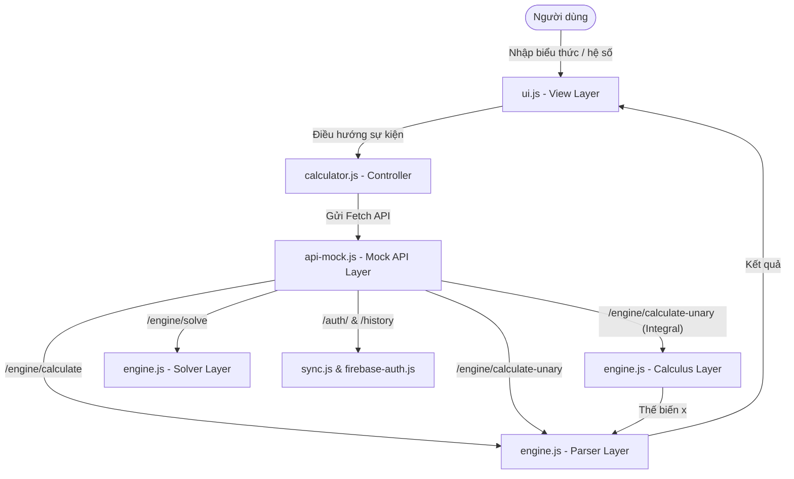
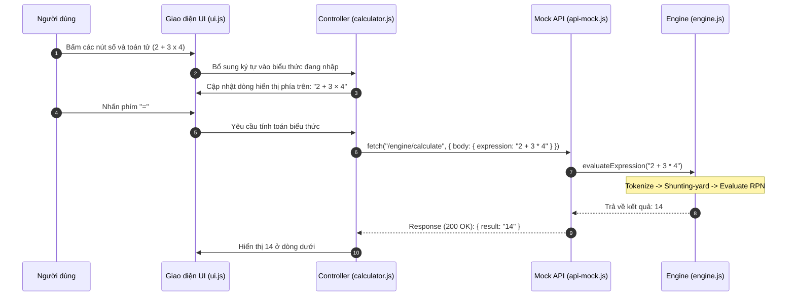
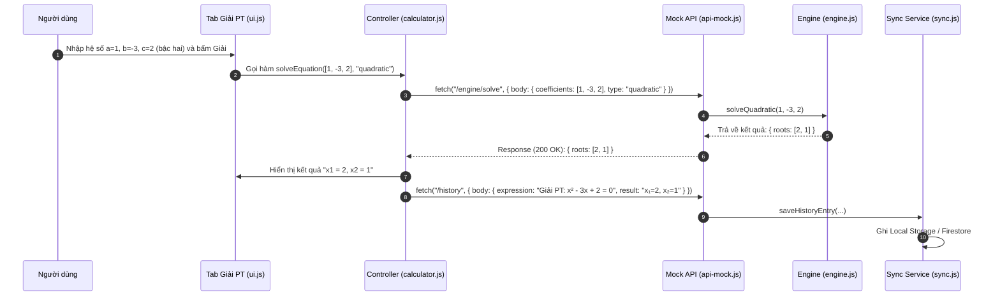
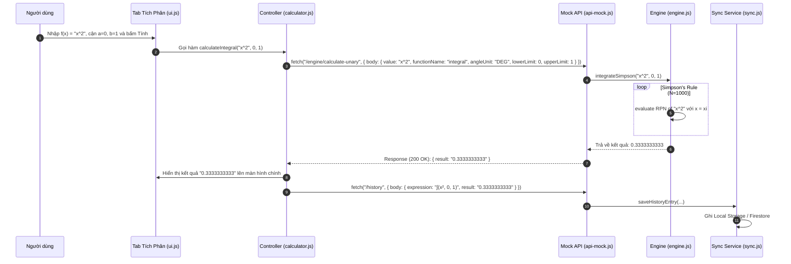
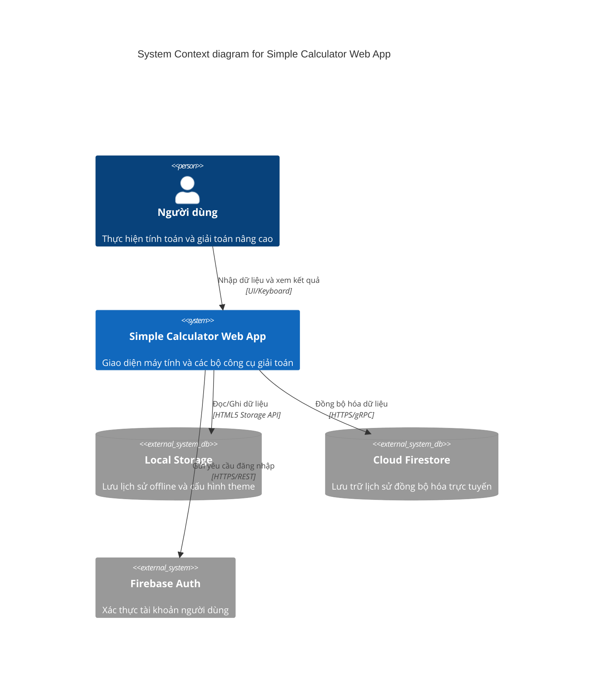
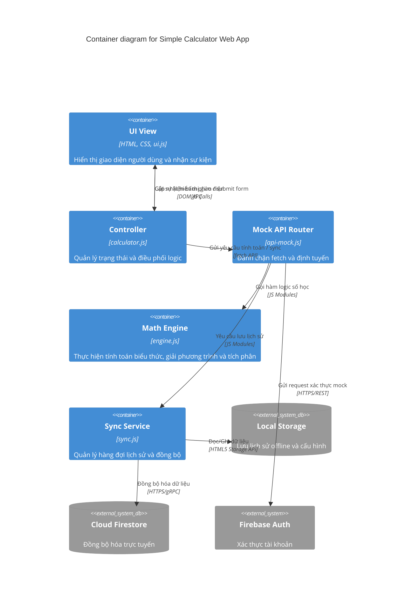
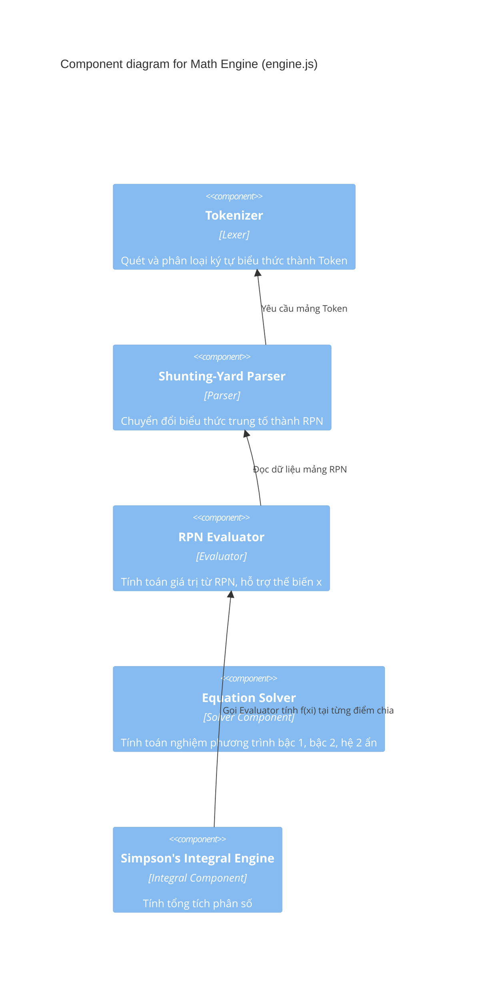

# SYSTEM ARCHITECTURE DOCUMENT (SAD) - Simple Calculator Web App v2.1.0

| Thông tin         | Chi tiết                        |
| :---------------- | :------------------------------ |
| **Dự án**         | Simple Calculator Web App       |
| **Phiên bản**     | v2.1.0                          |
| **Ngày cập nhật** | 2026-06-15                      |
| **Trạng thái**    | DRAFT                           |
| **Tác giả**       | Nam (Product Owner & Developer) |

---

## NHẬT KÝ THAY ĐỔI

| Version | Ngày       | Người sửa | Mô tả thay đổi                                                                                                |
| :------ | :--------- | :-------- | :------------------------------------------------------------------------------------------------------------ |
| 1.0.0   | 2026-05-29 | Nam       | Tài liệu kiến trúc ban đầu (v1.0.0)                                                                           |
| 2.0.0   | 2026-06-08 | Nam       | Cập nhật v2.0.0: Thêm Scientific Mode, Dark/Light Mode, Cloud History Sync, Firebase Authentication           |
| 2.1.0   | 2026-06-15 | Nam       | Nâng cấp v2.1.0: Thiết kế Expression Parser (PEMDAS), Equation Solver, Definite Integral Engine               |

---

## Section 1: Introduction and Goals

Simple Calculator Web App v2.1.0 nâng cấp hệ thống tính toán từ mô hình **tuần tự đơn giản** (chỉ thực hiện tính toán từng cặp hai số hạng) sang mô hình **Phân tích cú pháp biểu thức (Expression Parser)**. Đây là bước nhảy vọt giúp người dùng nhập liệu tự nhiên và giải quyết được các bài toán phức tạp hơn ngay trên trình duyệt mà không cần sử dụng máy tính khoa học chuyên dụng.

**Mục tiêu kiến trúc chính:**
- **Zero build step:** Tiếp tục duy trì nguyên tắc chạy trực tiếp mã nguồn ES Modules trong trình duyệt không qua build tool hay bundler.
- **Tách biệt mối quan tâm (Separation of Concerns):** Phân chia rõ ràng lớp hiển thị giao diện (View), điều phối (Controller), định tuyến API cục bộ (Mock API) và bộ xử lý toán học (Expression Engine).
- **Tính toán số học chính xác (Solver & Calculus):** Cung cấp các thuật toán hiệu năng cao để giải phương trình đại số và tính tích phân xác định trực tiếp trên luồng chính mà không gây đơ/treo giao diện.
- **Đồng bộ hóa nâng cao:** Mở rộng khả năng lưu trữ lịch sử hai tầng để xử lý các công thức nâng cao.

---

## Section 2: Architecture Constraints

- **Runtime & Ngôn ngữ:** Chỉ chạy trên trình duyệt sử dụng HTML5, CSS3 và Vanilla JS (ES Modules). Không phụ thuộc vào thư viện bên thứ ba bên ngoài Firebase CDN.
- **An toàn tính toán (No eval):** Bộ phân tích biểu thức bắt buộc triển khai thủ công bằng thuật toán **Shunting-yard** nhằm loại bỏ hoàn toàn việc sử dụng hàm `eval()` (rủi ro bảo mật XSS lớn).
- **Giới hạn thời gian thực thi (Performance budget):** Thuật toán tích phân Simpson's Rule giới hạn mặc định $N = 1000$ khoảng chia để đảm bảo thời gian tính toán luôn dưới **5ms**, nằm trong ngân sách render 60fps của trình duyệt.
- **Tính độc lập offline (Mock API):** Không phụ thuộc vào server thật. Tầng định tuyến fetch mock sẽ chặn toàn bộ request toán học/auth để chuyển hướng xuống engine local, đảm bảo chạy offline hoàn toàn.

---

## Section 3: Context and Scope

Hệ thống hoạt động độc lập ngay trên thiết bị khách (Client-side). Giao diện máy tính cung cấp ba tab chính để người dùng chọn tương tác, sau đó chuyển tín hiệu xuống Controller xử lý thông qua Mock API.



---

## Section 4: Data Architecture & Persistence

Toàn bộ dữ liệu cấu hình giao diện (Theme, góc DEG/RAD) và lịch sử tính toán được lưu giữ ở hai tầng:
1. **Local Storage (Tier 1):** Lưu trữ cấu hình và tối đa 50 phép tính gần nhất trong queue offline.
2. **Cloud Firestore (Tier 2):** Đồng bộ hóa tối đa 200 bản ghi lịch sử lên Firestore khi người dùng đăng nhập.

### Schema dữ liệu cho các phép toán v2.1.0 mới:
*   **PEMDAS (F-012/F-013):** Lưu trữ biểu thức dạng chuỗi hoàn chỉnh (ví dụ: `2 + 3 × (4 - 1)` với kết quả `11`).
*   **Solver (F-014):** 
    *   Bậc 2: `Giải PT: ax² + bx + c = 0 → x = nghiệm` (Ví dụ: `Giải PT: x² - 3x + 2 = 0 → x₁=2, x₂=1`).
    *   Bậc 1: `Giải PT: ax + b = 0 → x = nghiệm`.
    *   Hệ 2 ẩn: `Giải hệ PT: {a1x+b1y=c1, a2x+b2y=c2} → x = nghiệmX, y = nghiệmY`.
*   **Definite Integral (F-015):** Lưu dạng `∫(f(x), a, b) = kết quả` (Ví dụ: `∫(x², 0, 1) = 0.3333333333`).

---

## Section 5: Building Block View

### 5.1. Cấu trúc Phân tầng (Layered Architecture)

Dự án tuân thủ kiến trúc phân tầng dạng Service nhằm đảm bảo tính bảo trì và dễ viết test:

1.  **View Layer (index.html, style.css, ui.js):**
    *   Quản lý DOM, lắng nghe sự kiện từ UI/Bàn phím, toggle các tab màn hình (Cơ bản, Khoa học, Công cụ).
    *   Validate dữ liệu nhập vào Solver (chỉ cho phép số thực) và cận Tích phân trước khi gửi lệnh tính.
2.  **Controller Layer (calculator.js):**
    *   Quản lý trạng thái máy tính (calculator state: `currentInput`, `expression`, `isError`, `pendingUnary`, v.v.).
    *   Chuyển tiếp yêu cầu tính toán sang Mock API và cập nhật lại giao diện.
3.  **Mock API Layer (api-mock.js):**
    *   Ghi đè `window.fetch` toàn cục, đóng vai trò như một Router trung gian đón nhận các request mạng giả lập (`/engine/calculate`, `/engine/calculate-unary`, `/auth/login`, `/history`) và trả về `Response` JSON.
4.  **Engine Layer (engine.js):**
    *   Thực hiện toàn bộ logic toán học. Được chia thành các module chức năng độc lập (Tokenizer, Shunting-yard Parser, RPN Evaluator, Solver, Definite Integral).
5.  **Service Layer (firebase-auth.js, sync.js):**
    *   Xác thực phiên làm việc của người dùng và quản lý lưu trữ, đồng bộ dữ liệu.

```
Mã nguồn /js
├── engine.js       (Lõi tính toán số học & đại số - Không phụ thuộc DOM)
├── ui.js           (Lớp giao diện điều khiển phần tử hiển thị)
├── api-mock.js     (Tầng trung gian đánh chặn window.fetch)
├── sync.js         (Đồng bộ hóa dữ liệu lịch sử)
└── ../auth/        (Quản lý Firebase Authentication)
```

### 5.2. Phân rã Module trong engine.js

*   **Tokenizer:** Duyệt chuỗi biểu thức và chia nhỏ thành mảng các Token (`NUMBER`, `VARIABLE`, `OPERATOR`, `FUNCTION`, `PARENTHESIS`).
*   **Parser (Shunting-yard):** Chuyển mảng Token từ dạng Trung tố (Infix) sang dạng Hậu tố (Reverse Polish Notation - RPN) sử dụng Operator Stack.
*   **Evaluator:** Sử dụng Value Stack tính toán kết quả từ mảng RPN. Hỗ trợ thay thế biến tự do `x` bằng một giá trị thực tế (sử dụng khi tính tích phân).
*   **Solver Module:** Giải các phương trình đại số ($ax+b=0$, $ax^2+bx+c=0$ hỗ trợ nghiệm phức, và hệ phương trình 2 ẩn qua Cramer).
*   **Calculus Module:** Triển khai tích phân Simpson's Rule trên mảng các điểm chia rời rạc, gọi lại Evaluator để tính giá trị hàm $f(x)$ tại từng điểm.

---

## Section 6: Non-Functional Architecture Aspects

### 6.1 Performance & UX Strategy
- **Giao diện phản hồi ngay lập tức:** Khi gõ biểu thức, các ký tự được lưu trữ và nối chuỗi ngay trên dòng biểu thức mà không thực thi tính toán trung gian, giúp giảm thiểu độ trễ giao diện.
- **Tránh nghẽn Main Thread:** Phép tính tích phân số có độ phức tạp $O(N)$ được cố định $N=1000$ khoảng chia giúp giải thuật chạy dưới $1ms$ trên các CPU hiện đại, không cần đưa vào Web Worker.

### 6.2 Offline-First Sync Strategy
- Tận dụng `api-mock.js` để lưu tạm các bản ghi lịch sử vào `localStorage` khi mất mạng (`navigator.onLine === false`).
- Khi phát hiện thiết bị online trở lại, hệ thống tự động đẩy các bản ghi trong hàng đợi local lên Firestore.

### 6.3 Security Constraints
- Triệt tiêu hoàn toàn rủi ro tiêm mã độc (XSS) bằng việc tự viết bộ Parser riêng. Chuỗi người dùng nhập vào không bao giờ được chuyển vào các hàm nguy hiểm như `eval()` hay `Function()`.
- Quy định Firestore Security Rules chỉ cho phép đọc/ghi dữ liệu lịch sử khi `request.auth.uid == resource.data.userId`.

---

## Section 7: Runtime View

### 7.1 Luồng tính toán biểu thức PEMDAS (F-012)



### 7.2 Luồng giải phương trình Solver (F-014)



### 7.3 Luồng tính toán Tích phân xác định (F-015)



---

## Section 8: Deployment View

Do ứng dụng Simple Calculator v2.1.0 tuân thủ kiến trúc **Zero Build Step / Static App**, mô hình triển khai cực kỳ tinh giản:

- **Local Development:** Chỉ cần một HTTP server tĩnh siêu nhẹ chạy bằng Python hoặc Node.js để chạy được giao diện và định tuyến fetch mock (ví dụ: `python3 -m http.server 3000`).
- **Production Deployment:** Triển khai trực tiếp toàn bộ thư mục dự án lên các dịch vụ lưu trữ tĩnh (như GitHub Pages, Vercel, Netlify hoặc Firebase Hosting) dưới dạng các file HTML, CSS và JS tĩnh.
- **Firebase SDK Delivery:** Các thư viện Firebase Authentication và Firestore được nhúng trực tiếp qua thẻ script CDN từ máy chủ Google, không đóng gói cục bộ.

---

## C4 Model Diagrams

### Level 1: System Context Diagram



### Level 2: Container Diagram



### Level 3: Component Diagram (Focus: Math Engine)



---

END OF DOCUMENT
