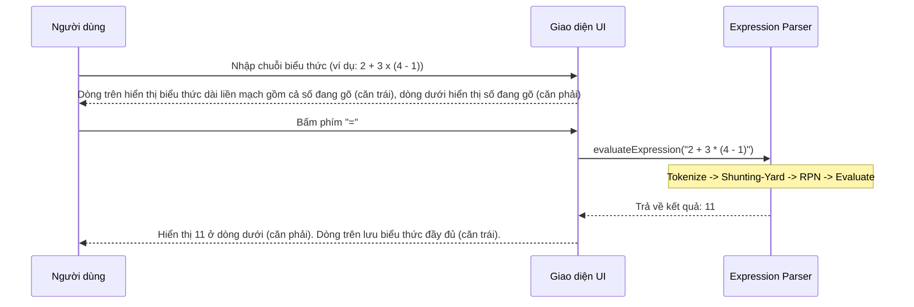
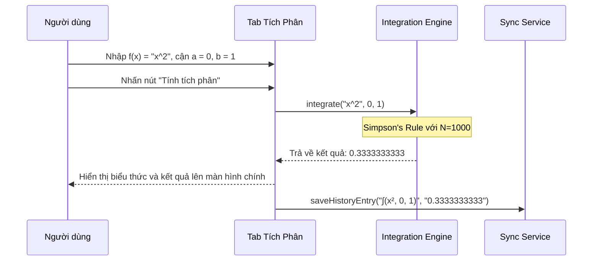
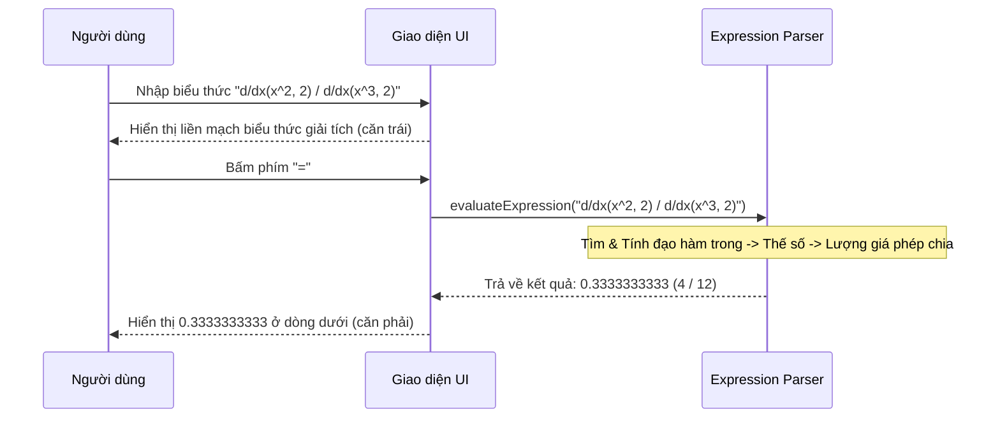

# BUSINESS REQUIREMENTS DOCUMENT (BRD) - Simple Calculator Web App v2.1.1

| Thông tin             | Chi tiết                        |
| :-------------------- | :------------------------------ |
| **Dự án**             | Simple Calculator Web App       |
| **Phiên bản**         | v2.1.1                          |
| **Cập nhật lần cuối** | 2026-06-18                      |
| **Trạng thái**        | APPROVED                        |
| **Tác giả**           | Nam (Product Owner & Developer) |

---

## REVISION HISTORY

| Phiên bản | Ngày       | Cập nhật bởi | Mô tả                                                                                                        |
| :-------- | :--------- | :----------- | :----------------------------------------------------------------------------------------------------------- |
| 1.0.0     | 2026-05-28 | Nam          | Phiên bản khởi tạo theo quy trình Spec-Driven Development                                                   |
| 2.0.0     | 2026-06-08 | Nam          | Nâng cấp lớn: thêm Scientific Mode, Dark/Light Mode, Cloud History Sync, Authentication và yêu cầu phím `=` để tính toán Unary |
| 2.1.0     | 2026-06-15 | Nam          | Nâng cấp tính năng nâng cao: PEMDAS Parser, Equation Display, Solver và Definite Integral                   |
| 2.1.1     | 2026-06-18 | Nam          | Nâng cấp giao diện hiển thị liền mạch, tích hợp chỉ báo trạng thái và hỗ trợ biểu thức giải tích phức hợp|

---

## 1. PROJECT OVERVIEW

Simple Calculator Web App v2.1.1 là bản phát hành nâng cấp toàn diện về khả năng hiển thị biểu thức (Display Layer) và mở rộng công cụ tính toán giải tích (Engine Layer). Kế thừa nền tảng toán học PEMDAS Expression Parser và các bộ công cụ Solver từ v2.1.0, phiên bản v2.1.1 mang lại trải nghiệm giống như một chiếc máy tính khoa học cầm tay thực tế.

Các điểm nâng cấp cốt lõi của v2.1.1 bao gồm:
- **Hiển thị biểu thức liền mạch, liên tục:** Hỗ trợ hiển thị trọn vẹn chuỗi biểu thức phức tạp khi đang nhập (ví dụ: `1 + 1 + 1 + 1` hoặc các phân số, đạo hàm dài) trên dòng biểu thức chính thay vì bị ngắt quãng giữa dòng biểu thức và dòng kết quả.
- **Biểu thức giải tích lồng nhau (Nested Calculus Expressions):** Hỗ trợ nhập và tính toán các biểu thức giải tích phức hợp chứa đạo hàm và tích phân lồng nhau hoặc thương của chúng (ví dụ: thương của đạo hàm `d/dx(x^2, 2) ÷ d/dx(x^3, 2)` hoặc các biểu thức kết hợp).
- **Căn lề tự nhiên:** Dòng biểu thức căn lề trái, dòng kết quả căn lề phải.
- **Thanh chỉ báo trạng thái:** Tích hợp kín đáo ở viền trên màn hình hiển thị để biểu thị các trạng thái hệ thống.

---

## 2. PROBLEMS & OPPORTUNITIES

### Problems

- **Biểu thức bị chia cắt trong quá trình nhập:** Dòng biểu thức chỉ hiển thị phần biểu thức đã lưu trước đó kèm theo toán tử cuối cùng (ví dụ `1 + 1 + 1 + `), còn toán hạng đang nhập hiện tại (ví dụ `1`) bị tách riêng và chỉ hiển thị ở dòng dưới.
- **Tính toán giải tích bị cô lập:** Ở v2.1.0, phép tính tích phân chỉ có thể thực hiện riêng biệt trong tab Tích phân và không thể lồng ghép vào biểu thức PEMDAS chính. Phép tính đạo hàm chưa được hỗ trợ. Người dùng không thể tính toán các biểu thức chứa thương số của hai đạo hàm hoặc kết hợp đạo hàm/tích phân.
- **Căn lề không đồng đều:** Cả biểu thức nhập vào và kết quả đều được căn lề phải (right-aligned). Trên các máy tính cầm tay tiêu chuẩn, dòng biểu thức thường được căn trái (left-aligned) để dễ đọc khi gõ từ trái sang phải, trong khi kết quả căn phải.
- **Thiếu các chỉ báo trạng thái trực quan:** Người dùng khó nhận biết trạng thái hiện hành của máy tính như chế độ góc (DEG/RAD) hay trạng thái phím chức năng (Shift/Unary pending) trực tiếp trên vùng hiển thị.

### Opportunities

- **Hiển thị biểu thức liền mạch (Seamless Expression Display):** Cho phép toàn bộ biểu thức đang gõ hiển thị liên tục thành một dòng thống nhất giúp người dùng dễ dàng kiểm tra và chỉnh sửa công thức.
- **Đột phá năng lực toán học (Advanced Calculus Parser):** Tích hợp trực tiếp toán tử đạo hàm số `d/dx(f(x), x_0)` và tích phân `∫(f(x), a, b)` vào parser PEMDAS chính, cho phép tính toán các biểu thức giải tích phức hợp và lồng nhau (ví dụ thương của đạo hàm).
- **Trải nghiệm người dùng đồng nhất:** Thanh chỉ báo trạng thái trực tiếp trên màn hình giúp người dùng theo dõi ngay chế độ góc (`D` cho DEG, `R` cho RAD) và trạng thái phím chức năng (`S` cho Shift/Pending Unary) mà không làm loãng thiết kế glassmorphic mượt mà hiện tại.

---

## 3. PROJECT OBJECTIVES

- **Hỗ trợ biểu thức giải tích lồng nhau:** Parser PEMDAS chấp nhận ký hiệu đạo hàm `d/dx(f(x), x_0)` và tích phân `∫(f(x), a, b)` lồng nhau hoặc kết hợp trong các phép toán cộng, trừ, nhân, chia.
- **Tích hợp thanh chỉ báo trạng thái (Indicators Bar):** Hiển thị các chỉ báo dạng ký hiệu siêu nhỏ ở viền trên màn hình, tự động bật/tắt theo trạng thái máy tính trong thời gian thực (< 10ms).
- **Cải tiến căn lề hiển thị:**
  - Biểu thức đang gõ hoặc đã tính toán: Căn trái (`left-aligned`).
  - Kết quả (số hoặc nghiệm phương trình): Căn phải (`right-aligned`).
- **Hiển thị chuỗi biểu thức liền mạch:** Dòng biểu thức `#display-expression` luôn hiển thị toàn bộ nội dung biểu thức đã nhập (bao gồm cả chữ số của toán hạng hiện hành và các hàm giải tích phức tạp).
- **Duy trì thiết kế cao cấp:** Bảo toàn phong cách glassmorphism mượt mà hiện có cho cả Dark và Light Mode.

---

## 4. PROJECT SCOPE

### 4.1 In Scope — Các tính năng kế thừa từ v2.1.0 (F-001 -> F-016)

| ID    | Tính năng | Mô tả tóm tắt |
| :---- | :-------- | :------------ |
| F-001 | Các phép tính số học cơ bản | Cộng, trừ, nhân, chia (+, −, ×, ÷) số nguyên hoặc thập phân; làm tròn 10 chữ số. |
| F-002 | Nhập liệu từ giao diện và bàn phím | Nhập chữ số và số thập phân từ phím ảo hoặc bàn phím cứng. |
| F-003 | Các chức năng xóa và sửa lỗi nhập | Phím AC để reset máy tính, phím ⌫ để xóa chữ số cuối cùng. |
| F-004 | Xử lý hiển thị nâng cao | Hiển thị dấu trừ, tự động chuyển về exponential notation khi kết quả dài. |
| F-005 | Xử lý lỗi chia cho 0 | Phát hiện chia cho 0, hiển thị thông báo lỗi rõ ràng và khóa máy tính. |
| F-006 | Phần trăm (%) | Chuyển giá trị hiện tại thành phần trăm (yêu cầu bấm `=`). |
| F-007 | Các hàm lượng giác | Hỗ trợ `sin`, `cos`, `tan`, `asin`, `acos`, `atan` và toggle DEG/RAD (yêu cầu bấm `=`). |
| F-008 | Các hàm logarithm và lũy thừa/căn thức | Hỗ trợ `log`, `ln`, `x^y`, `x^2`, `x^3`, `√x`, `³√x`, `n!`, `|x|`, và hằng số $\pi$, $e$ (yêu cầu bấm `=`). |
| F-009 | Dark Mode / Light Mode | Chuyển đổi giao diện sáng/tối mượt mà, lưu vào localStorage. |
| F-010 | Quản lý lịch sử tính toán hai tầng | Lưu lịch sử local (50 bản ghi) và đồng bộ Firestore Cloud (200 bản ghi). |
| F-011 | Đăng nhập & Đăng ký (Firebase Auth) | Xác thực người dùng bằng Email/Password để kích hoạt Cloud Sync. |
| F-012 | Phép tính PEMDAS | Phân tích và tính toán chuỗi biểu thức phức tạp cộng, trừ, nhân, chia, lũy thừa, căn thức, lượng giác bằng Shunting-yard. |
| F-013 | Hiển thị biểu thức dài | Hỗ trợ hiển thị đầy đủ chuỗi biểu thức nhập vào trực quan ở dòng trên (top display) trước khi tính. |
| F-014 | Tab Equation Solver | Cung cấp giao diện con (form nhập hệ số) để giải các phương trình bậc 1, bậc 2 và hệ 2 ẩn số. |
| F-015 | Tab Definite Integral | Cung cấp giao diện con (nhập hàm f(x), cận a, cận b) tính tích phân số bằng thuật toán Simpson's Rule. |
| F-016 | Lịch sử & đồng bộ nâng cao | Lưu trữ định dạng lịch sử chuyên biệt cho các phép tính Solver và Integral lên localStorage và Firestore. |

### 4.2 In Scope — Tính năng mới v2.1.1 (F-017 & F-018)

| ID    | Tính năng | Mô tả tóm tắt |
| :---- | :-------- | :------------ |
| **F-017** | **Hiển thị Biểu thức Liền mạch & Thanh Chỉ báo** | Nâng cấp toàn diện hộp hiển thị chính: - Thêm hàng chỉ báo trạng thái phía trên màn hình (`S`, `A`, `Math`, `D`, `R`, `▲`, `▼`). - Cấu trúc căn lề: Biểu thức căn trái, Kết quả căn phải. - **Biểu thức liền mạch**: Ghép nối tự động toán hạng hiện tại vào dòng biểu thức khi đang nhập. - Duy trì phong cách thiết kế glassmorphic hiện đại. |
| **F-018** | **Biểu thức Giải tích Phức hợp** | Hỗ trợ tính toán và lồng ghép giải tích: - Thêm toán tử đạo hàm số `d/dx(f(x), x_0)` tính bằng phương pháp sai phân trung tâm. - Tích hợp toán tử tích phân `∫(f(x), a, b)` vào parser PEMDAS chính. - Cho phép thực hiện các biểu thức kết hợp, thương số giữa đạo hàm và đạo hàm, hoặc đạo hàm và tích phân. |

### 4.3 Out of Scope — v2.1.1

| Tính năng | Lý do loại trừ / Kế hoạch |
| :--- | :--- |
| Chỉnh sửa công thức trực tiếp bằng con trỏ | Đòi hỏi điều phối cursor phức tạp; dời sang phiên bản sau. |
| Graphing Calculator (Vẽ đồ thị) | Đòi hỏi giao diện Canvas phức tạp; dời sang v3.0.0. |

---

## 5. BUSINESS PROCESS FLOW

### 5.1 Luồng tính toán biểu thức PEMDAS (F-012)

### 5.2 Luồng tính toán Tích phân xác định (F-015)

### 5.3 Luồng tính toán Thương đạo hàm / Giải tích phức hợp (F-018)

---

## 6. BUSINESS RULES

### Quy tắc kế thừa và điều chỉnh (BR-01 → BR-17)

| ID | Tên quy tắc | Chi tiết nghiệp vụ |
| :--- | :--- | :--- |
| **BR-01** | **Biểu thức PEMDAS** | Hỗ trợ nhập chuỗi biểu thức phức tạp có dấu ngoặc và tuân thủ thứ tự ưu tiên PEMDAS. |
| **BR-02** | **Tiếp tục sau kết quả** | Sau khi nhấn "=", nếu người dùng nhấn **toán tử** → kết quả hiện tại trở thành phần tử đầu tiên của biểu thức mới. Nếu nhấn **chữ số** → bắt đầu biểu thức mới hoàn toàn. |
| **BR-03** | **Giới hạn độ dài** | Biểu thức nhập vào có độ dài tối đa 100 ký tự để tránh quá tải hiển thị và xử lý. |
| **BR-04** | **Một dấu thập phân** | Mỗi số hạng thập phân trong biểu thức chỉ chấp nhận một dấu "." duy nhất. |
| **BR-05** | **Khóa sau lỗi chia cho 0** | Khi xảy ra lỗi chia cho 0 hoặc lỗi cú pháp, hiển thị thông báo lỗi, khóa các phím chức năng cơ bản/khoa học cho đến khi nhấn AC. |
| **BR-06** | **Làm tròn kết quả** | Kết quả thập phân được làm tròn tối đa 10 chữ số sau dấu phẩy để tránh lỗi floating-point. |
| **BR-07** | **Đồng bộ hóa lịch sử** | Hỏi người dùng đồng bộ lịch sử từ `localStorage` lên Cloud Firestore khi đăng nhập thành công. |
| **BR-08** | **Offline mode** | Hoạt động bình thường ngoại tuyến và tự động đồng bộ lịch sử lên Cloud khi có mạng trở lại. |
| **BR-09** | **Ký hiệu khoa học** | Kết quả vượt quá 15 chữ số hoặc cực nhỏ (< 1e-9) tự động hiển thị dưới dạng số mũ khoa học (Exponential notation). |
| **BR-10** | **Đơn vị lượng giác** | Mặc định khởi động là DEG (hoặc cấu hình đã lưu). Trạng thái DEG/RAD được lưu vào `localStorage`. |
| **BR-11** | **Lỗi toán học khoa học** | Hàm lượng giác/logarithm ngoài miền xác định, căn bậc 2 số âm, giai thừa số âm/thập phân sẽ báo `"Lỗi toán học"` và khóa máy tính. |
| **BR-12** | **Biểu thức PEMDAS hợp lệ** | Bộ parser chỉ chấp nhận biểu thức đúng cú pháp. Nếu sai, hiển thị `"Lỗi cú pháp"` và khóa máy tính. |
| **BR-13** | **Ưu tiên hiển thị toán học** | Toán tử hiển thị chuẩn trực quan: nhân là `×`, chia là `÷`, lũy thừa là `^`. Ký tự biến là chữ `x` thường. |
| **BR-14** | **Xử lý biến tự do x** | Ký tự `x` chỉ được coi là biến tự do bên trong các toán tử giải tích `d/dx(f(x), x_0)` hoặc `∫(f(x), a, b)`. Nếu gõ `x` đơn độc ở biểu thức thường PEMDAS và nhấn `=` sẽ báo `"Lỗi cú pháp"`. |
| **BR-15** | **Ràng buộc hệ số Solver** | Hệ số Solver phải là số thực. Nếu $a=0$ ở PT bậc 2, giải theo PT bậc 1. Hỗ trợ hiển thị nghiệm phức dạng `u + vi` / `u - vi` khi $\Delta < 0$. |
| **BR-16** | **Ràng buộc Tích phân** | Cận $a, b$ phải là số thực hữu hạn. Hàm $f(x)$ phải xác định liên tục trên đoạn tích phân. Nếu tính số ra `NaN`, `Infinity`, báo `"Lỗi toán học"`. |
| **BR-17** | **Schema lịch sử nâng cao** | Phép tính Solver và Tích phân lưu lịch sử theo định dạng chuyên biệt (ví dụ: `∫(f(x), a, b) = kết quả`). |

### Quy tắc mới v2.1.1 (BR-18 → BR-20)

| ID | Tên quy tắc | Chi tiết nghiệp vụ |
| :--- | :--- | :--- |
| **BR-18** | **Cập nhật Chỉ báo Trạng thái** | Các chỉ báo trên màn hình phản ánh trực tiếp trạng thái logic của ứng dụng: - **S (Shift)**: Sáng lên khi máy tính đang ở trạng thái chờ toán hạng cho hàm Unary đầu vào (khi `state.waitingForUnaryInput === true`). - **D (Degree)**: Sáng khi đơn vị góc là `DEG` (`state.angleUnit === 'DEG'`). - **R (Radian)**: Sáng khi đơn vị góc là `RAD` (`state.angleUnit === 'RAD'`). - **Math**: Luôn luôn sáng thể hiện chế độ nhập PEMDAS tự nhiên. - **▲ / ▼**: Sáng lên khi danh sách lịch sử có chứa ít nhất 1 bản ghi để báo cho người dùng biết có thể xem lại lịch sử. |
| **BR-19** | **Bố cục hiển thị biểu thức liền mạch** | Bố cục màn hình tuân thủ nguyên lý trực quan máy tính cầm tay: - Hộp màn hình có chiều cao cố định tối thiểu 116px để không bị co giật giao diện. - Chuỗi biểu thức (`#display-expression`) luôn hiển thị căn lề trái (left-aligned), hiển thị liên tục đầy đủ các số và toán tử đang nhập (Ví dụ: `1 + 1 + 1 + 1` hoặc `d/dx(x^2, 2) / d/dx(x^3, 2)` được hiển thị liền mạch trên dòng biểu thức). Tự động thu nhỏ font hoặc ẩn bớt ký tự thừa nếu vượt độ dài. - Kết quả tính toán (`#display-result`) luôn hiển thị căn lề phải (right-aligned), hiển thị chữ số của toán hạng hiện hành trong lúc nhập, hiển thị kết quả cuối cùng hoặc nghiệm (hỗ trợ xuống dòng) sau khi nhấn `=`. |
| **BR-20** | **Đánh giá Giải tích Phức hợp** | Parser PEMDAS tính toán các toán tử giải tích bằng cách đệ quy lượng giá từ trong ra ngoài: - Đạo hàm số `d/dx(f, x_0)` tính bằng sai phân trung tâm với bước $h = 10^{-5}$:   $$f'(x_0) \approx \frac{f(x_0 + h) - f(x_0 - h)}{2h}$$ - Tích phân `∫(f, a, b)` tính bằng Simpson's Rule với $N=1000$ khoảng chia. - Hỗ trợ lồng nhau, thương số và kết hợp đại số bình thường. Nếu phát hiện điểm bất định (NaN/Infinity) ở bất kỳ bước nào, trả về `"Lỗi toán học"`. |

---

## 7. FUNCTIONAL REQUIREMENTS

Danh sách chức năng đầy đủ theo ID:

| ID | Feature Group | Thuộc phiên bản |
| :-- | :---------------------- | :-------------- |
| F-001 | Các phép tính số học cơ bản | Kế thừa v2.0.0 (Gốc v1.0.0) |
| F-002 | Nhập liệu từ giao diện và bàn phím | Kế thừa v2.0.0 (Gốc v1.0.0) |
| F-003 | Các chức năng xóa và sửa lỗi nhập | Kế thừa v2.0.0 (Gốc v1.0.0) |
| F-004 | Xử lý hiển thị nâng cao | Kế thừa v2.0.0 (Gốc v1.0.0) |
| F-005 | Xử lý lỗi chia cho 0 | Kế thừa v2.0.0 (Gốc v1.0.0) |
| F-006 | Phần trăm (%) | Kế thừa v2.0.0 |
| F-007 | Các hàm lượng giác | Kế thừa v2.0.0 |
| F-008 | Các hàm logarithm và lũy thừa/căn thức | Kế thừa v2.0.0 |
| F-009 | Dark Mode / Light Mode | Kế thừa v2.0.0 |
| F-010 | Quản lý lịch sử tính toán hai tầng | Kế thừa v2.0.0 |
| F-011 | Đăng nhập & Đăng ký (Firebase Auth) | Kế thừa v2.0.0 |
| F-012 | Phép tính PEMDAS | Kế thừa v2.1.0 |
| F-013 | Hiển thị biểu thức dài | Kế thừa v2.1.0 |
| F-014 | Tab Equation Solver | Kế thừa v2.1.0 |
| F-015 | Tab Definite Integral | Kế thừa v2.1.0 |
| F-016 | Lịch sử & đồng bộ nâng cao | Kế thừa v2.1.0 |
| **F-017** | **Hiển thị Biểu thức Liền mạch & Thanh Chỉ báo** | Mới v2.1.1 |
| **F-018** | **Biểu thức Giải tích Phức hợp** | Mới v2.1.1 |

---

## 8. NON-FUNCTIONAL REQUIREMENTS

- **Responsive & Layout:** Đảm bảo viền co giãn tự động theo chiều ngang của hộp máy tính chính, không gây tràn màn hình trên các thiết bị mobile màn hình siêu hẹp.
- **Tương thích hoàn toàn (Backward Compatibility):** Các phần tử HTML mang ID `#display-expression` và `#display-result` phải được giữ nguyên và nằm trong phạm vi cây DOM hiển thị.
- **Hiệu năng:** Độ trễ hiển thị chỉ báo trạng thái chuyển đổi $\le 16\text{ms}$ khi cập nhật state. Đệ quy lượng giá đạo hàm/tích phân phản hồi dưới 300ms.

---

## 9. SUCCESS METRICS

- **Biểu thức nhập liệu trực quan:** Không còn tình trạng biểu thức bị ngắt quãng dở dang khi đang gõ số hạng hiện tại.
- **Tính toán giải tích chính xác:** Thương đạo hàm hoặc tích phân phức tạp được lượng giá đúng giá trị số học lý thuyết với sai số $\le 10^{-5}$.
- **Không xảy ra hồi lùi (No regressions):** Mọi tính năng giải phương trình và tích phân tích hợp trên màn hình ở v2.1.0 tiếp tục hoạt động trơn tru.

---

## 10. NOTES

- Tài liệu này mô tả yêu cầu ở cấp độ nghiệp vụ cho phiên bản v2.1.1.
- Chi tiết hành vi UI, trạng thái màn hình và test scenarios → xem **[FUNCTION_SPECIFICATION_v2.1.1.md](file:///Users/nam/Desktop/calculator/docs/v2.1.1/FUNCTION_SPECIFICATION_v2.1.1.md)** (Sẽ soạn thảo ở bước tiếp theo).
- Cấu trúc file, module JS và luồng dữ liệu → xem **[SYSTEM_ARCHITECTURE_v2.1.1.md](file:///Users/nam/Desktop/calculator/docs/v2.1.1/SYSTEM_ARCHITECTURE_v2.1.1.md)** (Sẽ soạn thảo ở bước tiếp theo).
- Schema Firestore và localStorage → xem **[DATABASE_DESIGN_v2.1.1.md](file:///Users/nam/Desktop/calculator/docs/v2.1.1/DATABASE_DESIGN_v2.1.1.md)** (Sẽ soạn thảo ở bước tiếp theo).
