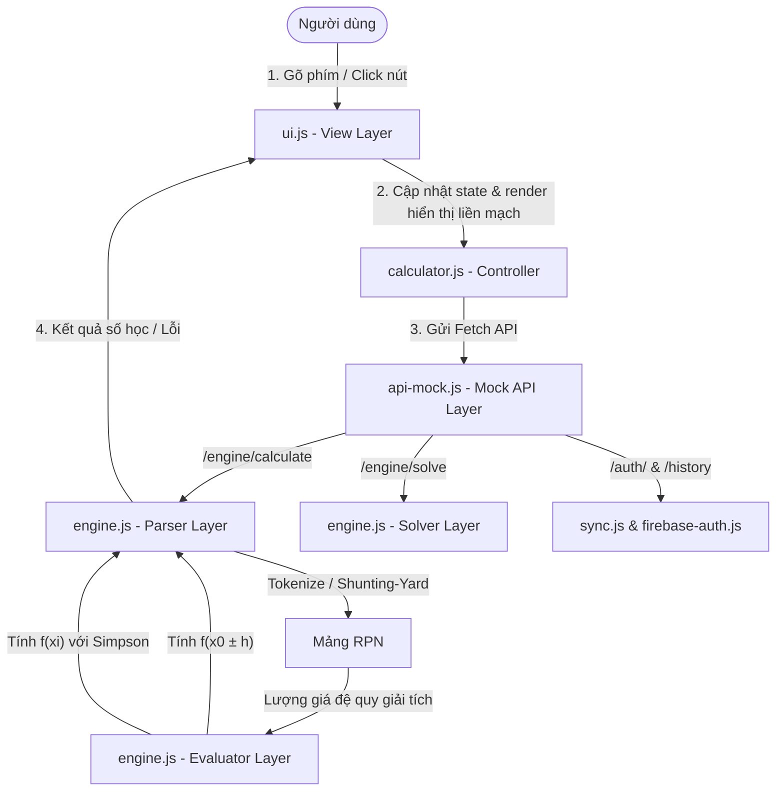
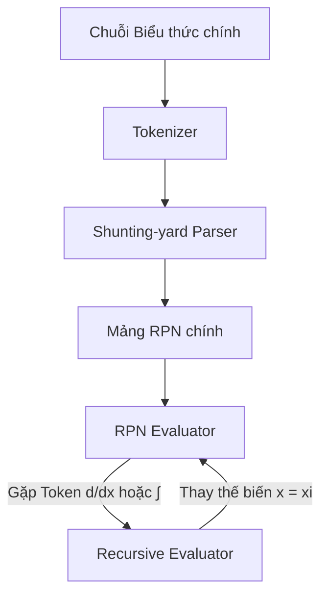
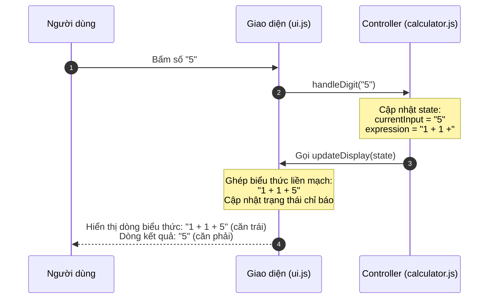
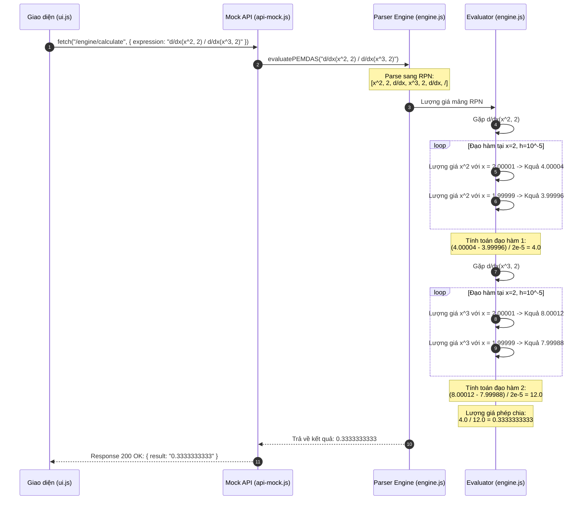
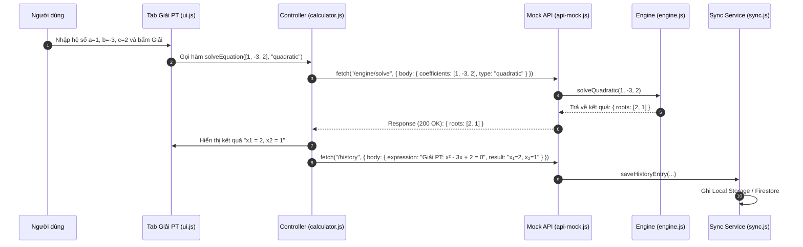
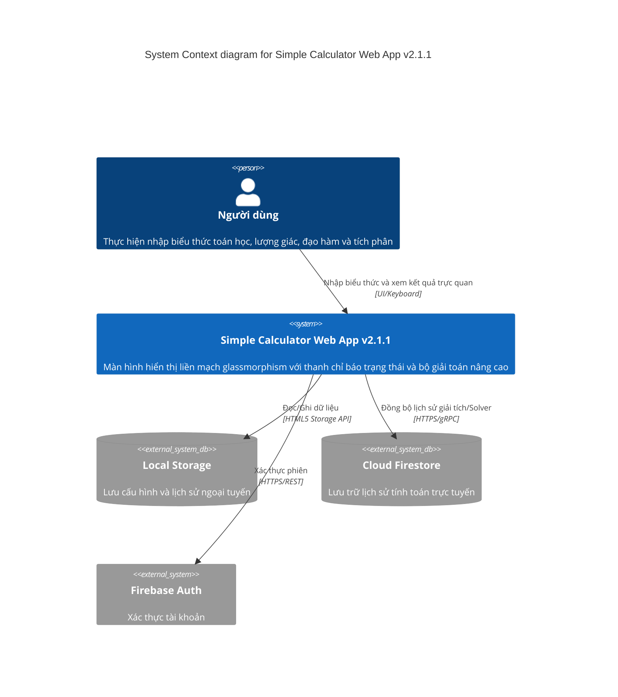
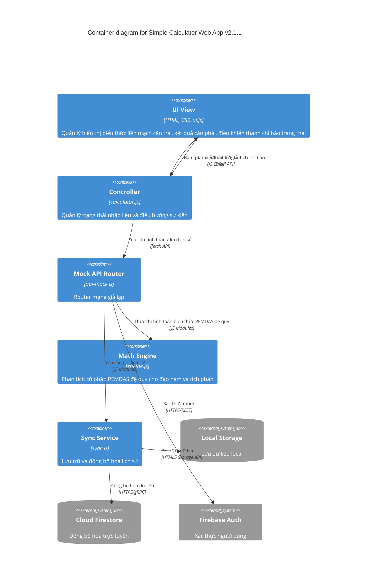
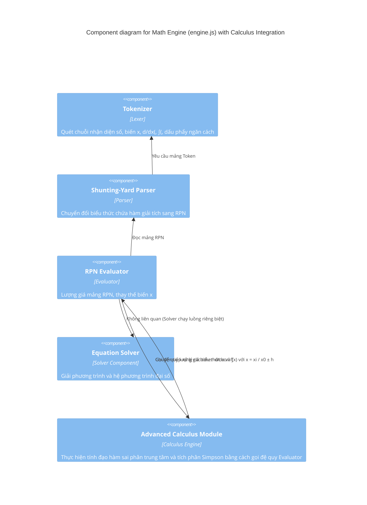

# SYSTEM ARCHITECTURE DOCUMENT (SAD) - Simple Calculator Web App v2.1.1

| Thông tin         | Chi tiết                        |
| :---------------- | :------------------------------ |
| **Dự án**         | Simple Calculator Web App       |
| **Phiên bản**     | v2.1.1                          |
| **Ngày cập nhật** | 2026-06-18                      |
| **Trạng thái**    | DRAFT                           |
| **Tác giả**       | Nam (Product Owner & Developer) |

---

## NHẬT KÝ THAY ĐỔI

| Version | Ngày       | Người sửa | Mô tả thay đổi                                                                                                |
| :------ | :--------- | :-------- | :------------------------------------------------------------------------------------------------------------ |
| 1.0.0   | 2026-05-29 | Nam       | Tài liệu kiến trúc ban đầu (v1.0.0)                                                                           |
| 2.0.0   | 2026-06-08 | Nam       | Cập nhật v2.0.0: Thêm Scientific Mode, Dark/Light Mode, Cloud History Sync, Firebase Authentication           |
| 2.1.0   | 2026-06-15 | Nam       | Nâng cấp v2.1.0: Thiết kế Expression Parser (PEMDAS), Equation Solver, Definite Integral Engine               |
| 2.1.1   | 2026-06-18 | Nam       | Nâng cấp v2.1.1: Thiết kế giao diện hiển thị liền mạch, thanh chỉ báo trạng thái và bộ phân tích giải tích nâng cao |

---

## Section 1: Introduction and Goals

Simple Calculator Web App v2.1.1 nâng cấp hệ thống hiển thị và lõi tính toán toán học nhằm đáp ứng trải nghiệm thực tế giống như máy tính khoa học cầm tay:
1.  **Lớp hiển thị (Display Layer):** Cải tiến luồng dữ liệu hiển thị nhằm cung cấp trải nghiệm gõ biểu thức liền mạch (Seamless Display). Toán hạng hiện tại đang gõ sẽ tự động đồng bộ thời gian thực lên dòng công thức phía trên thay vì tách biệt xuống dòng dưới. Đồng thời, tích hợp thanh chỉ báo trạng thái hệ thống (`S`, `A`, `Math`, `D`, `R`, `▲`, `▼`) ngay trên viền màn hình glassmorphism hiện đại.
2.  **Lõi tính toán giải tích (Advanced Calculus Engine):** Tích hợp sâu rộng toán tử đạo hàm số `d/dx(f(x), x_0)` và tích phân số `∫(f(x), a, b)` vào trực tiếp bộ phân tích cú pháp biểu thức PEMDAS chính. Cho phép giải quyết các biểu thức giải tích phức hợp lồng nhau hoặc các phép chia (thương số) giữa các đạo hàm/tích phân.

**Mục tiêu kiến trúc chính:**
*   **Zero build step:** Tiếp tục duy trì nguyên tắc chạy trực tiếp mã nguồn ES Modules trong trình duyệt không qua build tool hay bundler.
*   **Tách biệt mối quan tâm (Separation of Concerns):** Phân chia rõ ràng lớp hiển thị giao diện (View), điều phối (Controller), định tuyến API cục bộ (Mock API) và bộ xử lý toán học (Expression Engine).
*   **Không phá vỡ cấu trúc DOM (Backward Compatibility):** Tiếp tục sử dụng hai ID quan trọng là `#display-expression` và `#display-result` để đảm bảo các bộ test cũ tiếp tục chạy đúng.
*   **Tránh circular dependencies khi lượng giá đệ quy:** Thiết kế cơ chế thế biến $x$ và gọi đệ quy `evaluateExpression` một cách an toàn bên trong bộ lượng giá đạo hàm và tích phân số.

---

## Section 2: Architecture Constraints

*   **Runtime & Ngôn ngữ:** Chỉ chạy trên trình duyệt sử dụng HTML5, CSS3 và Vanilla JS (ES Modules). Không phụ thuộc vào thư viện bên thứ ba bên ngoài Firebase CDN.
*   **An toàn tính toán (No eval):** Bộ phân tích biểu thức bắt buộc triển khai thủ công bằng thuật toán **Shunting-yard** nhằm loại bỏ hoàn toàn việc sử dụng hàm `eval()` hay `Function()` (rủi ro bảo mật XSS lớn).
*   **Ràng buộc sai phân đạo hàm (Derivative Precision Budget):** Sử dụng phương pháp sai phân trung tâm (Central Differences) với bước dịch chuyển cố định $h = 10^{-5}$ để đạt độ chính xác tối ưu trong giới hạn số thực IEEE 754 kép:
    $$f'(x_0) \approx \frac{f(x_0 + h) - f(x_0 - h)}{2h}$$
*   **Ràng buộc tích phân số (Simpson's Rule Budget):** Số điểm chia được cố định ở mức $N = 1000$ khoảng để đảm bảo thời gian tính toán luôn dưới **10ms**, nằm trong ngân sách render của trình duyệt.
*   **Ngăn ngừa tràn ngăn xếp (Stack Overflow Prevention):** Giới hạn độ sâu đệ quy khi tính toán các hàm giải tích lồng nhau tối đa là **3 cấp**.
*   **Tính độc lập offline (Mock API):** Không phụ thuộc vào server thật. Tầng định tuyến fetch mock sẽ chặn toàn bộ request toán học/auth để chuyển hướng xuống engine local, đảm bảo chạy offline hoàn toàn.

---

## Section 3: Context and Scope

Hệ thống hoạt động độc lập ngay trên thiết bị khách (Client-side). Ở v2.1.1, các hàm giải tích không còn chạy tách biệt ở các Controller/API Solver/Integral riêng nữa, mà được tích hợp thẳng làm một Token loại `FUNCTION` bên trong Parser chính.



---

## Section 4: Data Architecture & Persistence

Toàn bộ dữ liệu cấu hình giao diện (Theme, góc DEG/RAD) và lịch sử tính toán được lưu giữ ở hai tầng:
1.  **Local Storage (Tier 1):** Lưu trữ cấu hình và tối đa 50 phép tính gần nhất trong queue offline.
2.  **Cloud Firestore (Tier 2):** Đồng bộ hóa tối đa 200 bản ghi lịch sử lên Firestore khi người dùng đăng nhập.

### Schema dữ liệu cho các phép toán:
*   **PEMDAS biểu thức thường:** `2 + 3 × (4 - 1) = 11`
*   **PEMDAS chứa giải tích phức hợp (v2.1.1):** `d/dx(x^2, 2) ÷ d/dx(x^3, 2) = 0.3333333333`
*   **Solver (F-014):** 
    *   Bậc 2: `Giải PT: ax² + bx + c = 0 → x = nghiệm` (Ví dụ: `Giải PT: x² - 3x + 2 = 0 → x₁=2, x₂=1`).
    *   Bậc 1: `Giải PT: ax + b = 0 → x = nghiệm`.
    *   Hệ 2 ẩn: `Giải hệ PT: {a1x+b1y=c1, a2x+b2y=c2} → x = nghiệmX, y = nghiệmY`.
*   **Definite Integral (F-015):** Lưu dạng `∫(f(x), a, b) = kết quả` (Ví dụ: `∫(x², 0, 1) = 0.3333333333`).

---

## Section 5: Building Block View

### 5.1. Cấu trúc Phân tầng (Layered Architecture)

Dự án tuân thủ kiến trúc phân tầng dạng Service nhằm đảm bảo tính bảo trì và dễ viết test:

1.  **View Layer (index.html, style.css, ui.js):**
    *   Quản lý DOM, lắng nghe sự kiện từ UI/Bàn phím, toggle các tab màn hình (Cơ bản, Khoa học, Công cụ).
    *   **Thanh chỉ báo trạng thái:** Render trạng thái DOM tương ứng với state máy tính (`S` sáng khi chờ Unary, `D`/`R` tương ứng đơn vị góc, `Math` luôn sáng, `▲`/`▼` sáng dựa trên độ dài danh sách lịch sử).
    *   **Hiển thị liền mạch:** Khi gõ, hàm `updateDisplay` lấy `state.expression` ghép nối với `state.currentInput` (nếu có) để cập nhật lên dòng biểu thức `#display-expression` (căn lề trái), dòng kết quả `#display-result` (căn lề phải).
    *   Validate dữ liệu nhập vào Solver (chỉ cho phép số thực) và cận Tích phân trước khi gửi lệnh tính.
2.  **Controller Layer (calculator.js):**
    *   Quản lý trạng thái máy tính (calculator state: `currentInput`, `expression`, `isError`, `pendingUnary`, v.v.).
    *   Lưu trữ state trung tâm. Khi người dùng bấm `=`, đóng gói toàn bộ biểu thức đang nhập và gửi xuống Mock API, sau đó cập nhật lại giao diện.
3.  **Mock API Layer (api-mock.js):**
    *   Ghi đè `window.fetch` toàn cục, đóng vai trò như một Router trung gian đón nhận các request mạng giả lập (`/engine/calculate`, `/engine/solve`, `/auth/login`, `/history`) và trả về `Response` JSON.
4.  **Engine Layer (engine.js):**
    *   Thực hiện toàn bộ logic toán học. Được chia thành các module chức năng độc lập (Tokenizer, Shunting-yard Parser, RPN Evaluator, Solver, Calculus).
5.  **Service Layer (firebase-auth.js, sync.js):**
    *   Xác thực phiên làm việc của người dùng và quản lý lưu trữ, đồng bộ dữ liệu.

```
Mã nguồn /js
├── engine.js       (Lõi toán học: Tokenizer, Shunting-yard, Evaluator, Solver, Calculus)
├── ui.js           (View: Quản lý DOM hiển thị liền mạch, thanh trạng thái S/A/Math/D/R/▲/▼)
├── api-mock.js     (Mock API Router đánh chặn request fetch)
├── sync.js         (Đồng bộ lịch sử local và Firebase Firestore)
└── ../auth/        (Quản lý Firebase Authentication)
```

### 5.2. Phân rã Module trong engine.js

*   **Tokenizer:** Duyệt chuỗi biểu thức và chia nhỏ thành mảng các Token (`NUMBER`, `VARIABLE`, `OPERATOR`, `FUNCTION`, `PARENTHESIS`). Nhận diện ký hiệu hàm đạo hàm `d/dx(` và tích phân `∫(`. Nhận diện dấu phẩy `,` làm toán tử ngăn cách đối số bên trong các hàm đa tham số.
*   **Parser (Shunting-yard):** Chuyển mảng Token từ dạng Trung tố (Infix) sang dạng Hậu tố (Reverse Polish Notation - RPN) sử dụng Operator Stack. Hỗ trợ các hàm giải tích chứa nhiều tham số như `d/dx(f(x), x_0)` (2 đối số) và `∫(f(x), a, b)` (3 đối số).
*   **Evaluator (RPN Evaluator):** Sử dụng Value Stack tính toán kết quả từ mảng RPN. Hỗ trợ nhận vào tham số môi trường chứa giá trị của biến `x`. Khi gặp token `d/dx` hoặc `∫`, Evaluator chuyển tiếp xử lý tới Calculus Module bằng cách truyền mảng RPN của hàm con $f(x)$ và giá trị các tham số thực tế.
*   **Solver Module:** Giải các phương trình đại số ($ax+b=0$, $ax^2+bx+c=0$ hỗ trợ nghiệm phức, và hệ phương trình 2 ẩn qua Cramer).
*   **Calculus Module (Advanced Calculus):**
    *   Thực hiện tính đạo hàm số tại điểm $x_0$ bằng cách gọi đệ quy Evaluator lượng giá mảng RPN hàm con với $x = x_0+h$ và $x = x_0-h$.
    *   Thực hiện tính tích phân số bằng cách gọi đệ quy Evaluator lượng giá mảng RPN hàm con tại 1001 điểm phân hoạch trong vòng lặp Simpson.
    *   **Tối ưu hiệu năng:** Tránh việc Tokenize và Parse lại chuỗi biểu thức con nhiều lần bằng cách tái sử dụng mảng RPN đã biên dịch sẵn từ Parser chính.



---

## Section 6: Non-Functional Architecture Aspects

### 6.1 Performance & UX Strategy
*   **Hiệu năng tính toán đệ quy:** Tránh nghẽn Main Thread bằng việc cố định $N=1000$ khoảng chia đối với tích phân và bước $h=10^{-5}$ đối với đạo hàm. Đồng thời giới hạn độ sâu đệ quy giải tích tối đa là **3 cấp** nhằm loại bỏ nguy cơ tràn ngăn xếp (Stack Overflow) khi lượng giá biểu thức lồng phức tạp.
*   **Thiết kế hiển thị không giật khung hình (Fluid Layout):** Hộp hiển thị `#display-container` được cố định chiều cao tối thiểu `116px` để chứa đủ thanh chỉ báo trạng thái (Indicators bar), dòng biểu thức và dòng kết quả mà không làm co giãn hay đẩy dịch các nút bấm bên dưới.
*   **Co chữ tự động (Auto-scaling font size):** Tự động đo `scrollWidth` so với `clientWidth` của thẻ hiển thị để giảm kích thước font (từ `1.8rem` xuống tối thiểu `1.1rem`) khi biểu thức quá dài, tránh hiện tượng xuống dòng ngoài ý muốn.

### 6.2 Offline-First Sync Strategy
*   Tận dụng `api-mock.js` để lưu tạm các bản ghi lịch sử vào `localStorage` khi mất mạng (`navigator.onLine === false`).
*   Khi phát hiện thiết bị online trở lại, hệ thống tự động đẩy các bản ghi trong hàng đợi local lên Firestore.

### 6.3 Security Constraints
*   Triệt tiêu hoàn toàn rủi ro tiêm mã độc (XSS) bằng việc tự viết bộ Parser riêng. Chuỗi người dùng nhập vào không bao giờ được chuyển vào các hàm nguy hiểm như `eval()` hay `Function()`.
*   Quy định Firestore Security Rules chỉ cho phép đọc/ghi dữ liệu lịch sử khi `request.auth.uid == resource.data.userId`.

---

## Section 7: Runtime View

### 7.1 Luồng nhập liệu và cập nhật giao diện liền mạch (F-017)



### 7.2 Luồng tính toán thương đạo hàm giải tích phức hợp (F-018)



### 7.3 Luồng giải phương trình Solver (F-014)



---

## Section 8: Deployment View

Do ứng dụng Simple Calculator v2.1.1 tuân thủ kiến trúc **Zero Build Step / Static App**, mô hình triển khai cực kỳ tinh giản:

- **Local Development:** Chỉ cần một HTTP server tĩnh siêu nhẹ chạy bằng Python hoặc Node.js để chạy được giao diện và định tuyến fetch mock (ví dụ: `python3 -m http.server 3001`).
- **Production Deployment:** Triển khai trực tiếp toàn bộ thư mục dự án lên các dịch vụ lưu trữ tĩnh (như GitHub Pages, Vercel, Netlify hoặc Firebase Hosting) dưới dạng các file HTML, CSS và JS tĩnh.
- **Firebase SDK Delivery:** Các thư viện Firebase Authentication và Firestore được nhúng trực tiếp qua thẻ script CDN từ máy chủ Google, không đóng gói cục bộ.

---

## C4 Model Diagrams

### Level 1: System Context Diagram



### Level 2: Container Diagram



### Level 3: Component Diagram (Focus: Math Engine)



---

## Section 9: Backward Compatibility & Test Suite Verification

*   **DOM Node Preservation:** Các phần tử `<div id="display-expression">` và `<div id="display-result">` bắt buộc phải tồn tại trong DOM tree của `index.html`. Lớp `ui.js` chỉ thay đổi thuộc tính `textContent` và cách bố trí CSS (căn lề) thay vì thay đổi cấu trúc thẻ hay ID.
*   **Test Case Assertions:** 
    *   Do dòng biểu thức phía trên (`#display-expression`) nay sẽ hiển thị liền mạch số hạng đang nhập thay vì chỉ hiển thị các số hạng trước đó, các ca kiểm thử unit test kiểm tra trạng thái màn hình trung gian (ví dụ: gõ `5 + 3` thì `#display-expression` hiển thị `5 +` ở v2.1.0) cần được cập nhật khẳng định (assertions) để khớp với định dạng mới (`5 + 3`).
    *   Các ca kiểm thử tính năng Equation Solver và Definite Integral dạng tab tiếp tục được giữ nguyên và chạy độc lập.

---

END OF DOCUMENT
