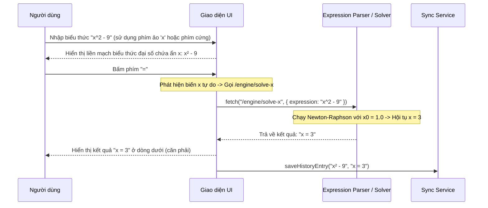

# BUSINESS REQUIREMENTS DOCUMENT (BRD) - Simple Calculator Web App v2.1.2

| Thông tin             | Chi tiết                        |
| :-------------------- | :------------------------------ |
| **Dự án**             | Simple Calculator Web App       |
| **Phiên bản**         | v2.1.2                          |
| **Cập nhật lần cuối** | 2026-06-19                      |
| **Trạng thái**        | APPROVED                        |
| **Tác giả**           | Nam (Product Owner & Developer) |

---

## REVISION HISTORY

| Phiên bản | Ngày       | Cập nhật bởi | Mô tả                                                                                                        |
| :-------- | :--------- | :----------- | :----------------------------------------------------------------------------------------------------------- |
| 1.0.0     | 2026-05-28 | Nam          | Phiên bản khởi tạo theo quy trình Spec-Driven Development                                                   |
| 2.0.0     | 2026-06-08 | Nam          | Nâng cấp lớn: thêm Scientific Mode, Dark/Light Mode, Cloud History Sync, Authentication và yêu cầu phím `=` để tính toán Unary |
| 2.1.0     | 2026-06-15 | Nam          | Nâng cấp tính năng nâng cao: PEMDAS Parser, Equation Display, Solver và Definite Integral                   |
| 2.1.1     | 2026-06-18 | Nam          | Nâng cấp giao diện hiển thị liền mạch, tích hợp chỉ báo trạng thái và hỗ trợ biểu thức giải tích phức hợp|
| 2.1.2     | 2026-06-19 | Nam          | Nâng cấp v2.1.2: Thêm phím nhập ẩn biến `x` trên bàn phím khoa học, bộ giải phương trình Tìm x (Newton-Raphson Solver) và phím nhập phân số trực quan `■/□` dạng ô vuông điền tham số. |

---

## 1. PROJECT OVERVIEW

Simple Calculator Web App v2.1.2 bổ sung năng lực giải phương trình trực tiếp trên màn hình nhập liệu chính thông qua việc giới thiệu phím nhập ẩn biến `x` và tích hợp bộ giải toán số học tìm `x` (Newton-Raphson Solver). Người dùng không còn bị giới hạn việc giải phương trình trong tab Solver cố định, mà có thể tự do gõ mọi phương trình/biểu thức đại số chứa ẩn `x` ngay trên dòng nhập liệu chính và nhấn phím `=` để tìm nghiệm trực tiếp. Đồng thời, v2.1.2 bổ sung phím nhập phân số trực quan dạng ô vuông `■/□` cho phép xây dựng cấu trúc phân số dạng đứng, lựa chọn các ô vuông trống và điền tham số trực tiếp.

Các điểm nâng cấp cốt lõi của v2.1.2 bao gồm:
- **Phím ẩn biến `x` trên bàn phím:** Thêm nút bấm `x` chuyên dụng trên bàn phím khoa học ảo (Keypad Scientific) và hỗ trợ phím cứng để tiện lợi khi nhập liệu.
- **Bộ giải phương trình Tìm x (Newton-Raphson Solver):** Khi người dùng nhập một biểu thức chứa biến tự do `x` (ví dụ `x^2 - 9 = 0` hoặc chỉ gõ `x^2 - 9` biểu thị phương trình bằng 0) và nhấn phím `=`, máy tính sẽ tự động chạy thuật toán Newton-Raphson để giải tìm nghiệm `x` và hiển thị kết quả `x = [nghiệm]`.
- **Phím nhập phân số trực quan (`■/□`):** Bổ sung nút bấm phân số trên scientific keypad (thay thế phím căn bậc 3 `³√`), cho phép chèn cấu trúc phân số đứng với các ô vuông điền tham số.

---

## 2. PROBLEMS & OPPORTUNITIES

### Problems

- **Hạn chế việc nhập biến x:** Ở v2.1.1, biến `x` chỉ được phép nhập bên trong các hàm giải tích `d/dx` hoặc `∫`. Nếu gõ `x` đơn độc hoặc bên ngoài các hàm này và nhấn `=`, máy tính sẽ báo lỗi cú pháp.
- **Thiếu phím biến số chuyên dụng:** Người dùng không có phím ảo `x` để gõ trên giao diện màn hình cảm ứng điện thoại, bắt buộc phải sử dụng bàn phím vật lý máy tính.
- **Giải phương trình bị gò bó:** Tab Solver ở v2.1.1 chỉ cho phép nhập hệ số của các dạng phương trình định sẵn (bậc 1, bậc 2, hệ 2 ẩn). Người dùng không thể nhập và giải các phương trình tùy ý hoặc phức tạp hơn (ví dụ: phương trình chứa lượng giác, logarit, mũ như `sin(x) - 0.5 = 0`).

### Opportunities

- **Tự do thiết lập phương trình:** Việc hỗ trợ nhập biến `x` và phím bấm tương ứng giúp người dùng biến dòng nhập liệu chính thành một bảng viết phương trình tự do.
- **Bộ giải toán tổng quát (General Numerical Solver):** Tích hợp thuật toán lặp số Newton-Raphson cho phép giải hầu hết các loại phương trình liên tục từ đơn giản đến phức tạp trực tiếp từ màn hình chính.
- **Trải nghiệm người dùng đồng nhất:** Tận dụng tối đa dòng hiển thị biểu thức liền mạch toán học của v2.1.1 để hiển thị các phương trình chứa ẩn, mang lại cảm giác cao cấp tương tự dòng máy tính Casio FX.

---

## 3. PROJECT OBJECTIVES

- **Hỗ trợ phím biến số `x`:** Thêm phím ảo `x` chuyên dụng vào Scientific Keypad.
- **Kích hoạt tính năng Tìm x qua phím `=`:** Khi phát hiện biểu thức chứa biến tự do `x`, phím `=` sẽ thực hiện tìm nghiệm thay vì báo lỗi cú pháp.
- **Giải nghiệm số chính xác cao:** Bộ solver Newton-Raphson hoạt động với sai số hội tụ cực nhỏ ($\le 10^{-7}$) và hỗ trợ đa điểm khởi tạo ($1.0, 0.0, -1.0, 10.0, -10.0$) để tối đa hóa khả năng tìm thấy nghiệm thực.
- **Không phá vỡ cấu trúc hiển thị:** Kết quả nghiệm tìm được hiển thị tường minh dưới dạng `x = [giá trị]` ở dòng dưới màn hình.

---

## 4. PROJECT SCOPE

### 4.1 In Scope — Các tính năng kế thừa từ v2.1.1 (F-001 -> F-018)

Kế thừa toàn bộ các tính năng cơ bản, khoa học, solver tab phụ, tích phân tab phụ, hiển thị liền mạch chỉ báo trạng thái, và định dạng toán học trực quan (phân số đứng, số mũ superscript) từ v2.1.1.

### 4.2 In Scope — Tính năng mới v2.1.2 (F-019, F-020, F-021)

| ID    | Tính năng | Mô tả tóm tắt |
| :---- | :-------- | :------------ |
| **F-019** | **Phím biến số `x` trên bàn phím** | Bổ sung phím ảo `x` trên scientific keypad (thu nhỏ phím `x!` từ 2 cột xuống 1 cột để lấy chỗ) và hỗ trợ phím cứng `x`/`X` từ bàn phím vật lý. |
| **F-020** | **Bộ giải phương trình Tìm x (Newton-Raphson Solver)** | Cho phép nhập biểu thức chứa ẩn tự do `x` trên màn hình chính (ví dụ `x^2 - 9`, `sin(x) - 0.5`) và nhấn `=` để tìm nghiệm số thực bằng phương pháp Newton-Raphson. Kết quả hiển thị dạng `x = [nghiệm]`. |
| **F-021** | **Nút nhập phân số trực quan (Visual Fraction Input)** | Bổ sung phím ảo `■/□` trên scientific keypad (thay thế phím căn bậc 3 `³√`), cho phép chèn phân số đứng dạng `(⬚)/(⬚)` và điền trực tiếp tham số vào các ô vuông nét đứt. |

### 4.3 Out of Scope — v2.1.2

- Tìm tất cả các nghiệm phức (chỉ tìm nghiệm thực thông qua khởi tạo thực).
- Vẽ đồ thị hàm số (dời sang v3.0.0).

---

## 5. BUSINESS PROCESS FLOW

### 5.1 Luồng tính toán Tìm x trực tiếp (F-020)

---

## 6. BUSINESS RULES

### Quy tắc điều chỉnh cho v2.1.2 (BR-14 & BR-21)

| ID | Tên quy tắc | Chi tiết nghiệp vụ |
| :--- | :--- | :--- |
| **BR-14 (Cập nhật)** | **Xử lý biến tự do x** | Trong v2.1.2, ký tự `x` được phép xuất hiện tự do ở bất kỳ vị trí nào trong biểu thức thường PEMDAS trên màn hình chính. Khi người dùng nhấn phím `=`, nếu biểu thức chứa biến `x` tự do (ngoài các hàm `d/dx` và `∫`), máy tính sẽ kích hoạt bộ giải tìm `x` số học: giải phương trình `Biểu thức = 0`. Nếu tìm thấy nghiệm thực, hiển thị `x = [nghiệm]`. Nếu không tìm thấy nghiệm thực hoặc thuật toán không hội tụ sau 100 vòng lặp trên tất cả các điểm khởi tạo, báo `"Lỗi toán học"` và khóa máy tính. |
| **BR-21 (Mới)** | **Nhập phân số trực quan** | Người dùng bấm phím `■/□` để chèn cấu trúc phân số mẫu `(⬚)/(⬚)`. Khi bấm, con trỏ ảo sẽ tự động nhảy vào ô vuông trống `⬚` ở tử số. Người dùng có thể click chuột hoặc chạm tay trực tiếp vào ô vuông tử/mẫu trên màn hình để đặt con trỏ và điền tham số (số, toán tử). Ký hiệu `⬚` sẽ bị biến mất và thay thế bằng ký tự gõ ở lượt gõ đầu tiên. |

---

## 7. FUNCTIONAL REQUIREMENTS

Danh sách chức năng đầy đủ theo ID:

| ID | Feature Group | Thuộc phiên bản |
| :-- | :---------------------- | :-------------- |
| F-001 -> F-018 | Các tính năng cơ bản, khoa học, solver, tích phân, hiển thị v2.1.1 | Kế thừa v2.1.1 |
| **F-019** | **Phím biến số `x` trên bàn phím** | Mới v2.1.2 |
| **F-020** | **Bộ giải phương trình Tìm x (Newton-Raphson Solver)** | Mới v2.1.2 |
| **F-021** | **Nút nhập phân số trực quan (Visual Fraction Input)** | Mới v2.1.2 |

---

## 8. NON-FUNCTIONAL REQUIREMENTS

- **Thời gian hội tụ:** Bộ giải tìm nghiệm số học phải hoàn thành tính toán và trả về kết quả dưới **100ms** để đảm bảo giao diện luôn mượt mà.
- **Tương thích hoàn toàn (Backward Compatibility):** Đảm bảo không làm ảnh hưởng đến luồng tính toán PEMDAS số học bình thường hoặc tính toán tích phân/đạo hàm chứa biến `x` bị cô lập.

---

## 9. SUCCESS METRICS

- **Tìm x chính xác:** Giải đúng nghiệm các phương trình đại số bậc nhất, bậc hai, lượng giác cơ bản với sai số $\le 10^{-5}$.
- **Trải nghiệm gõ tiện lợi:** Phím bấm `x` ảo trên Scientific Mode phản hồi tốt trên mobile và desktop.

---

## 10. NOTES

- Chi tiết hành vi UI, trạng thái màn hình và kịch bản test -> xem **[FUNCTION_SPECIFICATION_v2.1.2.md](file:///Users/nam/Desktop/calculator/docs/v2.1.2/FUNCTION_SPECIFICATION_v2.1.2.md)** (Sẽ soạn thảo ở bước tiếp theo).
