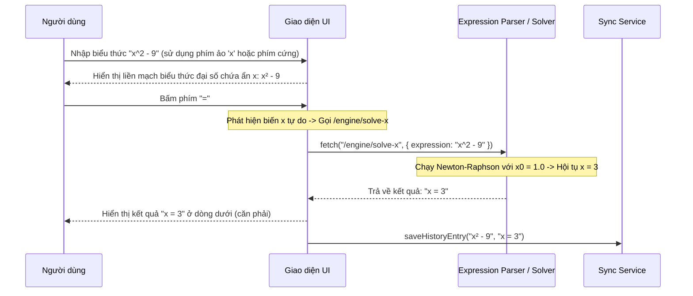

# BUSINESS REQUIREMENTS DOCUMENT (BRD) - Simple Calculator Web App v2.1.2

| Thông tin             | Chi tiết                        |
| :-------------------- | :------------------------------ |
| **Dự án**             | Simple Calculator Web App       |
| **Phiên bản**         | v2.1.2                          |
| **Cập nhật lần cuối** | 2026-06-23                      |
| **Trạng thái**        | APPROVED                        |
| **Tác giả**           | Nam (Product Owner & Developer) |

---

## REVISION HISTORY

| Phiên bản | Ngày       | Cập nhật bởi | Mô tả                                                                                                        |
| :-------- | :--------- | :----------- | :----------------------------------------------------------------------------------------------------------- |
| 1.0.0     | 2026-05-28 | Nam          | Phiên bản khởi tạo theo quy trình Spec-Driven Development                                                   |
| 2.0.0     | 2026-06-08 | Nam          | Nâng cấp lớn: thêm Scientific Mode, Dark/Light Mode, Cloud History Sync, Authentication và yêu cầu phím `=` để tính toán Unary |
| 2.1.0     | 2026-06-15 | Nam          | Nâng cấp tính năng nâng cao: PEMDAS Parser, Equation Display, Solver và Definite Integral                   |
| 2.1.1     | 2026-06-18 | Nam          | Nâng cấp giao diện hiển thị liền mạch, tích hợp chỉ báo trạng thái và hỗ trợ biểu thức giải tích phức hợp|
| 2.1.2     | 2026-06-23 | Nam          | Thống nhất đặc tả toàn bộ dự án từ phiên bản sơ khai đến v2.1.2: Bổ sung phím nhập ẩn biến `x` tự do trên màn hình chính, bộ giải phương trình tìm `x` số học (Newton-Raphson Solver), và phím nhập phân số đứng trực quan `■/□` dạng ô vuông điền tham số. |

---

## 1. PROJECT OVERVIEW
Simple Calculator Web App là ứng dụng máy tính đa năng chạy trực tiếp trên trình duyệt web, được thiết kế để mang lại trải nghiệm tính toán mượt mà, trực quan và mạnh mẽ từ các phép toán cơ bản đến nâng cao. Dự án này được thiết kế và triển khai chặt chẽ theo triết lý **Spec-Driven Development** (Phát triển hướng đặc tả) nhằm chuẩn hóa toàn bộ tài liệu đặc tả trước khi lập trình.

- **Mục đích:** Cung cấp một nền tảng tính toán khoa học đa năng, trực quan, chạy trực tiếp trên trình duyệt web, giúp người dùng giải quyết các bài toán từ cơ bản đến nâng cao một cách thuận tiện mà không cần cài đặt phần mềm bổ sung.
- **Giá trị kinh doanh:** Tối ưu hóa hiệu suất làm việc của người dùng bằng cách giảm thiểu sự gián đoạn trong luồng thao tác trên trình duyệt, cung cấp khả năng truy cập tức thì, tính nhất quán trên mọi thiết bị và đảm bảo tính liên tục của dữ liệu mà không phát sinh chi phí cài đặt hay bảo trì.
- **Người dùng mục tiêu:** Nhân viên văn phòng, học sinh, sinh viên, kỹ sư và bất kỳ ai có nhu cầu tính toán hoặc xử lý số liệu nhanh chóng trong học tập và công việc hàng ngày.

---

## 2. PROBLEMS & OPPORTUNITIES

### Problems
- **Rào cản truy cập:** Máy tính trên hệ điều hành yêu cầu nhiều thao tác để mở; người dùng không muốn cài thêm ứng dụng mới chỉ để tính toán đơn giản, đồng thời các ứng dụng tính toán web thông thường đòi hỏi kết nối mạng liên tục và không thể hoạt động ngoại tuyến (Offline-First).
- **Thiếu tính nhất quán:** Giao diện và hành vi máy tính khác nhau trên từng hệ điều hành, đồng thời dữ liệu lịch sử tính toán không được lưu giữ hoặc đồng bộ hóa an toàn giữa các thiết bị khác nhau của cùng một người dùng.
- **Gián đoạn luồng làm việc:** Người dùng đang thao tác trên trình duyệt phải thoát ra ngoài để mở các công cụ giải tích và giải phương trình chuyên sâu phức tạp, hoặc gặp khó khăn khi nhập các công thức phức tạp (như phân số đứng) ngay trên dòng nhập liệu thông thường.

### Opportunities
- **Truy cập tức thì, không rào cản:** Người dùng chỉ cần mở trình duyệt và vào URL — không cài đặt, không bắt buộc đăng ký để sử dụng các tính năng cơ bản, và hoạt động hoàn toàn ngoại tuyến sau lần tải đầu tiên.
- **Nhất quán trên mọi thiết bị:** Giao diện hiển thị trực quan và hành vi hoàn toàn giống nhau dù dùng trên Windows, macOS, iOS hay Android, đồng thời tích hợp tính năng đồng bộ đám mây (Cloud Sync) để duy trì lịch sử tính toán liền mạch khi đăng nhập trên mọi thiết bị.
- **Không tốn chi phí vận hành:** Sử dụng kiến trúc Serverless (không máy chủ) kết hợp xử lý client-side, đảm bảo hệ thống tự vận hành ổn định trên GitHub Pages/CDN mà không phát sinh chi phí duy trì cơ sở hạ tầng.
- **Dễ chia sẻ và mở rộng:** Dễ dàng chia sẻ qua liên kết URL và mở rộng liên tục các tính năng giải toán chuyên sâu (PEMDAS, đạo hàm, tích phân, bộ giải phương trình) trên cùng một cấu trúc mã nguồn chuẩn hóa.

---

## 3. PROJECT OBJECTIVES

- **Đơn giản tuyệt đối:** Thiết kế giao diện trực quan giúp người dùng dễ dàng làm quen, nhập liệu và nhận kết quả tính toán nhanh chóng mà không cần tài liệu hướng dẫn.
- **Chính xác và tin cậy:** Đảm bảo độ chính xác số học cao cho mọi thuật toán xử lý; nhận diện và thông báo lỗi tường minh đối với các trường hợp lỗi cú pháp hoặc giá trị toán học vượt ngoài miền xác định.
- **Hiệu năng tối ưu:** Tốc độ xử lý tính toán phản hồi tức thời (< 100ms); ứng dụng hoạt động ổn định và sẵn sàng phục vụ trong cả môi trường ngoại tuyến (Offline-First).
- **Phát triển hướng đặc tả (Spec-Driven Development):** Toàn bộ cấu trúc hệ thống, luồng dữ liệu và thiết kế giao diện phải được chuẩn hóa qua bộ tài liệu đặc tả trước khi bắt đầu lập trình.

---

## 4. PROJECT SCOPE

### 4.1 In Scope — Các tính năng kế thừa từ v2.1.1 (F-001 -> F-018)

Kế thừa toàn bộ các tính năng cơ bản, khoa học, solver tab phụ, tích phân tab phụ, hiển thị liền mạch chỉ báo trạng thái, và định dạng toán học trực quan (phân số đứng, số mũ superscript) từ v2.1.1.

### 4.2 In Scope — Tính năng mới v2.1.2 (F-019, F-020, F-021)

| ID    | Tính năng | Mô tả tóm tắt |
| :---- | :-------- | :------------ |
| **F-019** | **Phím biến số `x` trên bàn phím** | Bổ sung phím ảo `x` trên scientific keypad (thu nhỏ phím `x!` từ 2 cột xuống 1 cột để lấy chỗ) và hỗ trợ phím cứng `x`/`X` từ bàn phím vật lý. |
| **F-020** | **Bộ giải phương trình Tìm x (Newton-Raphson Solver)** | Cho phép nhập biểu thức chứa ẩn tự do `x` trên màn hình chính (ví dụ `x^2 - 9`, `sin(x) - 0.5`) và nhấn `=` để tìm nghiệm số thực bằng phương pháp Newton-Raphson. Kết quả hiển thị dạng `x = [nghiệm]`. |
| **F-021** | **Nút nhập phân số trực quan (Visual Fraction Input)** | Bổ sung phím ảo `■/□` trên scientific keypad (thay thế phím căn bậc 3 `³√`), cho phép chèn phân số đứng dạng `(⬚)/(⬚)` và điền trực tiếp tham số vào các ô vuông nét đứt. |

### 4.3 Out of Scope — v2.1.2

- Tìm tất cả các nghiệm phức (chỉ tìm nghiệm thực thông qua khởi tạo thực).
- Vẽ đồ thị hàm số (dời sang v3.0.0).

---

## 5. BUSINESS PROCESS FLOW

### 5.1 Luồng tính toán Tìm x trực tiếp (F-020)

---

## 6. BUSINESS RULES

### Quy tắc điều chỉnh cho v2.1.2 (BR-14 & BR-21)

| ID | Tên quy tắc | Chi tiết nghiệp vụ |
| :--- | :--- | :--- |
| **BR-14 (Cập nhật)** | **Xử lý biến tự do x** | Trong v2.1.2, ký tự `x` được phép xuất hiện tự do ở bất kỳ vị trí nào trong biểu thức thường PEMDAS trên màn hình chính. Khi người dùng nhấn phím `=`, nếu biểu thức chứa biến `x` tự do (ngoài các hàm `d/dx` và `∫`), máy tính sẽ kích hoạt bộ giải tìm `x` số học: giải phương trình `Biểu thức = 0`. Nếu tìm thấy nghiệm thực, hiển thị `x = [nghiệm]`. Nếu không tìm thấy nghiệm thực hoặc thuật toán không hội tụ sau 100 vòng lặp trên tất cả các điểm khởi tạo, báo `"Lỗi toán học"` và khóa máy tính. |
| **BR-21 (Mới)** | **Nhập phân số trực quan** | Người dùng bấm phím `■/□` để chèn cấu trúc phân số mẫu `(⬚)/(⬚)`. Khi bấm, con trỏ ảo sẽ tự động nhảy vào ô vuông trống `⬚` ở tử số. Người dùng có thể click chuột hoặc chạm tay trực tiếp vào ô vuông tử/mẫu trên màn hình để đặt con trỏ và điền tham số (số, toán tử). Ký hiệu `⬚` sẽ bị biến mất và thay thế bằng ký tự gõ ở lượt gõ đầu tiên. |

---

## 7. FUNCTIONAL REQUIREMENTS

Danh sách chức năng đầy đủ theo ID:

| ID | Feature Group | Thuộc phiên bản |
| :-- | :---------------------- | :-------------- |
| F-001 -> F-018 | Các tính năng cơ bản, khoa học, solver, tích phân, hiển thị v2.1.1 | Kế thừa v2.1.1 |
| **F-019** | **Phím biến số `x` trên bàn phím** | Mới v2.1.2 |
| **F-020** | **Bộ giải phương trình Tìm x (Newton-Raphson Solver)** | Mới v2.1.2 |
| **F-021** | **Nút nhập phân số trực quan (Visual Fraction Input)** | Mới v2.1.2 |

---

## 8. NON-FUNCTIONAL REQUIREMENTS

- **Thời gian hội tụ:** Bộ giải tìm nghiệm số học phải hoàn thành tính toán và trả về kết quả dưới **100ms** để đảm bảo giao diện luôn mượt mà.
- **Tương thích hoàn toàn (Backward Compatibility):** Đảm bảo không làm ảnh hưởng đến luồng tính toán PEMDAS số học bình thường hoặc tính toán tích phân/đạo hàm chứa biến `x` bị cô lập.

---

## 9. SUCCESS METRICS

- **Tìm x chính xác:** Giải đúng nghiệm các phương trình đại số bậc nhất, bậc hai, lượng giác cơ bản với sai số $\le 10^{-5}$.
- **Trải nghiệm gõ tiện lợi:** Phím bấm `x` ảo trên Scientific Mode phản hồi tốt trên mobile và desktop.

---

## 10. NOTES

- Chi tiết hành vi UI, trạng thái màn hình và kịch bản test -> xem **[FUNCTION_SPECIFICATION_v2.1.2.md](file:///Users/nam/Desktop/calculator/docs/v2.1.2/FUNCTION_SPECIFICATION_v2.1.2.md)** (Sẽ soạn thảo ở bước tiếp theo).
