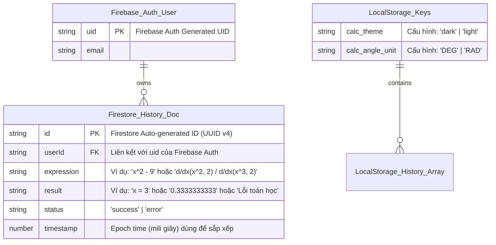

# DATABASE DESIGN DOCUMENT - Simple Calculator Web App v2.1.2

| Thông tin            | Chi tiết                                                         |
| :------------------ | :--------------------------------------------------------------- |
| **Dự án**            | Simple Calculator Web App                                        |
| **Phiên bản**        | v2.1.2                                                           |
| **Ngày cập nhật**    | 2026-06-19                                                       |
| **Trạng thái**       | APPROVED                                                         |
| **Công nghệ lưu trữ**| Local Storage (Tier 1) & Firebase Firestore Cloud NoSQL (Tier 2) |
| **Tác giả**          | Nam (Product Owner & Developer)                                  |

---

## NHẬT KÝ THAY ĐỔI

| Version | Ngày       | Người sửa | Mô tả thay đổi                                                                                                     |
| :------ | :--------- | :-------- | :----------------------------------------------------------------------------------------------------------------- |
| 1.0.0   | 2026-05-31 | Nam       | Phiên bản giả lập SQLite phục vụ học tập (không triển khai thực tế)                                                 |
| 2.0.0   | 2026-06-08 | Nam       | Thiết kế thực tế: Đồng bộ 2 tầng dùng Local Storage (Tier 1) và Firebase Firestore NoSQL (Tier 2)                  |
| 2.1.0   | 2026-06-15 | Nam       | Cập nhật v2.1.0: Mở rộng định dạng schema lưu trữ lịch sử nâng cao cho Solver (F-014) và Definite Integral (F-015) |
| 2.1.1   | 2026-06-18 | Nam       | Cập nhật v2.1.1: Mở rộng schema lịch sử cho biểu thức giải tích phức hợp (thương đạo hàm, tích phân lồng nhau) và ánh xạ chỉ báo lịch sử |
| 2.1.2   | 2026-06-19 | Nam       | Cập nhật v2.1.2: Bổ sung định dạng lưu trữ lịch sử cho phép giải phương trình Tìm x (Newton-Raphson Solver) và hỗ trợ lưu trữ phân số trực quan `(⬚)/(⬚)`. |

---

## 1. ENTITY RELATIONSHIP DIAGRAM (ERD)

Kiến trúc phân cấp lưu trữ hai tầng (Multi-tier Storage) tiếp tục được duy trì để hỗ trợ chế độ Offline-First:
*   **Tier 1 — Cục bộ (Local Storage Persistence):** Web Storage API (`localStorage`) lưu trữ cấu hình (`calc_theme`, `calc_angle_unit`), cache lịch sử cục bộ tối đa 50 phần tử (`calc_local_history`) và hàng đợi đồng bộ ngoại tuyến (`calc_offline_queue`).
*   **Tier 2 — Đám mây (Cloud Persistence):** Firebase Firestore NoSQL lưu trữ lịch sử đồng bộ trực tuyến tối đa 200 bản ghi cho mỗi người dùng đã đăng nhập.



---

## 2. TABLE DEFINITIONS

### 2.1. local_config (Cấu hình cục bộ)
Lưu trữ tùy chọn hiển thị và tính toán của người dùng trên trình duyệt (Local Storage).
*   `calc_theme` (VARCHAR(5)): Giao diện hiện tại (`'dark'` hoặc `'light'`). Mặc định tự phát hiện theo tùy chọn hệ điều hành.
*   `calc_angle_unit` (VARCHAR(3)): Đơn vị đo góc cho các phép tính lượng giác và giải tích liên quan (`'DEG'` hoặc `'RAD'`). Mặc định là `'DEG'`.

### 2.2. calculation_history (Lịch sử tính toán)
Thực thể lưu lịch sử phép tính đã thực hiện thành công hoặc gặp lỗi. Được sử dụng chung cho cả `localStorage` và `Cloud Firestore`.

*   `id` (VARCHAR(36), PK): ID duy nhất của phép tính (UUID v4 tự sinh ở Client hoặc Firestore Document ID).
*   `userId` (VARCHAR(36), FK): UID người dùng từ Firebase Auth (null nếu chưa đăng nhập hoặc tính offline).
*   `expression` (VARCHAR(200)): Chuỗi biểu thức toán học hoàn chỉnh do người dùng nhập hoặc chuỗi ký hiệu phép tính nâng cao.
*   `result` (VARCHAR(100)): Kết quả hiển thị của phép tính (số thực được định dạng, nghiệm phương trình, hoặc thông điệp lỗi).
*   `status` (VARCHAR(10)): Trạng thái phép toán (`"success"` hoặc `"error"`).
*   `timestamp` (BIGINT): Thời gian thực hiện phép tính dưới dạng Unix Epoch Time (milliseconds).

#### Định dạng chuẩn cho trường `expression` và `result` theo từng nhóm chức năng (Cập nhật v2.1.2):

| Loại tính toán | Định dạng trường `expression` | Định dạng trường `result` |
| :--- | :--- | :--- |
| **Phép tính số học (PEMDAS)** | Biểu thức hoàn chỉnh dạng toán học.<br>*Ví dụ:* `2 + 3 × (4 - 1)` | Kết quả số thực được làm tròn.<br>*Ví dụ:* `11` |
| **Giải PT bậc nhất** | `Giải PT: ax + b = 0`<br>*Ví dụ:* `Giải PT: 2x - 4 = 0` | Nghiệm x.<br>*Ví dụ:* `x = 2` (hoặc `Vô nghiệm`, `Vô số nghiệm`) |
| **Giải PT bậc hai** | `Giải PT: ax² + bx + c = 0`<br>*Ví dụ:* `Giải PT: x² - 3x + 2 = 0` | Các nghiệm phân biệt.<br>*Ví dụ:* `x₁=2, x₂=1` (hoặc nghiệm phức `x1=1+2i, x2=1-2i`) |
| **Giải hệ 2 ẩn** | `Giải hệ PT: {a1x+b1y=c1, a2x+b2y=c2}`<br>*Ví dụ:* `Giải hệ PT: {x+y=3, x-y=1}` | Cặp nghiệm (x, y).<br>*Ví dụ:* `x = 2, y = 1` (hoặc `Vô nghiệm`, `Vô số nghiệm`) |
| **Tích phân xác định (Tab phụ)** | `∫(f(x), a, b)`<br>*Ví dụ:* `∫(x², 0, 1)` | Kết quả tích phân số.<br>*Ví dụ:* `0.3333333333` |
| **Đạo hàm số (v2.1.1)** | Biểu thức chứa đạo hàm đơn hoặc kết hợp.<br>*Ví dụ:* `d/dx(x^2, 2)` | Kết quả đạo hàm số.<br>*Ví dụ:* `4` |
| **Giải tích phức hợp (v2.1.1)** | Chuỗi PEMDAS chứa đạo hàm và tích phân lồng nhau hoặc kết hợp phép chia.<br>*Ví dụ:* `d/dx(x^2, 2) / d/dx(x^3, 2)` | Kết quả tính toán giải tích.<br>*Ví dụ:* `0.3333333333` |
| **Giải phương trình Tìm x (Màn hình chính) (v2.1.2)** | Biểu thức chứa biến tự do `x` để giải.<br>*Ví dụ:* `x^2 - 9` | Kết quả nghiệm thực số học tìm được.<br>*Ví dụ:* `x = 3` |
| **Phép tính phân số trực quan (v2.1.2)** | Biểu thức chứa phân số đứng dạng cặp dấu ngoặc chia.<br>*Ví dụ:* `(5)/(3)` hoặc `(⬚)/(⬚)` (nếu dở dang) | Kết quả số thực được làm tròn.<br>*Ví dụ:* `1.6666666667` hoặc `'Lỗi cú pháp'` |


---

## 3. BUSINESS RULES ÁNH XẠ VÀO DATABASE

| Business Rule (từ BRD v2.1.2) | Ánh xạ vào DB |
| :--- | :--- |
| **BR-12 (Lỗi cú pháp PEMDAS)** | Nếu biểu thức sai cú pháp (nhập sai dấu ngoặc, thừa toán tử), ghi nhận: `status = 'error'`, `result = 'Lỗi cú pháp'`, và `expression` lưu lại chuỗi biểu thức lỗi người dùng đã gõ. |
| **BR-14 (Cập nhật v2.1.2 - Tìm x)** | Nếu biểu thức chứa biến tự do `x` (ngoài hàm `d/dx`, `∫`):<br>- Giải nghiệm thành công: ghi nhận `status = 'success'`, `result` lưu dạng `x = [nghiệm]`, và `expression` lưu biểu thức nguyên bản.<br>- Giải nghiệm thất bại (không hội tụ): ghi nhận `status = 'error'`, `result = 'Lỗi toán học'`, và `expression` lưu chuỗi biểu thức. |
| **BR-21 (Mới - Phân số trực quan)** | Cho phép lưu trữ biểu thức phân số đứng dưới dạng chuỗi phẳng PEMDAS ngăn cách bởi dấu chia (ví dụ `(5)/(3)`). Nếu biểu thức dở dang chứa placeholder `⬚` (ví dụ `(⬚)/(⬚)`), ghi nhận `status = 'error'`, `result = 'Lỗi cú pháp'`, và `expression` lưu chuỗi dở dang. |

| **BR-15 (Ràng buộc hệ số Solver)** | - Đối với hệ số Solver không hợp lệ, hệ thống trả về thông báo lỗi trực tiếp.<br>- Các trường hợp đặc biệt (vô nghiệm/vô số nghiệm/nghiệm phức) được định dạng chuỗi tương ứng ở trường `result` và ghi nhận với `status = 'success'`. |
| **BR-16 (Ràng buộc Tích phân & Lỗi toán học)** | Khi tích phân gặp điểm bất định (NaN/Infinity), ghi nhận: `status = 'error'`, `result = 'Lỗi toán học'`, và `expression` lưu dạng `∫(f(x), a, b)`. |
| **BR-20 (Lỗi giải tích đệ quy v2.1.1)** | Khi tính toán đạo hàm số hoặc tích phân số lồng nhau phát hiện điểm bất định (NaN/Infinity) hoặc vượt quá giới hạn đệ quy 3 cấp, ghi nhận: `status = 'error'`, `result = 'Lỗi toán học'`, và `expression` lưu chuỗi biểu thức giải tích phức hợp người dùng đã nhập. |
| **BR-18 (Chỉ báo Lịch sử ▲ / ▼)** | Các chỉ báo mũi tên `▲` và `▼` trên thanh trạng thái sáng lên nếu danh sách lịch sử có chứa ít nhất 1 bản ghi. Điều này ánh xạ tới điều kiện: `calc_local_history.length >= 1`. |
| **BR-08 (Đồng bộ offline-first)** | Phép toán offline ghi vào cache local đồng thời xếp vào `calc_offline_queue`. Khi online và đã đăng nhập, đẩy queue lên Firestore qua `/history/sync`, sau đó xóa queue. |
| **F-010 / F-016 (Giới hạn lịch sử hiển thị)** | - Khi query Firestore để nạp Sidebar: sử dụng `.where("userId", "==", uid).orderBy("timestamp", "desc").limit(200)` để lấy tối đa 200 bản ghi.<br>- Khi ghi offline: nếu mảng đạt 50, thực hiện `shift()` trước khi `push()`. |

---

## 4. INDEXES & PERFORMANCE

| Index Name | Collection / Bảng | Trường (Cột) | Lý do |
| :--- | :--- | :--- | :--- |
| `idx_history_userId` | `calculation_history` | `userId` | Lọc nhanh danh sách lịch sử theo từng người dùng. |
| `idx_history_timestamp` | `calculation_history` | `timestamp` | Sắp xếp lịch sử hiển thị theo thứ tự thời gian giảm dần (mới nhất lên đầu). |
| `composite_user_timestamp` | `calculation_history` | `userId` (Asc), `timestamp` (Desc) | Chỉ mục hỗn hợp (Composite Index) bắt buộc trên Firestore để chạy query lọc theo user kết hợp sắp xếp. |

### Ràng buộc Bảo mật (Firestore Security Rules)

```javascript
rules_version = '2';
service cloud.firestore {
  match /databases/{database}/documents {
    match /history/{document} {
      allow read, delete: if request.auth != null && request.auth.uid == resource.data.userId;
      allow create, update: if request.auth != null && request.auth.uid == request.resource.data.userId;
    }
  }
}
```

---

## 5. NOTES

*   **Mock Fallback Storage (`calc_mock_cloud_history`):**
    *   Nhằm mục đích phục vụ kiểm thử khi chưa cấu hình Firebase, hệ thống sử dụng key local `calc_mock_cloud_history` để giả lập Firestore. Cấu trúc phần tử hoàn toàn giống với schema của lịch sử Firestore.
*   **Tính năng Offline-First:**
    *   Cơ chế đồng bộ tối ưu hóa giúp giảm số lượng kết nối mạng thừa. Hệ thống luôn đọc dữ liệu từ local cache trước tiên và chỉ đồng bộ lên Cloud khi online và người dùng đăng nhập thành công.

---

END OF DOCUMENT
