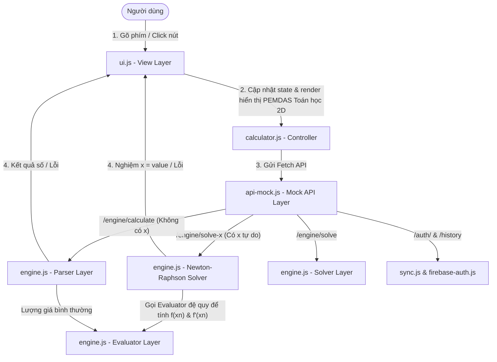
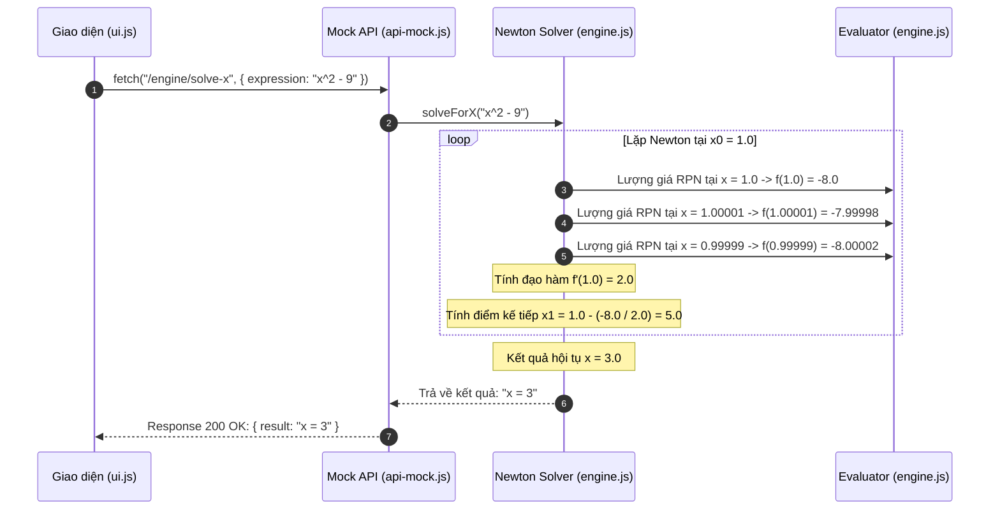
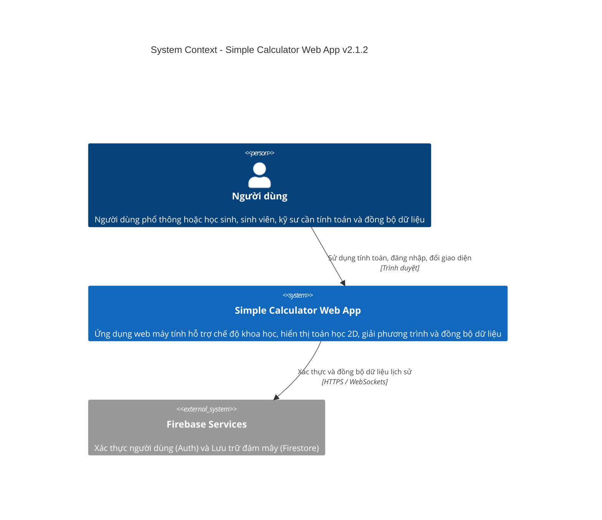
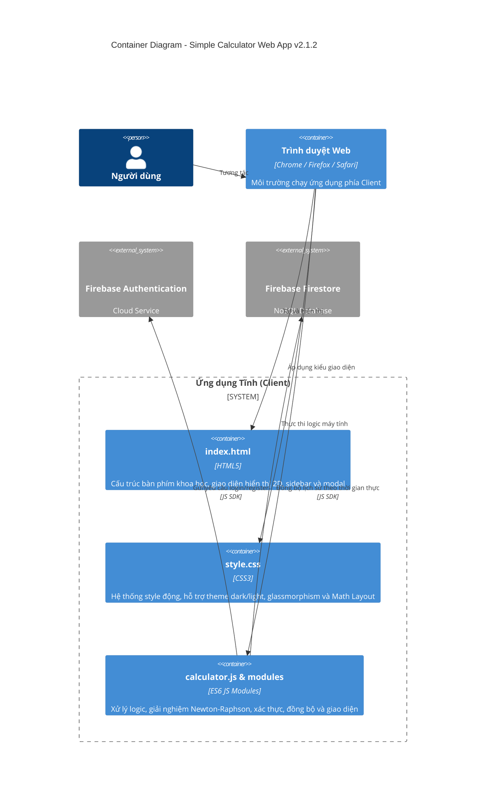
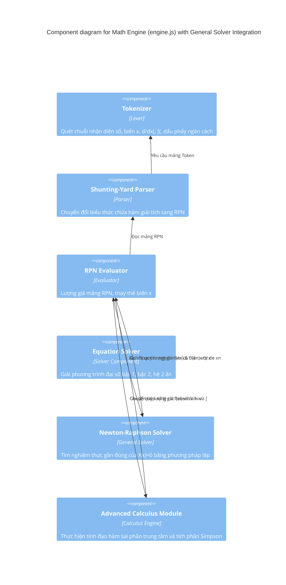

# SYSTEM ARCHITECTURE DOCUMENT (SAD) - Simple Calculator Web App v2.1.2

| Thông tin         | Chi tiết                        |
| :---------------- | :------------------------------ |
| **Dự án**         | Simple Calculator Web App       |
| **Phiên bản**     | v2.1.2                          |
| **Ngày cập nhật** | 2026-06-19                      |
| **Trạng thái**    | APPROVED                        |
| **Tác giả**       | Nam (Product Owner & Developer) |

---

## NHẬT KÝ THAY ĐỔI

| Version | Ngày       | Người sửa | Mô tả thay đổi                                                                                                |
| :------ | :--------- | :-------- | :------------------------------------------------------------------------------------------------------------ |
| 1.0.0   | 2026-05-29 | Nam       | Tài liệu kiến trúc ban đầu (v1.0.0)                                                                           |
| 2.0.0   | 2026-06-08 | Nam       | Cập nhật v2.0.0: Thêm Scientific Mode, Dark/Light Mode, Cloud History Sync, Firebase Authentication           |
| 2.1.0   | 2026-06-15 | Nam       | Nâng cấp v2.1.0: Thiết kế Expression Parser (PEMDAS), Equation Solver, Definite Integral Engine               |
| 2.1.1   | 2026-06-18 | Nam       | Nâng cấp v2.1.1: Thiết kế giao diện hiển thị liền mạch, thanh chỉ báo trạng thái và bộ phân tích giải tích nâng cao (lồng nhau/thương đạo hàm) |
| 2.1.2   | 2026-06-19 | Nam       | Nâng cấp v2.1.2: Thiết kế hiển thị biểu thức định dạng toán học trực quan (Math Layout Renderer), phím ẩn biến `x`, bộ giải phương trình tìm x (Newton-Raphson Solver) và phím nhập phân số trực quan `■/□` có con trỏ điền ô vuông. (F-021) |

---

## Section 1: Introduction and Goals

Simple Calculator Web App v2.1.2 nâng cấp trải nghiệm hiển thị toán học trực quan, phím nhập phân số và lõi giải phương trình số học tìm x tự do từ màn hình chính:
1.  **Bộ định dạng hiển thị toán học (Math Layout Renderer):** Tích hợp bộ phân tích cú pháp hiển thị chuyên dụng trong `js/ui.js` để tự động chuyển đổi chuỗi biểu thức PEMDAS sang định dạng HTML toán học 2D sống động (phân số đứng tử/mẫu, số mũ dạng superscript, đạo hàm dài, tích phân có cận hiển thị đứng). Sử dụng các phần tử ẩn để bảo toàn thuộc tính DOM `textContent` nhằm tương thích ngược hoàn toàn với bộ kiểm thử tự động (E2E & Unit Tests).
2.  **Lõi giải phương trình số học (Newton-Raphson Solver):** Bổ sung phím ảo biến ẩn `x` trên bàn phím khoa học và tích hợp thuật toán tìm nghiệm thực đa điểm Newton-Raphson trực tiếp vào hàm đánh giá biểu thức chính.
3.  **Phím nhập phân số trực quan (`■/□`):** Thêm phím phân số đứng dạng ô vuông điền tham số `(⬚)/(⬚)` và hỗ trợ con trỏ ảo cùng click chọn ô vuông trực quan (tính năng F-021).

---

## Section 2: Architecture Constraints

*   **Runtime & Ngôn ngữ:** Chỉ chạy trên trình duyệt sử dụng HTML5, CSS3 và Vanilla JS (ES Modules). Không phụ thuộc vào thư viện bên thứ ba bên ngoài Firebase CDN.
*   **An toàn tính toán (No eval):** Bộ phân tích biểu thức bắt buộc triển khai thủ công bằng thuật toán **Shunting-yard** nhằm loại bỏ hoàn toàn việc sử dụng hàm `eval()` hay `Function()`.
*   **Ràng buộc sai phân đạo hàm (Derivative Precision Budget):** Sử dụng phương pháp sai phân trung tâm (Central Differences) với bước dịch chuyển cố định $h = 10^{-5}$ để đạt độ chính xác tối ưu trong giới hạn số thực IEEE 754 kép:
    $$f'(x_0) \approx \frac{f(x_0 + h) - f(x_0 - h)}{2h}$$
*   **Ràng buộc tích phân số (Simpson's Rule Budget):** Số điểm chia được cố định ở mức $N = 1000$ khoảng để đảm bảo thời gian tính toán luôn dưới **10ms**, nằm trong ngân sách render của trình duyệt.
*   **Ngăn ngừa tràn ngăn xếp (Stack Overflow Prevention):** Giới hạn độ sâu đệ quy khi tính toán các hàm giải tích lồng nhau tối đa là **3 cấp**.
*   **Ràng buộc Newton-Raphson Solver:** Thuật toán lặp số học chạy tối đa 100 vòng với ngưỡng sai số $\le 10^{-7}$ trên 5 điểm khởi đầu thực ($1.0, 0.0, -1.0, 10.0, -10.0$).
*   **Tính tương thích của bộ test:** Mặc dù sử dụng HTML động cho biểu thức toán học, thuộc tính `textContent` của phần tử `#display-expression` bắt buộc phải trả về chính xác chuỗi text phẳng PEMDAS để tránh gãy bộ kiểm thử tự động.

---

## Section 3: Context and Scope

Hệ thống hoạt động độc lập ngay trên thiết bị khách (Client-side). Ở v2.1.2, bộ giải tìm nghiệm `solveForX` được tiếp cận công khai qua API endpoint `/engine/solve-x` phục vụ cho các biểu thức chứa ẩn số x tự do.



---

## Section 4: Data Architecture & Persistence

Toàn bộ dữ liệu cấu hình giao diện (Theme, góc DEG/RAD) và lịch sử tính toán được lưu giữ ở hai tầng: Local Storage và Cloud Firestore.

### Schema dữ liệu bổ sung cho v2.1.2:
*   **Giải phương trình Tìm x từ màn hình chính:** `expression` = `x^2 - 9`, `result` = `x = 3` (hoặc định dạng nghiệm tương tự).

---

## Section 5: Building Block View

### 5.1. Cấu trúc Phân tầng (Layered Architecture)

Dự án tuân thủ kiến trúc phân tầng dạng Service nhằm đảm bảo tính bảo trì và dễ viết test:

1.  **View Layer (index.html, style.css, ui.js):**
    *   Quản lý DOM, lắng nghe sự kiện từ UI/Bàn phím, toggle các tab màn hình (Cơ bản, Khoa học, Công cụ).
    *   **Hiển thị biểu thức toán học 2D:** Sử dụng các hàm helper `tokenizeDisplay`, `DisplayParser` và `renderASTToHTML` để sinh mã HTML định dạng toán học trực quan (phân số đứng, lũy thừa số mũ, đạo hàm, tích phân).
    *   **Con trỏ phân số & Placeholder:** Gắn thuộc tính `data-index` cho các thẻ `.math-placeholder` biểu diễn `⬚` dựa trên vị trí ký tự gốc để cho phép click chuyển đổi tiêu điểm con trỏ ảo thời gian thực (F-021).
    *   **Bảo toàn textContent:** Sử dụng thuộc tính `style="display:none"` trên các thẻ toán tử (ví dụ `<span style="display:none"> ÷ </span>`) và sử dụng CSS pseudo-elements `::before`/`::after` để render cận tích phân nhằm giấu cận khỏi thuộc tính `textContent`.
2.  **Controller Layer (calculator.js):**
    *   Quản lý trạng thái máy tính (calculator state: `currentInput`, `expression`, `isError`, v.v.).
    *   Quản lý chỉ số con trỏ `state.cursorIndex` cho phép chèn số, hằng số, biến số vào ô trống đang được chọn của phân số.
    *   Nhận diện thêm nút `variable` để nhập biến số `x` và nút `fraction` (`■/□`) để chèn phân số đứng. Chuyển tiếp luồng tính toán tương ứng.
3.  **Mock API Layer (api-mock.js):**
    *   Ghi đè `window.fetch` toàn cục, đón nhận request mạng giả lập và chuyển hướng xuống engine local.
4.  **Engine Layer (engine.js):**
    *   Thực hiện toàn bộ logic toán học. Được bổ sung module giải phương trình tổng quát ẩn `x` sử dụng thuật toán Newton-Raphson.

```
Mã nguồn /js
├── engine.js       (Lõi toán học: Tokenizer, Shunting-yard, Evaluator, Solver, Calculus, NewtonSolver)
├── ui.js           (View: Quản lý DOM hiển thị toán học 2D, thanh trạng thái S/A/Math/D/R/▲/▼)
├── api-mock.js     (Mock API Router đánh chặn request fetch)
├── sync.js         (Đồng bộ lịch sử local và Firebase Firestore)
└── ../auth/        (Quản lý Firebase Authentication)
```

### 5.2. Phân rã Module trong engine.js

*   **Newton-Raphson Solver:** Nhận mảng RPN của biểu thức chứa biến `x`, thực hiện tìm nghiệm thực số học gần đúng tại các điểm khởi tạo thực. Tính đạo hàm $f'(x_n)$ bằng phương pháp sai phân số trực tiếp qua Evaluator.

---

## Section 6: Non-Functional Architecture Aspects

### 6.1 Performance & UX Strategy
*   **Giới hạn số vòng lặp:** Bộ giải Newton-Raphson được giới hạn tối đa 100 vòng lặp cho mỗi điểm xuất phát, đảm bảo thời gian xử lý luôn dưới **100ms** trên môi trường đơn luồng (Single Thread) của trình duyệt.
*   **Bố cục màn hình cố định:** Duy trì chiều cao hiển thị tối thiểu `116px` của `.display` để tránh co giật layout khi hiển thị các biểu thức phân số đứng lớn.

### 6.2 Security Constraints
*   Triệt tiêu hoàn toàn rủi ro tiêm mã độc (XSS) bằng việc tự viết bộ Parser riêng. Chuỗi người dùng nhập vào không bao giờ được chuyển vào các hàm nguy hiểm như `eval()` hay `Function()`.

---

## Section 7: Runtime View

### 7.1 Luồng giải phương trình Tìm x trực tiếp (F-020)



---

## Section 8: Deployment View

Do ứng dụng tuân thủ kiến trúc **Zero Build Step / Static App**, mô hình triển khai cực kỳ tinh giản dưới dạng các file HTML, CSS và JS tĩnh lên các dịch vụ hosting như GitHub Pages, Vercel, Netlify hoặc Firebase Hosting.

---

## Section 9: Backward Compatibility & Test Suite Verification

*   **DOM Node Preservation:** Các phần tử `<div id="display-expression">` và `<div id="display-result">` được giữ nguyên trong cây DOM của `index.html`.
*   **Test Compatibility:** Cận tích phân ẩn khỏi `textContent` bằng CSS pseudo-elements, và các toán tử phân cách ẩn bằng `display: none` đảm bảo `elExpression.textContent` trả về chuỗi PEMDAS phẳng nguyên bản, giúp 100% test case cũ chạy ổn định không cần thay đổi assert.

---

## C4 Model Diagrams

### Level 1: System Context Diagram



### Level 2: Container Diagram



### Level 3: Component Diagram (Focus: Math Engine)



---

## Section 10: NOTES

- Chi tiết hành vi UI, các nút bấm và kịch bản test -> xem **[FUNCTION_SPECIFICATION_v2.1.2.md](file:///Users/nam/Desktop/calculator/docs/v2.1.2/FUNCTION_SPECIFICATION_v2.1.2.md)** (Sẽ soạn thảo ở bước tiếp theo).

---

END OF DOCUMENT
