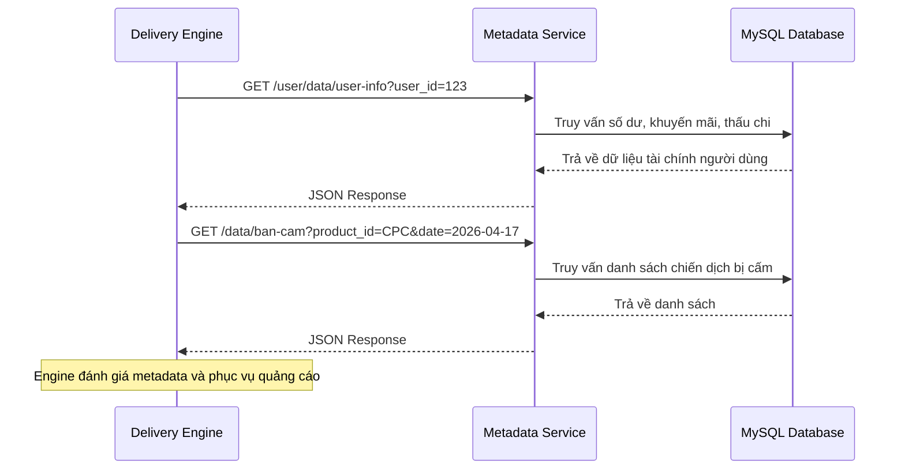

# BUSINESS REQUIREMENTS DOCUMENT (BRD) - AdCpc Metadata Service

| Thông tin             | Chi tiết               |
| :-------------------- | :--------------------- |
| **Dự án**             | AdCpc Metadata Service |
| **Phiên bản**         | v1.1.0                 |
| **Cập nhật lần cuối** | 2026-04-22             |
| **Trạng thái**        | FINAL                  |
| **Tác giả**           | AdTech BigData Team    |

---

## REVISION HISTORY
| Phiên bản | Ngày       | Cập nhật bởi | Mô tả                                                       |
| :-------- | :--------- | :----------- | :---------------------------------------------------------- |
| 1.0.0     | 2026-04-17 | Gemini       | Phiên bản ban đầu dựa trên phân tích codebase               |
| 1.1.0     | 2026-04-22 | Gemini       | Bổ sung Quy tắc nghiệp vụ, Dung lượng và chính sách Bảo mật |

---

## 1. PROJECT OVERVIEW
AdCpc Metadata Service là một microservice backend hiệu năng cao được xây dựng bằng Spring Boot, được thiết kế để cung cấp quyền truy cập tập trung vào các metadata quan trọng phục vụ hệ sinh thái phân phối quảng cáo Ad CPC (Cost Per Click) trong VCCorp.

- **Mục đích:** Đóng vai trò là nhà cung cấp dữ liệu chuyên biệt giữa kho lưu trữ bền vững (MySQL) và các engine phân phối thời gian thực, đảm bảo metadata được phục vụ hiệu quả cho các quyết định đặt thầu và phân phối quảng cáo.
- **Giá trị kinh doanh:** Tập trung hóa quản lý metadata, giảm tải trực tiếp lên database từ nhiều node phân phối, đảm bảo tính nhất quán dữ liệu trên toàn nền tảng, và đơn giản hóa các schema phức tạp thành các API response tối ưu.
- **Người dùng mục tiêu:** Các hệ thống AdTech nội bộ, bao gồm Ad Server, Delivery Engine và các thành phần Real-Time Bidding (RTB).

---

## 2. PROBLEMS & OPPORTUNITIES

### Problems
- **Áp lực trực tiếp lên Database:** Nhiều node delivery engine truy vấn trực tiếp vào database có thể dẫn đến cạn kiệt kết nối và suy giảm hiệu năng.
- **Dữ liệu không nhất quán:** Quản lý logic metadata ở nhiều nơi làm tăng nguy cơ đưa ra các quyết định phân phối không đồng nhất.
- **Sự phức tạp:** Schema database thô thường phức tạp và không được tối ưu cho các yêu cầu tốc độ cao của delivery engine.

### Opportunities
- **Tối ưu hóa hiệu năng:** Triển khai một service chuyên dụng cho phép áp dụng caching chuyên biệt và tối ưu hóa truy vấn phù hợp với việc truy xuất metadata.
- **Tách biệt (Decoupling):** Tách rời logic phân phối khỏi chi tiết lưu trữ dữ liệu, cho phép mỗi bên phát triển độc lập.
- **Khả năng mở rộng:** Cho phép mở rộng ngang (horizontal scaling) tầng truy cập metadata để xử lý lượng traffic tăng trưởng mạnh.

---

## 3. PROJECT OBJECTIVES

- **Độ chính xác:** Đảm bảo toàn bộ metadata được cung cấp (số dư, giới hạn, trạng thái chiến dịch) nhất quán với trạng thái mới nhất trong database.
- **Hiệu năng:** Duy trì độ trễ phản hồi API cực thấp (< 50ms) để đáp ứng ràng buộc phục vụ quảng cáo thời gian thực.
- **Tự động hóa:** Cung cấp các REST API chuẩn hóa để tự động hóa việc tiêu thụ metadata bởi các delivery engine.
- **Khả năng mở rộng:** Hỗ trợ thông lượng cao (hàng nghìn request mỗi giây) trên toàn cụm microservice.

---

## 4. PROJECT SCOPE

### 4.1 In Scope
- **Metadata Chiến dịch:** Truy xuất các chiến dịch bị cấm/chặn dựa trên loại sản phẩm và ngày.
- **Metadata Domain & Zone:** Quản lý và truy xuất thông tin domain, ánh xạ zone-domain, và cấu hình định giá.
- **Metadata Người dùng:** Lưu trữ và truy xuất thông tin tài chính của người dùng (số dư, khuyến mãi, thấu chi) và liên kết người dùng-chiến dịch.
- **Kiểm soát phân phối:** Truy xuất log phân phối và cài đặt "max value" cho việc giới hạn tần suất và kiểm soát ngân sách.
- **Dữ liệu Super Zone:** Truy xuất cấu hình super zone đang chạy.

### 4.2 Out of Scope
- **Hiển thị quảng cáo (Ad Rendering):** Service không xử lý việc hiển thị hoặc render quảng cáo.
- **Logic đấu thầu (Bidding Logic):** Các thuật toán lựa chọn quảng cáo thực tế được xử lý bởi Delivery Engine, không phải service này.
- **Giao diện quản lý (Data Management UI):** Không bao gồm giao diện web quản trị; đây là service chỉ chạy phía backend.
- **Xử lý giao dịch:** Service không xử lý các giao dịch thanh toán hoặc ghi log click quảng cáo (chỉ cung cấp metadata cho chúng).

---

## 5. BUSINESS PROCESS FLOW

Luồng sau minh họa cách Delivery Engine tương tác với Metadata Service để đưa ra quyết định phân phối:

---

## 6. BUSINESS RULES

- **Xử lý Khuyến mãi & Thấu chi:** Giá trị khuyến mãi hoạt động như một số dư phụ. Thấu chi xác định số dư âm tối đa được phép trước khi các chiến dịch của nhà quảng cáo bị tạm dừng. Tổng khả năng chi tiêu được đánh giá là `balance + promotion + overdraft`.
- **Logic Cấm Chiến dịch:** Các chiến dịch bị đánh dấu là bị cấm dựa trên ngày cụ thể và loại sản phẩm (ví dụ: AD_CPC). Khi một chiến dịch khớp với các tiêu chí này cho ngày hiện tại, sẽ không có quảng cáo nào từ chiến dịch đó được phục vụ.
- **Trạng thái Tài chính Người dùng:** Người dùng có số dư không đủ sẽ bị tạm dừng các chiến dịch đang hoạt động theo thời gian thực. Metadata Service phải phản ánh chính xác các chỉ số tài chính này tới Ad Server.
- **Chiến lược Định giá:** Định giá domain được cấu hình rõ ràng theo từng domain qua `tbl_cpc_domain_price`. Nếu không có giá cụ thể nào được thiết lập, CPC/CPM mặc định toàn hệ thống sẽ áp dụng (được xử lý ở cấp Ad Server).

---

## 7. FUNCTIONAL REQUIREMENTS

| ID   | Feature Group              | Description                                                                                            |
| :--- | :------------------------- | :----------------------------------------------------------------------------------------------------- |
| F1   | Campaign Metadata          | Truy xuất các chiến dịch bị cấm theo sản phẩm và ngày cụ thể để ngăn phục vụ quảng cáo không hợp lệ.   |
| F2   | Domain & Zone Metadata     | Lấy metadata domain, định giá, và ánh xạ zone-domain cho việc nhắm mục tiêu vị trí đặt quảng cáo.      |
| F3   | Budget & Frequency Control | Truy xuất cài đặt "max value" và log distributor để thực thi giới hạn ngân sách và kiểm soát tần suất. |
| F4   | User Financial Info        | Cung cấp quyền truy cập thời gian thực vào số dư người dùng, tín dụng khuyến mãi và giới hạn thấu chi. |
| F5   | User-Campaign Mapping      | Truy xuất mối quan hệ giữa người dùng và các chiến dịch quảng cáo đang hoạt động của họ.               |
| F6   | Super Zone Configuration   | Lấy cấu hình cho các super zone đang chạy trong mạng quảng cáo.                                        |
| F7   | System Monitoring          | Cung cấp endpoint kiểm tra sức khỏe (ping) để giám sát tình trạng sẵn sàng của service.                |

---

## 8. NON-FUNCTIONAL REQUIREMENTS

- **Hiệu năng:** Thời gian phản hồi API trung bình phải dưới 50ms.
- **Độ khả dụng:** Mục tiêu uptime 99.99% vì đây là thành phần đường dẫn quan trọng cho việc phục vụ quảng cáo.
- **Khả năng mở rộng & Dung lượng:**
  - Cụm microservice phải hỗ trợ ít nhất 5.000 Request mỗi giây (RPS) trong giờ cao điểm.
  - Connection pool database MySQL phải được tối ưu hóa kích thước (ví dụ: sử dụng HikariCP) để ngăn timeout kết nối dưới tải nặng.
- **Bảo mật & Xác thực:**
  - Quyền truy cập bị giới hạn trong phạm vi IP nội bộ VCCorp qua firewall/gateway.
  - Xác thực dựa trên sự tin tưởng nội bộ giữa các microservice; không yêu cầu OAuth token rõ ràng cho các endpoint dữ liệu chỉ đọc này.
- **Định dạng dữ liệu:** Tất cả các response phải là JSON được mã hóa UTF-8 hợp lệ.

---

## 9. SUCCESS METRICS

- **Ổn định:** Không có sự cố downtime do lỗi kết nối database ở tầng phân phối.
- **Độ trễ:** Phân vị thứ 99 của thời gian phản hồi vẫn dưới 100ms.
- **Độ chính xác:** 100% đồng thuận giữa metadata được phục vụ và bản ghi database nguồn.

---

## 10. NOTES

- Tài liệu này tập trung vào các yêu cầu ở cấp độ nghiệp vụ.
- Để biết chi tiết triển khai kỹ thuật, hãy tham khảo Tài liệu Kiến trúc Hệ thống (SAD), Thiết kế Database và Đặc tả API.

---

KẾT THÚC TÀI LIỆU
