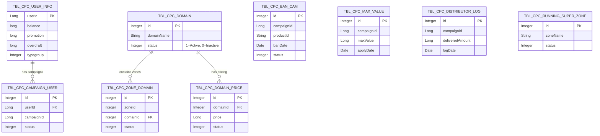

# DATABASE DESIGN DOCUMENT - AdCPC Metadata Service

| Information | Details |
| :--- | :--- |
| **Project** | AdCPC Metadata Service |
| **Version** | v1.0.0 |
| **Last Updated** | 2026-04-22 |
| **Status** | FINAL |
| **Database** | MySQL (forecastdb) |

---

## 1. ENTITY RELATIONSHIP DIAGRAM (ERD)

Sơ đồ ERD mô tả các thực thể chính trong hệ thống và mối quan hệ giữa chúng (dựa trên các Entity JPA).

---

## 2. TABLE DEFINITIONS

### 2.1. tbl_cpc_user_info
Lưu trữ thông tin tài chính của người dùng (nhà quảng cáo).
- `userid` (Long, PK): ID duy nhất của người dùng.
- `balance` (long): Số dư tài khoản chính (VND).
- `promotion` (long): Số dư tài khoản khuyến mãi (VND).
- `overdraft` (long): Hạn mức thấu chi cho phép (VND).
- `typegroup` (Integer): Phân loại nhóm người dùng (VIP, Standard, etc).

### 2.2. tbl_cpc_domain
Quản lý danh sách các tên miền (website) phân phối quảng cáo.
- `id` (Integer, PK): ID của domain.
- `domain_name` (String): Tên miền (vd: dantri.com.vn, kenh14.vn).
- `status` (Integer): Trạng thái hoạt động (1 = Active, 0 = Inactive).

### 2.3. tbl_cpc_zone_domain
Ánh xạ giữa Zone (vị trí đặt quảng cáo) và Domain.
- `id` (Integer, PK): Khóa chính.
- `zone_id` (Integer): ID của vị trí quảng cáo.
- `domain_id` (Integer, FK): Tham chiếu tới `tbl_cpc_domain`.
- `status` (Integer): Trạng thái kích hoạt.

### 2.4. tbl_cpc_domain_price
Cấu hình giá (CPC/CPM) cho từng domain cụ thể.
- `id` (Integer, PK): Khóa chính.
- `domain_id` (Integer, FK): Tham chiếu tới `tbl_cpc_domain`.
- `price` (Long): Giá áp dụng.
- `status` (Integer): Trạng thái giá đang áp dụng.

### 2.5. tbl_cpc_campaign_user
Quản lý danh sách các chiến dịch quảng cáo thuộc về người dùng nào.
- `id` (Integer, PK): Khóa chính.
- `user_id` (Long, FK): Tham chiếu tới người dùng tạo chiến dịch.
- `campaign_id` (Long): ID của chiến dịch.
- `status` (Integer): Trạng thái ánh xạ.

### 2.6. tbl_cpc_ban_cam
Ghi nhận danh sách các chiến dịch bị chặn/cấm phân phối theo ngày và loại sản phẩm.
- `id` (Integer, PK): Khóa chính.
- `campaign_id` (Long): ID chiến dịch bị chặn.
- `product_id` (String): Loại quảng cáo (vd: "AD_CPC").
- `ban_date` (Date): Ngày áp dụng chặn.
- `status` (Integer): Trạng thái chặn.

### 2.7. tbl_cpc_max_value
Cấu hình giới hạn ngân sách (Max Value) cho chiến dịch.
- `id` (Integer, PK): Khóa chính.
- `campaign_id` (Long): ID chiến dịch.
- `max_value` (Long): Giá trị tối đa cho phép tiêu.
- `apply_date` (Date): Ngày áp dụng giới hạn.

### 2.8. tbl_cpc_distributor_log
Log ghi nhận số tiền đã phân phối (đã tiêu) của chiến dịch.
- `id` (Integer, PK): Khóa chính.
- `campaign_id` (Long): ID chiến dịch.
- `delivered_amount` (Long): Số tiền đã phân phối.
- `log_date` (Date): Ngày ghi log.

---
END OF DOCUMENT
