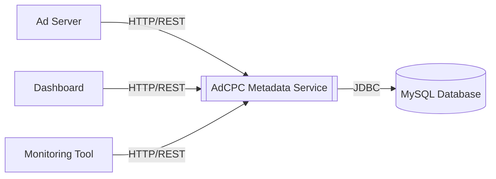
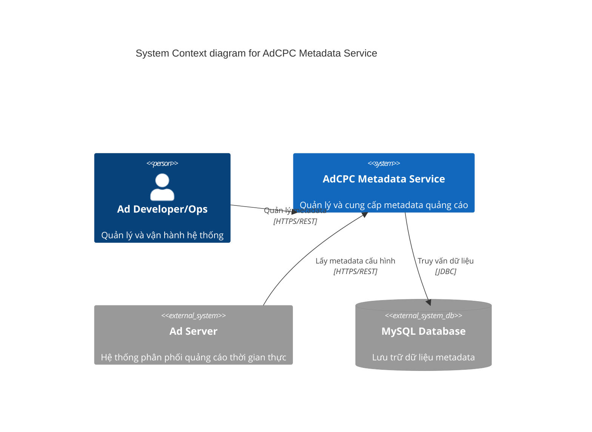
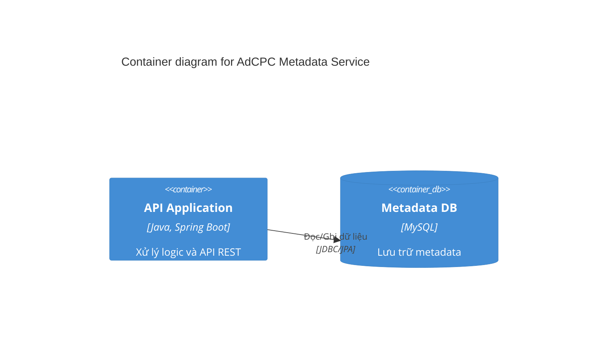
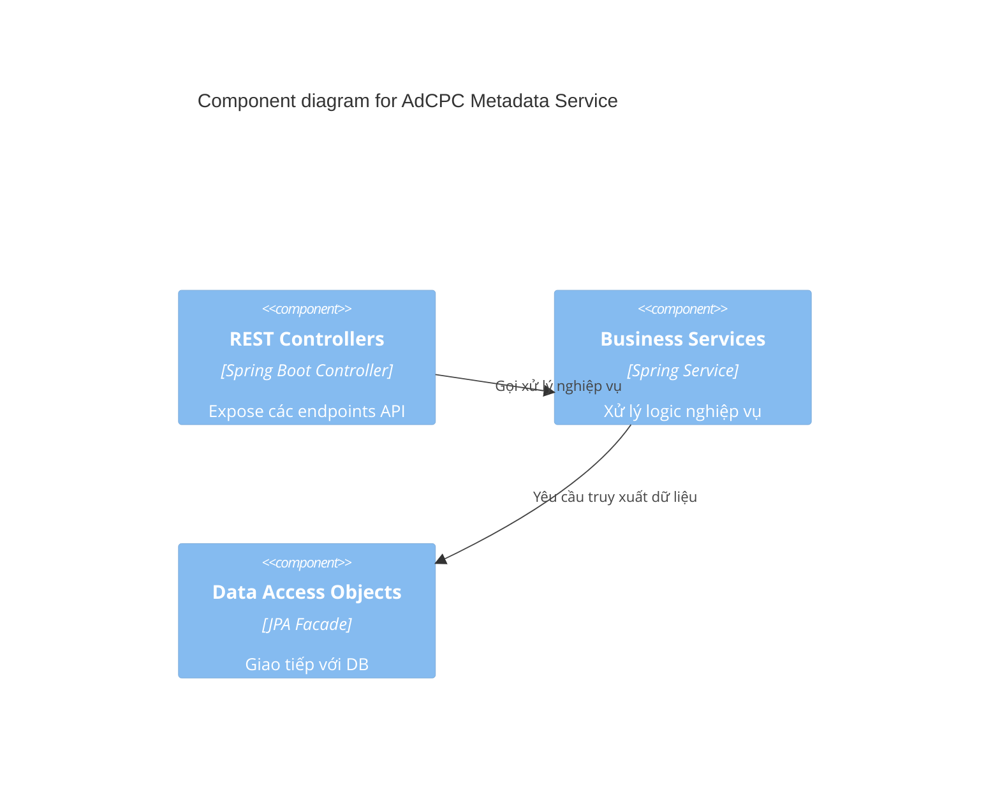

# SYSTEM ARCHITECTURE DOCUMENT (SAD) - AdCPC Metadata Service

| Thông tin         | Chi tiết               |
| :---------------- | :--------------------- |
| **Dự án**         | AdCPC Metadata Service |
| **Phiên bản**     | 1.1.0                  |
| **Ngày cập nhật** | 2026-04-22             |
| **Trạng thái**    | Final                  |
| **Tác giả**       | Adtech Bigdata Team    |

---

## NHẬT KÝ THAY ĐỔI

| Version | Ngày       | Người sửa | Mô tả thay đổi                                           |
| :------ | :--------- | :-------- | :------------------------------------------------------- |
| 1.0.0   | 2026-04-17 | Gemini    | Tài liệu ban đầu                                         |
| 1.1.0   | 2026-04-22 | Gemini    | Bổ sung cấu trúc dữ liệu, Cache, Logging & Configuration |

---

## Section 1: Introduction and Goals

AdCPC Metadata Service là một microservice được xây dựng bằng Spring Boot để quản lý và cung cấp metadata liên quan đến các chiến dịch quảng cáo (ad campaigns) trong hệ thống quảng cáo trực tuyến của VCCorp. Service này chịu trách nhiệm lưu trữ, truy xuất và xử lý các thông tin metadata như giá cả, zone, domain, user info, campaign settings liên quan đến quảng cáo.

**Mục tiêu chính:**

- Cung cấp REST API truy xuất metadata tập trung cho các hệ thống như Ad Server, Dashboard và Monitoring.
- Quản lý và cung cấp thông tin người dùng (UserInfo), chiến dịch (Campaign), và các ràng buộc phân phối (BanCam).
- Đồng bộ và cung cấp dữ liệu về giá domain (DomainPrice) và các super zone (RunningSuperZone).
- Tối ưu hóa hiệu năng truy xuất metadata bằng cách sử dụng JPA/Hibernate và Connection Pool (HikariCP).

## Section 2: Architecture Constraints

- **Framework:** Spring Boot 2.0.5.RELEASE - Framework chính cho việc phát triển microservice.
- **Ngôn ngữ:** Java 1.8 (JDK 8) - Sử dụng các tính năng tiêu chuẩn của Java 8.
- **Persistence:** MySQL (forecastdb) - Hệ quản trị cơ sở dữ liệu quan hệ chính.
- **ORM:** Spring Data JPA / Hibernate - Ánh xạ đối tượng và thực hiện các thao tác database.
- **Infrastructure:** Docker - Đóng gói ứng dụng để triển khai dễ dàng và nhất quán.
- **Logging:** Speed4j, Log4j2.

## Section 3: Context and Scope

Hệ thống cung cấp metadata cho các thành phần khác trong hệ sinh thái Adtech thông qua giao thức HTTP/JSON.

## Section 4: Data Architecture & Persistence

Toàn bộ Metadata được lưu trữ tập trung tại cơ sở dữ liệu MySQL (`forecastdb`). Thiết kế các bảng tuân theo mô hình chuẩn hóa nhằm tối ưu hoá cho việc truy vấn đọc khối lượng lớn (read-heavy). 

Chi tiết về thiết kế Schema, khóa chính, khóa ngoại và biểu đồ ERD được quy định chi tiết tại tài liệu **`02_DATABASE_DESIGN.md`**.

## Section 5: Building Block View

### 5.1. Cấu trúc Phân tầng (Layered Architecture)

Dịch vụ tuân thủ kiến trúc phân tầng 4 lớp tiêu chuẩn:

1.  **Controller Layer:** Tiếp nhận các HTTP Request, xử lý tham số, và trả về Response dưới dạng JSON. Sử dụng `Gson` để serialize đối tượng.
2.  **Service Layer:** Chứa logic nghiệp vụ xử lý dữ liệu, phối hợp giữa các DAO để thực hiện các yêu cầu phức tạp.
3.  **DAO (Facade) Layer:** Tầng truy cập dữ liệu sử dụng EntityManager và JPA, kế thừa từ `AbstractFacade` để tái sử dụng code.
4.  **Entity Layer:** Định nghĩa các JPA Entities (POJO) ánh xạ trực tiếp với các bảng trong cơ sở dữ liệu MySQL.

### 5.2. Phân rã Module chi tiết

- **vn.vccorp.adtech.bigdata.controller:** Chứa các REST Controllers: `AdsController`, `UserInfoController`, `MaxValueController`, `DeliveryController`, `PingController`.
- **vn.vccorp.adtech.bigdata.service:** Chứa logic nghiệp vụ chính.
- **vn.vccorp.adtech.bigdata.dao:** Truy cập dữ liệu DB.
- **vn.vccorp.adtech.bigdata.entities:** JPA entities ánh xạ với DB.
- **vn.vccorp.adtech.bigdata.model:** Request/Response DTOs.
- **vn.vccorp.adtech.bigdata.builder:** Lớp `Response` builder định dạng trả về tiêu chuẩn.

## Section 6: Non-Functional Architecture Aspects

### 6.1 Caching Strategy
Do đặc thù hệ thống là **Read-Heavy** (tỉ lệ đọc dữ liệu Metadata lớn hơn rất nhiều lần so với ghi), hệ thống cần áp dụng các cấp độ Cache:
- **JPA L1/L2 Cache:** Tận dụng cache tích hợp của Hibernate để giảm tải truy vấn lặp lại trên cùng session.
- **Local Memory Cache (Đề xuất phát triển tương lai):** Tích hợp Caffeine Cache hoặc Guava cho các Metadata cực kỳ ít thay đổi (VD: `DomainPrice`, `ZoneDomain`).
- *Lưu ý:* Hiện tại version 1.0.0 phụ thuộc chủ yếu vào Connection Pool (HikariCP) và tối ưu hóa câu Query SQL qua JPA Facade.

### 6.2 Logging & Monitoring
- **Performance Logging:** Sử dụng thư viện **Speed4j** (`StopWatch`) kết hợp `requestLogger` (thông qua `Log4j2`) để đo lường độ trễ (latency) của từng API call. Định dạng log: `finish process request {URI} in {Time}ms`.
- **Error Logging:** Bắt các ngoại lệ (Exception) ở Controller và ghi log chi tiết qua `eLogger.error()`.
- **Monitoring Integration:** File log có thể được đẩy lên hệ thống ELK Stack (Elasticsearch, Logstash, Kibana) của VCCorp để cảnh báo khi API latency vượt ngưỡng > 50ms hoặc lỗi 500 tăng đột biến.

### 6.3 Configuration Management
Cấu hình ứng dụng được đặt ở file `src/main/resources/application.properties`. Các thông tin chính:
- **Database Connection:** `spring.datasource.url`, `username`, `password`.
- **HikariCP Tuning:**
  - `maximum-pool-size=5` (Nên xem xét tăng lên cho môi trường Production thực tế nếu lưu lượng đạt hàng nghìn RPS).
  - Cấu hình Prepare Statement Cache giúp tối ưu truy vấn lặp lại: `prepStmtCacheSize=250`.

## Section 7: Runtime View

### Luồng xử lý một Request API (Đồng bộ)

1.  **Client:** Gửi HTTP GET request tới endpoint `/data/ban-cam?product_id=...&date=...`.
2.  **Controller:** Khởi tạo `StopWatch` để đo thời gian xử lý.
3.  **Service:** Xử lý logic nghiệp vụ.
4.  **DAO:** Thực hiện truy vấn JPA tới MySQL để lấy dữ liệu thô.
5.  **Builder:** Đóng gói kết quả vào `Response` builder với cấu trúc `status`, `message`, `code`, `data`.
6.  **Controller:** Serialize thành JSON bằng `Gson` và trả về cho Client, đồng thời lưu `StopWatch` log.

## Section 8: Deployment View

Hệ thống được đóng gói và triển khai linh hoạt.

- **Maven Build:** Tạo file JAR executable chứa toàn bộ dependency.
- **Dockerization:** Sử dụng `Dockerfile` với base image JRE 8. Các script `image-builder.sh` hỗ trợ build image tự động.
- **Runtime Scripts:** `entrypoint.sh` và `entrypoint-normal.sh` dùng để khởi chạy ứng dụng trong container.

---

## C4 Model Diagrams

### Level 1: System Context Diagram

### Level 2: Container Diagram

### Level 3: Component Diagram (Focus: Service & DAO Layer)

