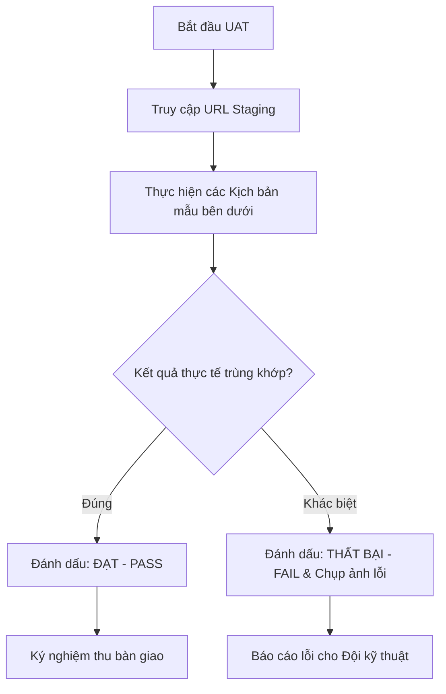

# TÀI LIỆU HƯỚNG DẪN KIỂM THỬ CHẤP NHẬN NGƯỜI DÙNG (UAT TESTING GUIDE)
## DỰ ÁN: SIMPLE CALCULATOR WEB APP (v2.1.2)

Kính gửi Quý khách hàng / Product Owner,

Tài liệu này hướng dẫn chi tiết các bước để Quý khách hàng thực hiện kiểm thử nghiệm thu (UAT) trên môi trường Staging/UAT của dự án Máy tính Web. Bộ kịch bản này tập trung vào các luồng nghiệp vụ sử dụng thực tế của người dùng cuối.

---

## 1. THÔNG TIN MÔI TRƯỜNG KIỂM THỬ UAT

*   **Đường dẫn truy cập (UAT URL):** [http://localhost:8086/](http://localhost:8086/) *(Chạy trên nền Docker Nginx)*
*   **Thiết bị hỗ trợ:** Máy tính để bàn (Desktop), Laptop, Máy tính bảng (Tablet) hoặc Điện thoại di động (Mobile).
*   **Trình duyệt khuyến nghị:** Google Chrome, Apple Safari, Mozilla Firefox hoặc Microsoft Edge phiên bản mới nhất.

---

## 2. QUY TRÌNH THỰC HIỆN KIỂM THỬ UAT

---

## 3. CÁC KỊCH BẢN KIỂM THỬ UAT MẪU (SAMPLES SCENARIOS)

Quý khách hàng vui lòng thực hiện tuần tự các kịch bản thực tế dưới đây để đánh giá chất lượng sản phẩm:

### 📑 KỊCH BẢN 1: TÍNH TOÁN CƠ BẢN VÀ XỬ LÝ LỖI (BASIC MATHS)
*   **Bước 1:** Nhấp biểu thức `1` $\rightarrow$ `.` $\rightarrow$ `5` $\rightarrow$ `+` $\rightarrow$ `2` $\rightarrow$ `.` $\rightarrow$ `5` $\rightarrow$ `=`
    *   *Kết quả mong đợi:* Dòng hiển thị trên ghi `1.5 + 2.5`, dòng kết quả dưới hiện **`4`**.
*   **Bước 2:** Nhấn phím `×` $\rightarrow$ gõ số `3` $\rightarrow$ `=`
    *   *Kết quả mong đợi:* Hệ thống kế thừa kết quả cũ, dòng trên ghi `4 × 3`, kết quả hiển thị **`12`**.
*   **Bước 3:** Nhấn số `9` (sau khi đã tính xong)
    *   *Kết quả mong đợi:* Máy tính tự động xóa sạch biểu thức cũ và bắt đầu số mới là **`9`** trên màn hình.
*   **Bước 4:** Nhập biểu thức `1` $\rightarrow$ `0` $\rightarrow$ `÷` $\rightarrow$ `0` $\rightarrow$ `=`
    *   *Kết quả mong đợi:* Màn hình hiện cảnh báo **`Không thể chia cho 0`**. Toàn bộ bàn phím bị khóa (ấn số khác không có tác dụng).
*   **Bước 5:** Nhấn phím `AC`
    *   *Kết quả mong đợi:* Màn hình được giải phóng lỗi, quay về trạng thái mặc định hiển thị **`0`**.

---

### 📑 KỊCH BẢN 2: HÀM KHOA HỌC VÀ ĐỒNG BỘ LỊCH SỬ (SCIENTIFIC & SYNC)
*   **Bước 1:** Nhấp phím **`Scientific`** trên giao diện để mở rộng bàn phím khoa học.
*   **Bước 2:** Đảm bảo nút góc đang hiển thị **`DEG`**. Nhập `3` $\rightarrow$ `0` $\rightarrow$ nhấn phím **`sin`** $\rightarrow$ nhấn phím `=`
    *   *Kết quả mong đợi:* Màn hình hiển thị kết quả **`0.5`**.
*   **Bước 3:** Nhấp phím **`DEG`** để chuyển trạng thái sang **`RAD`** (chữ hiển thị trên nút góc chuyển sang RAD).
*   **Bước 4:** Nhấn phím **`Theme Toggle`** (Biểu tượng mặt trăng/mặt trời ở góc trên).
    *   *Kết quả mong đợi:* Giao diện máy tính chuyển đổi mượt mà giữa nền tối (Dark) và nền sáng (Light).
*   **Bước 5:** Bấm **`Đăng nhập / Auth`** ở góc trên $\rightarrow$ Chọn Đăng ký/Đăng nhập $\rightarrow$ Điền thông tin bất kỳ để đăng nhập.
*   **Bước 6:** Thực hiện vài phép tính bất kỳ $\rightarrow$ Bấm nút **`History`** (Biểu tượng đồng hồ lịch sử).
    *   *Kết quả mong đợi:* Màn hình Sidebar mở ra, hiển thị đúng danh sách các phép tính Quý khách vừa thực hiện. Khi click vào một thẻ lịch sử, biểu thức đó được nạp ngược lại màn hình chính.

---

### 📑 KỊCH BẢN 3: PHÂN SỐ ĐỨNG VÀ BỘ GIẢI TÌM X (TÍNH NĂNG MỚI v2.1.2)
*   **Bước 1:** Trên bàn phím khoa học, nhấn phím phân số **`■/□`**.
    *   *Kết quả mong đợi:* Giao diện hiển thị cấu trúc phân số đứng **`(⬚)/(⬚)`** và con trỏ ảo đang nhấp nháy tại ô vuông tử số.
*   **Bước 2:** Nhấn phím số **`5`**.
    *   *Kết quả mong đợi:* Tử số thay đổi thành `5` $\rightarrow$ biểu thức hiển thị là `(5)/(⬚)`.
*   **Bước 3:** Click chuột hoặc chạm tay trực tiếp vào ô vuông **`⬚`** ở mẫu số.
    *   *Kết quả mong đợi:* Con trỏ ảo chuyển xuống nhấp nháy tại mẫu số.
*   **Bước 4:** Nhấn phím số **`2`** $\rightarrow$ nhấn phím **`=`**.
    *   *Kết quả mong đợi:* Kết quả hiển thị dưới trả về đúng **`2.5`**.
*   **Bước 5:** Nhấn phím xóa **`AC`** $\rightarrow$ Nhấp phím biến số **`x`** ảo trên bàn phím (hoặc phím cứng `x` trên bàn phím máy tính).
    *   *Kết quả mong đợi:* Dòng biểu thức hiển thị ký tự **`x`**.
*   **Bước 6:** Nhập tiếp biểu thức để tạo thành phương trình: **`x^2 - 9`** $\rightarrow$ nhấn phím **`=`**.
    *   *Kết quả mong đợi:* Hệ thống kích hoạt thuật toán Newton-Raphson tự động tìm nghiệm và hiển thị kết quả **`x = 3`** (hoặc `x = -3`).

---

## 4. GHI NHẬN KẾT QUẢ KIỂM THỬ UAT (UAT LOG TEMPLATE)

Quý khách hàng có thể ghi nhận lại kết quả vào bảng dưới đây để gửi lại cho Đội phát triển:

| Kịch bản | Trạng thái Nghiệm thu (Đạt / Không đạt) | Góp ý / Mô tả lỗi phát sinh (nếu có) |
| :--- | :---: | :--- |
| **Kịch bản 1:** Tính toán cơ bản và xử lý lỗi | `.......................` | |
| **Kịch bản 2:** Hàm khoa học và Đồng bộ | `.......................` | |
| **Kịch bản 3:** Phân số đứng và Solver x | `.......................` | |

**Ý KIẾN CHUNG CỦA ĐẠI DIỆN KHÁCH HÀNG:**
......................................................................................................................................................
......................................................................................................................................................

*Đại diện khách hàng ký duyệt (ghi rõ họ tên và ngày tháng):*
